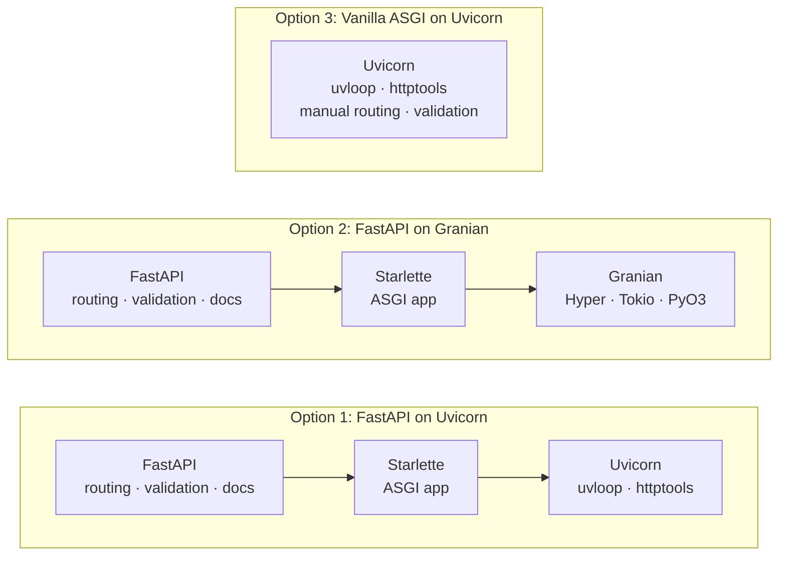
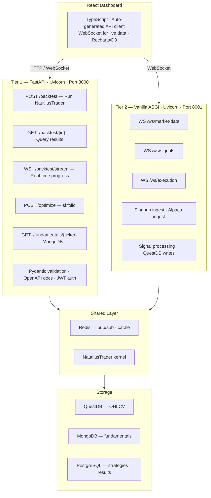

# ASGI Web Server: Framework & Architecture Decision

## Decision Summary

**FastAPI on Uvicorn** is the default ASGI web server stack for QuantLens. For production systems that combine research dashboards with live trading, use a **hybrid two-tier architecture**: FastAPI on Uvicorn for strategy backtesting and data dashboards, and a **lightweight Uvicorn gateway** (vanilla ASGI or Starlette-thin) for real-time market data ingestion and signal processing.

---

## Context

QuantLens serves two distinct workload profiles through its web layer:

1. **Research, backtesting & dashboards** — REST endpoints for running NautilusTrader simulations, portfolio optimization via skfolio, strategy CRUD, and serving results to a React frontend. These are compute-bound and database-heavy; the HTTP framework is not the bottleneck.
2. **Real-time trading** — WebSocket streaming of market data from multiple providers (Finnhub, Alpaca), live signal processing, QuestDB writes, and order execution. These are I/O-bound and latency-sensitive.

This document evaluates server architectures based on TechEmpower benchmark data, the internal mechanics of Uvicorn and Granian, and QuantLens's specific workload profile.

---

## Server Architectures Compared



---

## Uvicorn vs Granian: Architectural Deep Dive

### Uvicorn — Optimized C/Python Hybrid

Uvicorn is not pure Python. It is a **hybrid C/Cython architecture** specifically optimized for I/O-bound workloads:

| Component | Implementation | Purpose |
|-----------|---------------|---------|
| **uvloop** | Cython (compiled to C) | Event loop replacement using libuv (Node.js's I/O engine) |
| **httptools** | C (Node.js HTTP parser) | HTTP parsing at C speed |
| **asyncio** | C-optimized Python stdlib | Coroutine scheduling |

The entire request path stays in **C/Python memory space** with no FFI boundary crossing:

```
Client → httptools (C) → uvloop (Cython/C) → asyncio → asyncpg (C) → PostgreSQL
```

Key advantages:
- **uvloop** provides **2–4× faster** event loop operations than standard asyncio, built on libuv — the same battle-tested async I/O library that powers Node.js.
- **asyncpg** (the PostgreSQL driver used in benchmarks) is written in **C with a thin Python wrapper**, using PostgreSQL's binary protocol and prepared statement caching.
- A single event loop manages the entire request lifecycle — no scheduling overhead between runtimes.

### Granian — Rust HTTP Server Embedding Python

Granian takes a fundamentally different approach: a **Rust HTTP server** that calls into Python via FFI:

| Component | Implementation | Purpose |
|-----------|---------------|---------|
| **Hyper** | Rust | HTTP/1.1 and HTTP/2 protocol handling |
| **Tokio** | Rust | Async runtime (Rust's equivalent of asyncio) |
| **PyO3** | Rust | Python bindings and FFI layer |
| **RSGI/ASGI** | Rust ↔ Python bridge | Application interface |

Every request crosses the **FFI boundary**:

```
Client → Hyper (Rust/Tokio) → PyO3 FFI → asyncio (Python) → asyncpg (C) → PostgreSQL
```

This boundary crossing involves:
- **GIL acquisition** on every request
- **Memory marshalling** between Rust and Python heaps
- **Object conversion** (Rust types → Python objects)
- **Two event loops** (Tokio + asyncio) with scheduling overhead between them

### Where Granian Wins: JSON Serialization

Granian's RSGI interface can **short-circuit** the async ceremony for simple responses. ASGI requires two awaited `send()` calls per response; RSGI collapses this to a single synchronous call:

```python
# ASGI (Uvicorn) — requires await for every step
await send({"type": "http.response.start", ...})
await send({"type": "http.response.body", ...})   # Extra event loop cycle

# RSGI (Granian) — synchronous for complete responses
proto.response_str(status=200, body="{}")           # Single call, no await
```

For micro-benchmarks with no I/O (pure JSON serialization of `{"message": "Hello, World!"}`), this protocol overhead matters. Granian leads here.

### Where Uvicorn Wins: Database Queries and I/O

In TechEmpower benchmarks, **Uvicorn ranks #1 in single-query and #2 in multiple-query tests** — both ahead of Granian. The reasons:

1. **No FFI tax.** asyncpg runs natively in Python's asyncio loop. Granian adds Tokio → asyncio context switches on every query.
2. **Connection pool efficiency.** asyncpg's pool is optimized for asyncio's event loop without Tokio interference.
3. **Lower tail latency.** uvloop's libuv foundation provides stable, low-variance I/O scheduling — critical for database-heavy workloads and WebSocket streaming.

---

## TechEmpower Benchmark Results

### By Test Type

| Test | Uvicorn Rank | Granian Rank | Winner | Key Factor |
|------|-------------|-------------|--------|------------|
| **JSON Serialization** | Lower | Higher | Granian | RSGI protocol optimization, no async overhead for trivial responses |
| **Single Database Query** | #1 | Lower | Uvicorn | FFI-free path, native asyncpg integration |
| **Multiple Database Queries** | #2 | Lower | Uvicorn | Connection pool efficiency, lower latency variance |

### Framework-Level Throughput

| Configuration | Requests/sec | Latency p50 |
|---------------|-------------|-------------|
| BlackSheep | 10 505 | 4.70 ms |
| Sanic | 10 777 | 6.97 ms |
| Starlette | 8 135 | 6.03 ms |
| FastAPI | 5 882 | 8.36 ms |
| Vanilla Uvicorn (est.) | ~11 000 | ~3 ms |

FastAPI adds ~30% overhead versus Starlette alone. Vanilla ASGI on Uvicorn approaches BlackSheep/Sanic speeds.

### What This Means for QuantLens

QuantLens is **database-heavy and I/O-bound** in both tiers:

- **Tier 1 (backtesting/dashboards):** Reads/writes to PostgreSQL (strategy configs, backtest results), MongoDB (fundamentals), and QuestDB (historical OHLCV). Uvicorn's benchmark lead on database queries directly applies.
- **Tier 2 (real-time trading):** Continuous QuestDB writes, asyncpg connection pool under sustained load, WebSocket streaming to the React frontend. Uvicorn's lower tail latency and single-event-loop architecture deliver more predictable performance.

Granian's JSON serialization advantage is irrelevant here — QuantLens endpoints are never "return a static JSON string." Every request involves database I/O, compute, or both.

---

## Performance Reality Check

Backtesting is **compute-bound, not I/O-bound**. A NautilusTrader simulation taking seconds to minutes will not be materially faster with Uvicorn's microsecond-level advantages over Granian. The server overhead is noise compared to engine runtime.

For the real-time path, the overhead matters:

### Latency Budget — Real-Time Trading Path

| Component | Target | FastAPI + Uvicorn | Vanilla Uvicorn |
|-----------|--------|-------------------|-----------------|
| Market data ingest (Finnhub/Alpaca) | < 5 ms | +2–5 ms | +0.3 ms |
| Signal calculation (NautilusTrader) | 10–50 ms | same | same |
| DB write (QuestDB) | 5–10 ms | same | same |
| WebSocket push to React | < 10 ms | +2–3 ms | +0.3 ms |
| **Total round-trip** | **~30–75 ms** | **+4–8 ms (10–25%)** | **Minimal** |

Uvicorn's uvloop delivers **lower tail latency** than Granian's Tokio-to-asyncio bridge for sustained I/O, making it the better foundation for both tiers.

---

## Tier 1: FastAPI on Uvicorn — Backtesting & Dashboards

### Why FastAPI

| Aspect | Pros | Cons |
|--------|------|------|
| **Development Speed** | Automatic OpenAPI docs, Pydantic validation, dependency injection, auto-generated client SDKs | ~30% overhead vs Starlette (irrelevant for compute-bound backtests) |
| **Code Clarity** | Declarative route definitions, type hints drive validation, clean separation of concerns | "Magic" can obscure control flow for advanced use |
| **Trading System Fit** | Native Pydantic matches NautilusTrader data models, WebSocket support, seamless skfolio integration | Extra layers versus vanilla ASGI |
| **Maintenance** | Large community, extensive documentation, battle-tested in production | Framework updates may break APIs |

### Why Uvicorn (Not Granian) for This Tier

1. **Database queries dominate.** Backtest results, strategy configs, historical OHLCV, and fundamentals all hit PostgreSQL/QuestDB/MongoDB. Uvicorn wins on every database benchmark.
2. **asyncpg runs natively.** No Tokio → asyncio context switches. Connection pool performance is optimal.
3. **Mixed sync/async workload.** skfolio's CPU-heavy optimization runs in process pools via `loop.run_in_executor` — Uvicorn's executor integration is well-optimized and battle-tested.
4. **NautilusTrader is async-native Python/Rust.** It integrates directly with Python's asyncio ecosystem without an extra FFI layer.

### React Frontend Integration

| Requirement | FastAPI Solution |
|-------------|-----------------|
| CORS preflight | `CORSMiddleware` one-liner |
| Type-safe API | Auto-generated OpenAPI → TypeScript client |
| Real-time updates | Native WebSocket support |
| File uploads (trade logs) | `UploadFile` dependency |
| Pagination (large results) | `fastapi-pagination` library |

### Auto-Generated Client SDK

FastAPI's `/docs` endpoint produces an OpenAPI spec that generates a TypeScript client automatically:

```bash
# Generate TypeScript client for React
npx openapi-typescript-codegen \
  --input http://localhost:8000/openapi.json \
  --output ./src/api
```

```typescript
// Auto-generated — full type safety in React
const results = await BacktestService.runBacktest({
    strategy_id: "momentum_v1",
    start_date: "2024-01-01",
    parameters: { lookback: 20 },
});
```

### skfolio Integration

FastAPI request/response models remain Pydantic-based, while skfolio provides the optimization engine:

```python
from skfolio.optimization import MeanRisk, CVaR
import pandas as pd
from pydantic import BaseModel

class OptimizationRequest(BaseModel):
    returns_data: list[list[float]]  # rows=time observations, columns=asset returns
    confidence_level: float = 0.95

@app.post("/optimize")
async def optimize_portfolio(request: OptimizationRequest):
    returns_df = pd.DataFrame(request.returns_data)
    optimizer = MeanRisk(risk_measure=CVaR(request.confidence_level))
    optimizer.fit(returns_df)
    return {
        "weights": optimizer.weights_,
    }
```

### Clean Backtest Endpoints

```python
@app.post("/backtest")
async def run_backtest(config: BacktestConfig) -> BacktestResults:
    strategy = load_strategy(config.strategy_id)
    # This dominates runtime (seconds), not server overhead (microseconds)
    results = await run_nautilus_backtest(strategy, config.params)
    return results  # Auto-serialized to JSON
```

### Tier 1 Implementation

```python
# fastapi_service.py
from fastapi import FastAPI
from fastapi.middleware.cors import CORSMiddleware
from contextlib import asynccontextmanager
from concurrent.futures import ProcessPoolExecutor

@asynccontextmanager
async def lifespan(app: FastAPI):
    app.state.kernel = NautilusKernel()
    await app.state.kernel.start()
    yield
    await app.state.kernel.stop()

app = FastAPI(title="QuantLens Backtest API", lifespan=lifespan)
executor = ProcessPoolExecutor(max_workers=4)

app.add_middleware(
    CORSMiddleware,
    allow_origins=["http://localhost:3000"],  # React dev server
    allow_methods=["*"],
    allow_headers=["*"],
)

@app.post("/backtest")
async def run_backtest(config: BacktestConfig):
    results = await app.state.kernel.backtest(config)
    return results

@app.post("/optimize-portfolio")
async def optimize_portfolio(holdings: dict):
    loop = asyncio.get_event_loop()
    return await loop.run_in_executor(executor, run_optimization_sync, holdings)

# Run with:
# uvicorn main:app --loop uvloop --http httptools --workers 4 --limit-concurrency 1000
```

---

## Tier 2: Vanilla Uvicorn Gateway — Real-Time Trading

### Why Vanilla ASGI (Not FastAPI) for This Tier

When the system handles multiple streaming data sources, live signal processing, and order execution, FastAPI's middleware stack adds measurable latency to the hot path. Stripping down to vanilla ASGI on Uvicorn provides:

- **No middleware traversal** — direct WebSocket handling
- **Custom serialization** — MessagePack/Protobuf instead of JSON
- **Direct kernel integration** — NautilusTrader tick injection with zero framework overhead
- **Backpressure control** — fine-grained queue management for sustained ingestion

### Why Uvicorn (Not Granian) for This Tier

1. **WebSocket streaming is the bottleneck.** Uvicorn's uvloop has mature, low-variance WebSocket performance. Granian's Tokio → asyncio bridge adds scheduling jitter under sustained streaming load.
2. **QuestDB writes on every tick.** QuestDB's high-performance Influx Line Protocol (ILP) over TCP handles writes efficiently under Uvicorn's single event loop, while PGWire queries for reads integrate cleanly with asyncio-native drivers.
3. **Lower tail latency.** For real-time trading, p99 latency matters more than peak throughput. Uvicorn's libuv foundation delivers more predictable I/O scheduling.
4. **Ecosystem maturity.** The `websockets` library, asyncpg, and aioredis are all optimized for asyncio/uvloop — no FFI friction.

### WebSocket Performance

Real-time trading requires bidirectional streaming with minimal overhead:

```python
import asyncio
import msgpack

class TradingGateway:
    def __init__(self):
        self.clients: set = set()
        self.nautilus_kernel = NautilusKernel()

    async def handle_market_data(self, data: bytes):
        tick = msgpack.unpackb(data, raw=False)

        # Direct kernel injection — no framework overhead
        signal = await self.nautilus_kernel.process_tick(tick)

        if signal:
            await asyncio.gather(
                self.persist_to_questdb(signal, tick),
                self.broadcast_signal(signal),
            )

    async def broadcast_signal(self, signal):
        payload = msgpack.packb({
            "timestamp": signal.timestamp,
            "action": signal.action,
            "price": signal.price,
            "confidence": signal.confidence,
        })
        for client in self.clients:
            await client.send(payload)
```

### Data Ingestion with Backpressure

Multiple streaming sources need backpressure handling to stay resilient:

```python
class DataIngestionManager:
    def __init__(self):
        self.questdb_pool = asyncpg.create_pool(dsn="postgresql://...")
        self.signal_queue = asyncio.Queue(maxsize=10_000)

    async def finnhub_ingest(self):
        async with websockets.connect("wss://ws.finnhub.io") as ws:
            await ws.send('{"type":"subscribe","symbol":"AAPL"}')
            async for message in ws:
                if self.signal_queue.qsize() > 9_000:
                    logging.warning("Backpressure: dropping tick")
                    continue
                await self.signal_queue.put(("finnhub", message))

    async def process_pipeline(self):
        while True:
            source, data = await self.signal_queue.get()
            await asyncio.gather(
                self.write_ohlcv_questdb(data),
                self.check_strategy_signals(data),
            )
```

### Tier 2 Implementation

```python
# realtime_gateway.py
import asyncio
import json
import logging
import msgpack
import aioredis
import asyncpg
import websockets

class RealtimeGateway:
    def __init__(self):
        self.redis = aioredis.from_url("redis://localhost")
        self.questdb_pool = None
        self.nautilus = None

    async def setup(self):
        self.questdb_pool = await asyncpg.create_pool("postgresql://localhost:8812/qdb")
        self.nautilus = await NautilusKernel.create()
        asyncio.create_task(self.finnhub_ingest())
        asyncio.create_task(self.alpaca_ingest())

    async def finnhub_ingest(self):
        while True:
            try:
                async with websockets.connect(
                    "wss://ws.finnhub.io?token=" + FINNHUB_KEY
                ) as ws:
                    await ws.send(json.dumps({
                        "type": "subscribe",
                        "symbol": "BINANCE:BTCUSDT",
                    }))
                    async for message in ws:
                        tick = json.loads(message)
                        pipe = self.redis.pipeline()
                        pipe.publish("market:ticks", msgpack.packb(tick))
                        await pipe.execute()

                        await self.questdb_pool.execute(
                            "INSERT INTO ohlcv_1m (time, symbol, price, volume) "
                            "VALUES ($1, $2, $3, $4)",
                            datetime.fromtimestamp(tick["t"] / 1000),
                            tick["s"],
                            tick["p"],
                            tick["v"],
                        )
                        asyncio.create_task(self.check_signal(tick))
            except Exception as e:
                logging.error(f"Finnhub reconnect after: {e}")
                await asyncio.sleep(5)

    async def check_signal(self, tick):
        signal = await self.nautilus.process_tick(tick)
        if signal and signal.strength > 0.8:
            await self.redis.publish(
                "signals:high",
                msgpack.packb({
                    "symbol": tick["s"],
                    "action": signal.action,
                    "price": tick["p"],
                    "timestamp": tick["t"],
                }),
            )

gateway = RealtimeGateway()

async def app(scope, receive, send):
    if scope["type"] == "websocket":
        pubsub = gateway.redis.pubsub()
        await pubsub.subscribe("market:ticks", "signals:high")
        async for message in pubsub.listen():
            if message["type"] == "message":
                await send({"type": "websocket.send", "bytes": message["data"]})
    elif scope["type"] == "http":
        await send({
            "type": "http.response.start",
            "status": 200,
            "headers": [(b"content-type", b"application/json")],
        })
        await send({
            "type": "http.response.body",
            "body": b'{"status": "live"}',
        })

# Run with:
# uvicorn realtime_gateway:app --loop uvloop --http httptools --workers 2 --port 8001
```

---

## Recommended Architecture: Hybrid Two-Tier

For production systems that combine research and real-time trading, split the workload across two Uvicorn processes:



### Benefits

- **Both tiers run on Uvicorn**, leveraging its database query and WebSocket streaming advantages across the board.
- **FastAPI** handles business logic (portfolio optimization, backtesting, reporting) with full developer experience — OpenAPI docs, Pydantic validation, CORS middleware.
- **Vanilla ASGI** handles the hot path (market data ingestion, order execution, real-time risk) with minimal latency and direct asyncpg/WebSocket control.
- Both tiers share Pydantic models via a shared library.
- Isolated failure domains — a crash in the research API does not affect live trading.
- **Redis pub/sub** decouples the tiers with built-in backpressure handling.
- A single event loop architecture (uvloop) on both tiers means **no Tokio ↔ asyncio scheduling friction** for database operations.

---

## Database-Specific Patterns

### QuestDB (Primary OHLCV)

```python
async def questdb_insert_ilp(session, tick: dict):
    """Influx Line Protocol (ILP) for high-throughput QuestDB ingestion."""
    line = (
        f"ohlcv,symbol={tick['symbol']} "
        f"open={tick['open']},high={tick['high']},"
        f"low={tick['low']},close={tick['close']},"
        f"volume={tick['volume']} "
        f"{tick['timestamp']}\n"
    )
    await session.post("http://localhost:9000/write", data=line)
```

```python
async def questdb_query(pool, symbol: str, start: str, end: str):
    """PGWire protocol for QuestDB reads — native SAMPLE BY and LATEST ON."""
    async with pool.acquire() as conn:
        return await conn.fetch(
            """
            SELECT timestamp, symbol,
                   first(price) as open, max(price) as high,
                   min(price) as low, last(price) as close,
                   sum(volume) as volume
            FROM trades
            WHERE symbol = $1 AND timestamp BETWEEN $2 AND $3
            SAMPLE BY 1m
            """,
            symbol, start, end,
        )
```

### MongoDB (Fundamentals)

```python
from motor.motor_asyncio import AsyncIOMotorClient

mongo = AsyncIOMotorClient(os.getenv("MONGODB_URI"))
db = mongo.trading

async def get_fundamentals(ticker: str) -> dict:
    return await db.fundamentals.find_one({"ticker": ticker}, {"_id": 0})
```

---

## When to Consider Granian

Granian is not the right default for QuantLens, but there are scenarios where it could be worth evaluating:

| Scenario | Rationale |
|----------|-----------|
| **HTTP/2 or HTTP/3 required** | Granian has native HTTP/2 support via Hyper; Uvicorn does not |
| **Pure JSON API with no database** | Granian's RSGI protocol optimization provides an edge for trivial responses |
| **Static file serving** | Granian's `pathsend` extension is efficient |

If any of these become a priority, benchmark against Uvicorn on QuantLens's actual workload before switching. Synthetic micro-benchmarks (JSON serialization) can be misleading for database-heavy applications.

---

## Final Verdict

| Use Case | Recommendation |
|----------|----------------|
| **Research / backtesting platform** | FastAPI on Uvicorn |
| **Data dashboards (React frontend)** | FastAPI on Uvicorn |
| **Live trading with low latency** | Vanilla ASGI on Uvicorn |
| **Mixed system (research + production)** | Hybrid — FastAPI on Uvicorn for Tier 1, vanilla ASGI on Uvicorn for Tier 2 |
| **Small team, rapid development** | FastAPI on Uvicorn (single tier, add Tier 2 when needed) |
| **Multiple real-time data sources** | Build the vanilla ASGI gateway on Uvicorn from day one |

For QuantLens specifically — backtesting NautilusTrader strategies, running skfolio optimization, and serving dashboards to a React frontend — start with **FastAPI on Uvicorn**. Uvicorn's Cython/C architecture (uvloop + httptools + asyncpg) delivers benchmark-leading database query performance, and FastAPI's developer experience (OpenAPI docs, Pydantic validation, CORS middleware) eliminates boilerplate. When live trading is added, extract real-time endpoints to a vanilla ASGI service on a second Uvicorn process using the hybrid architecture above.

| Component | Technology | Reason |
|-----------|-----------|--------|
| Research / backtest API | FastAPI on Uvicorn | Developer experience, docs, validation, DB query performance |
| Real-time market data gateway | Vanilla ASGI on Uvicorn | Low-latency WebSocket streaming, native asyncpg, single event loop |
| Signal processing | Vanilla ASGI + NautilusTrader | Direct kernel integration, no FFI overhead |
| Data persistence | QuestDB primary | Time-series optimized, 11M+ rows/sec ingestion, native OHLCV features |
| Cross-service communication | Redis pub/sub | Decoupling, backpressure handling |
| Frontend | React + WebSocket (msgpack) | Binary framing for efficiency |

### Production Configuration

```bash
# Tier 1 — FastAPI (backtesting, dashboards)
uvicorn main:app --loop uvloop --http httptools --workers 4 --limit-concurrency 1000

# Tier 2 — Vanilla ASGI (real-time trading)
uvicorn realtime_gateway:app --loop uvloop --http httptools --workers 2 --port 8001
```

See also: [asgi_rsgi_wsgi.md](asgi_rsgi_wsgi.md) for the ASGI vs WSGI vs RSGI interface decision.
