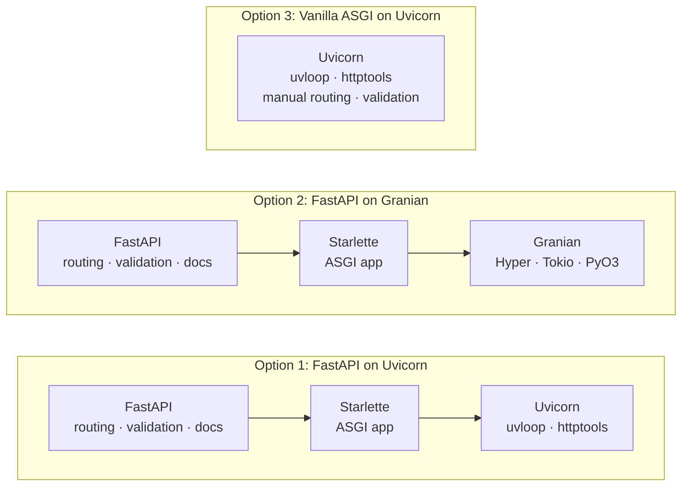
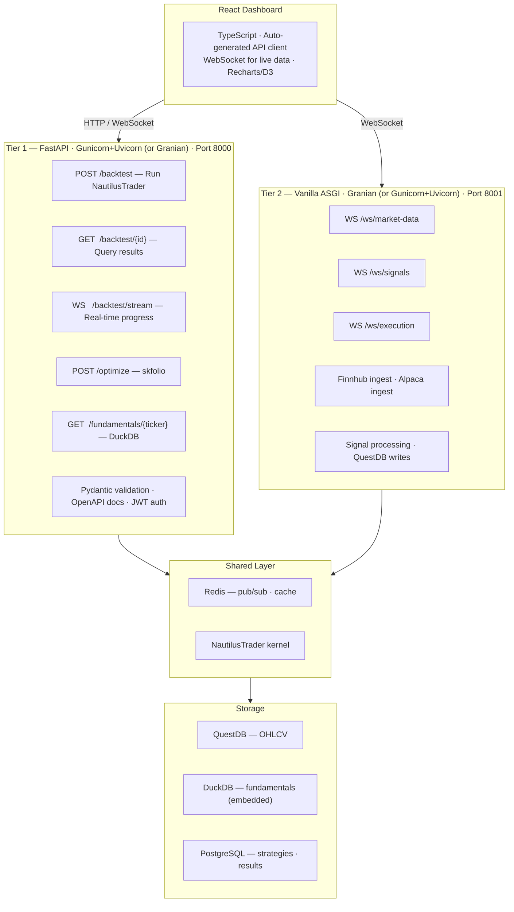

# ASGI Web Server: Framework & Architecture Decision

## Decision Summary

**FastAPI on Gunicorn+Uvicorn** is the default ASGI web server stack for QuantLens. Internal extended benchmarks confirm that multi-worker stacks sustain ~2× the throughput of single-worker Uvicorn for CPU-bound portfolio optimization and backtesting. For production systems that combine research dashboards with live trading, use a **hybrid two-tier architecture**: FastAPI on Gunicorn+Uvicorn (or Granian) for strategy backtesting and data dashboards, and a **vanilla ASGI Granian gateway** for real-time market data ingestion and signal processing.

---

## Context

QuantLens serves two distinct workload profiles through its web layer:

1. **Research, backtesting & dashboards** — REST endpoints for running NautilusTrader simulations, portfolio optimization via skfolio, strategy CRUD, and serving results to a React frontend. These are compute-bound; internal benchmarks confirm that worker parallelism (not framework choice) is the bottleneck.
2. **Real-time trading** — WebSocket streaming of market data from multiple providers (Finnhub, Alpaca), live signal processing, QuestDB writes, and order execution. These are I/O-bound and latency-sensitive.

This document evaluates server architectures based on TechEmpower benchmark data, internal extended ASGI stack benchmarks (skfolio CPU-bound and health check I/O-bound scenarios), the internal mechanics of Uvicorn and Granian, and QuantLens's specific workload profile.

---

## Server Architectures Compared



---

## Uvicorn vs Granian: Architectural Deep Dive

### Uvicorn — Optimized C/Python Hybrid

Uvicorn is not pure Python. It is a **hybrid C/Cython architecture** specifically optimized for I/O-bound workloads:

| Component | Implementation | Purpose |
|-----------|---------------|---------|
| **uvloop** | Cython (compiled to C) | Event loop replacement using libuv (Node.js's I/O engine) |
| **httptools** | C (Node.js HTTP parser) | HTTP parsing at C speed |
| **asyncio** | C-optimized Python stdlib | Coroutine scheduling |

The entire request path stays in **C/Python memory space** with no FFI boundary crossing:

```
Client → httptools (C) → uvloop (Cython/C) → asyncio → asyncpg (C) → PostgreSQL
```

Key advantages:
- **uvloop** provides **2–4× faster** event loop operations than standard asyncio, built on libuv — the same battle-tested async I/O library that powers Node.js.
- **asyncpg** (the PostgreSQL driver used in benchmarks) is written in **C with a thin Python wrapper**, using PostgreSQL's binary protocol and prepared statement caching.
- A single event loop manages the entire request lifecycle — no scheduling overhead between runtimes.

### Granian — Rust HTTP Server Embedding Python

Granian takes a fundamentally different approach: a **Rust HTTP server** that calls into Python via FFI:

| Component | Implementation | Purpose |
|-----------|---------------|---------|
| **Hyper** | Rust | HTTP/1.1 and HTTP/2 protocol handling |
| **Tokio** | Rust | Async runtime (Rust's equivalent of asyncio) |
| **PyO3** | Rust | Python bindings and FFI layer |
| **RSGI/ASGI** | Rust ↔ Python bridge | Application interface |

Every request crosses the **FFI boundary**:

```
Client → Hyper (Rust/Tokio) → PyO3 FFI → asyncio (Python) → asyncpg (C) → PostgreSQL
```

This boundary crossing involves:
- **GIL acquisition** on every request
- **Memory marshalling** between Rust and Python heaps
- **Object conversion** (Rust types → Python objects)
- **Two event loops** (Tokio + asyncio) with scheduling overhead between them

### Where Granian Wins: JSON Serialization

Granian's RSGI interface can **short-circuit** the async ceremony for simple responses. ASGI requires two awaited `send()` calls per response; RSGI collapses this to a single synchronous call:

```python
# ASGI (Uvicorn) — requires await for every step
await send({"type": "http.response.start", ...})
await send({"type": "http.response.body", ...})   # Extra event loop cycle

# RSGI (Granian) — synchronous for complete responses
proto.response_str(status=200, body="{}")           # Single call, no await
```

For micro-benchmarks with no I/O (pure JSON serialization of `{"message": "Hello, World!"}`), this protocol overhead matters. Granian leads here.

### Where Uvicorn Wins: Database Queries and I/O

In TechEmpower benchmarks, **Uvicorn ranks #1 in single-query and #2 in multiple-query tests** — both ahead of Granian. The reasons:

1. **No FFI tax.** asyncpg runs natively in Python's asyncio loop. Granian adds Tokio → asyncio context switches on every query.
2. **Connection pool efficiency.** asyncpg's pool is optimized for asyncio's event loop without Tokio interference.
3. **Lower tail latency.** uvloop's libuv foundation provides stable, low-variance I/O scheduling — critical for database-heavy workloads and WebSocket streaming.

---

## TechEmpower Benchmark Results (External Reference)

### By Test Type

| Test | Uvicorn Rank | Granian Rank | Winner | Key Factor |
|------|-------------|-------------|--------|------------|
| **JSON Serialization** | Lower | Higher | Granian | RSGI protocol optimization, no async overhead for trivial responses |
| **Single Database Query** | #1 | Lower | Uvicorn | FFI-free path, native asyncpg integration |
| **Multiple Database Queries** | #2 | Lower | Uvicorn | Connection pool efficiency, lower latency variance |

### Framework-Level Throughput

| Configuration | Requests/sec | Latency p50 |
|---------------|-------------|-------------|
| BlackSheep | 10 505 | 4.70 ms |
| Sanic | 10 777 | 6.97 ms |
| Starlette | 8 135 | 6.03 ms |
| FastAPI | 5 882 | 8.36 ms |
| Vanilla Uvicorn (est.) | ~11 000 | ~3 ms |

FastAPI adds ~30% overhead versus Starlette alone. Vanilla ASGI on Uvicorn approaches BlackSheep/Sanic speeds.

---

## Extended ASGI Stack Benchmark Results (QuantLens Workload)

These results are from the internal extended benchmark suite run against QuantLens's actual workload patterns: I/O-light health checks and CPU-bound skfolio portfolio optimization. NautilusTrader is mocked; skfolio runs for real. All runs: 30 s per timed scenario, 2 workers for multi-process stacks, GitHub Actions `ubuntu-latest`.

### Memory Footprint

| Stack | Idle RSS | After Load RSS |
|-------|----------|----------------|
| Uvicorn · Raw ASGI | 180 MB | 190 MB |
| FastAPI · Uvicorn | 194 MB | 205 MB |
| Gunicorn+Uvicorn · Raw ASGI | 385 MB | 405 MB |
| FastAPI · Gunicorn+Uvicorn | 407 MB | 435 MB |
| Granian · Raw ASGI | 423 MB | 445 MB |
| FastAPI · Granian | 448 MB | 472 MB |

Single-worker Uvicorn is the lightest option. Multi-worker stacks (Granian, Gunicorn+Uvicorn) cost roughly 2–2.5× more RAM in exchange for parallelism.

### I/O-Bound: GET /health

| Stack | Req/s (c=50) | Req/s (c=200) | P99 (c=200) |
|-------|-------------:|--------------:|------------:|
| Granian · Raw ASGI | 25,421 | 30,618 | 13.2 ms |
| Gunicorn+Uvicorn · Raw ASGI | 22,706 | 25,353 | 13.9 ms |
| Uvicorn · Raw ASGI | 17,546 | 17,253 | 47.9 ms |
| FastAPI · Gunicorn+Uvicorn | 11,992 | 13,122 | 21.3 ms |
| FastAPI · Granian | 11,831 | 11,626 | 26.4 ms |
| FastAPI · Uvicorn | 7,661 | 7,476 | 82.1 ms |

For I/O-light requests, Granian Raw leads at all concurrency levels. Single-worker Uvicorn's P99 degrades sharply at c=200 (47.9 ms), while multi-worker stacks hold tighter tail latency.

### CPU-Bound: POST /portfolio/optimize (skfolio MeanRisk)

| Stack | Req/s (c=10) | Req/s (c=50) | P99 (c=50) |
|-------|-------------:|-------------:|-----------:|
| Gunicorn+Uvicorn · Raw ASGI | 49 | 49 | 4.0 s |
| Granian · Raw ASGI | 48 | 49 | 1.2 s |
| FastAPI · Granian | 49 | 48 | 1.1 s |
| FastAPI · Gunicorn+Uvicorn | 47 | 48 | 4.0 s |
| Uvicorn · Raw ASGI | 25 | 24 | 14.4 s |
| FastAPI · Uvicorn | 24 | 24 | 14.5 s |

**Multi-worker stacks deliver ~2× the throughput of single-worker Uvicorn for CPU-bound optimization work.** Single-worker Uvicorn's P99 at c=50 reaches 14.4 s — unacceptable for interactive analyst workflows. Granian's multi-worker model shows the lowest P99 tail latency at high concurrency.

### CPU-Bound: POST /portfolio/hierarchical (skfolio HRP, 10 assets)

| Stack | Req/s (c=10) | P99 (c=10) |
|-------|-------------:|-----------:|
| FastAPI · Gunicorn+Uvicorn | 56 | 188 ms |
| Gunicorn+Uvicorn · Raw ASGI | 55 | 214 ms |
| Granian · Raw ASGI | 54 | 343 ms |
| FastAPI · Granian | 29 | 387 ms |
| Uvicorn · Raw ASGI | 28 | 373 ms |
| FastAPI · Uvicorn | 27 | 386 ms |

Gunicorn+Uvicorn wins on HRP throughput. FastAPI overhead matters less when compute dominates.

### What This Means for QuantLens

QuantLens has two distinct workload profiles across its tiers:

- **Tier 1 (backtesting/portfolio optimization — CPU-bound):** Benchmarks confirm that **single-worker Uvicorn throughput collapses under concurrent CPU load** (~24 req/s vs ~49 req/s for multi-worker stacks). For skfolio MeanRisk and NautilusTrader backtesting, Granian or Gunicorn+Uvicorn are the correct choices. FastAPI on Gunicorn+Uvicorn provides the best combination of developer experience and multi-worker parallelism; FastAPI on Granian offers similar throughput with better P99 tail latency.
- **Tier 2 (real-time trading — I/O-bound):** Granian Raw leads throughput (30K req/s) with tighter tail latency at high concurrency. Uvicorn Raw's P99 degrades to 47.9 ms at c=200, while Granian holds 13.2 ms. For the low-latency WebSocket path, Granian or Gunicorn+Uvicorn both handle burst traffic more predictably.

The TechEmpower advantage for Uvicorn on database queries is not contradicted by these results — no DB path was tested — but for QuantLens endpoints where the compute cost dominates (backtesting, optimization), worker parallelism outweighs event-loop efficiency.

---

## Performance Reality Check

Backtesting is **compute-bound, not I/O-bound**. Extended benchmark results confirm this directly: single-worker Uvicorn handles only ~24–25 req/s for concurrent portfolio optimizations, while multi-worker Granian or Gunicorn+Uvicorn sustain ~48–49 req/s — a 2× throughput difference. A NautilusTrader simulation taking seconds to minutes will be meaningfully slower at the server tier when multiple analysts run concurrent backtests against a single-worker process.

For the real-time path, tail latency matters more than peak throughput:

### Latency Budget — Real-Time Trading Path

| Component | Target | FastAPI + Uvicorn | FastAPI + Granian | Vanilla Granian |
|-----------|--------|-------------------|-------------------|-----------------|
| Market data ingest (Finnhub/Alpaca) | < 5 ms | +2–5 ms | +1–3 ms | +0.3 ms |
| Signal calculation (NautilusTrader) | 10–50 ms | same | same | same |
| DB write (QuestDB) | 5–10 ms | same | same | same |
| WebSocket push to React | < 10 ms | +2–3 ms | +1–2 ms | +0.3 ms |
| **Total round-trip** | **~30–75 ms** | **+4–8 ms (10–25%)** | **+2–5 ms** | **Minimal** |

Internal benchmarks show Granian's P99 at high concurrency (13.2 ms at c=200) significantly outperforms single-worker Uvicorn (47.9 ms at c=200) for I/O-bound requests. Multi-worker stacks provide more predictable tail latency across both tiers.

---

## Tier 1: FastAPI on Gunicorn+Uvicorn (or Granian) — Backtesting & Dashboards

### Why FastAPI

| Aspect | Pros | Cons |
|--------|------|------|
| **Development Speed** | Automatic OpenAPI docs, Pydantic validation, dependency injection, auto-generated client SDKs | ~30% overhead vs Starlette (irrelevant for compute-bound backtests) |
| **Code Clarity** | Declarative route definitions, type hints drive validation, clean separation of concerns | "Magic" can obscure control flow for advanced use |
| **Trading System Fit** | Native Pydantic matches NautilusTrader data models, WebSocket support, seamless skfolio integration | Extra layers versus vanilla ASGI |
| **Maintenance** | Large community, extensive documentation, battle-tested in production | Framework updates may break APIs |

### Why Multi-Worker (Gunicorn+Uvicorn or Granian) for This Tier

Internal benchmarks confirm that single-worker Uvicorn is the wrong choice when concurrent CPU-bound requests are expected:

1. **CPU-bound optimization throughput.** FastAPI on Gunicorn+Uvicorn and FastAPI on Granian both sustain ~48–49 req/s for concurrent skfolio MeanRisk optimization; FastAPI on single-worker Uvicorn caps at ~24 req/s — a 2× deficit.
2. **P99 tail latency under load.** Single-worker Uvicorn P99 reaches 14.5 s at c=50 for CPU-bound requests; FastAPI on Granian holds 1.1 s P99.
3. **NautilusTrader backtesting is also CPU-bound.** A simulation that ties up the single worker blocks all other requests; multiple workers keep the API responsive.
4. **asyncpg still runs natively on the Uvicorn workers** inside Gunicorn, preserving the database query advantages from TechEmpower benchmarks.

**FastAPI on Gunicorn+Uvicorn** is the default recommendation: familiar Uvicorn worker model, process-level parallelism, and predictable P99. **FastAPI on Granian** is the alternative if lower P99 tail latency at high concurrency is a priority (Granian P99 at c=50: 1.1 s vs Gunicorn+Uvicorn P99: 4.0 s).

### React Frontend Integration

| Requirement | FastAPI Solution |
|-------------|-----------------|
| CORS preflight | `CORSMiddleware` one-liner |
| Type-safe API | Auto-generated OpenAPI → TypeScript client |
| Real-time updates | Native WebSocket support |
| File uploads (trade logs) | `UploadFile` dependency |
| Pagination (large results) | `fastapi-pagination` library |

### Auto-Generated Client SDK

FastAPI's `/docs` endpoint produces an OpenAPI spec that generates a TypeScript client automatically:

```bash
# Generate TypeScript client for React
npx openapi-typescript-codegen \
  --input http://localhost:8000/openapi.json \
  --output ./src/api
```

```typescript
// Auto-generated — full type safety in React
const results = await BacktestService.runBacktest({
    strategy_id: "momentum_v1",
    start_date: "2024-01-01",
    parameters: { lookback: 20 },
});
```

### skfolio Integration

FastAPI request/response models remain Pydantic-based, while skfolio provides the optimization engine:

```python
from skfolio.optimization import MeanRisk, CVaR
import pandas as pd
from pydantic import BaseModel

class OptimizationRequest(BaseModel):
    returns_data: list[list[float]]  # rows=time observations, columns=asset returns
    confidence_level: float = 0.95

@app.post("/optimize")
async def optimize_portfolio(request: OptimizationRequest):
    returns_df = pd.DataFrame(request.returns_data)
    optimizer = MeanRisk(risk_measure=CVaR(request.confidence_level))
    optimizer.fit(returns_df)
    return {
        "weights": optimizer.weights_,
    }
```

### Clean Backtest Endpoints

```python
@app.post("/backtest")
async def run_backtest(config: BacktestConfig) -> BacktestResults:
    strategy = load_strategy(config.strategy_id)
    # This dominates runtime (seconds), not server overhead (microseconds)
    results = await run_nautilus_backtest(strategy, config.params)
    return results  # Auto-serialized to JSON
```

### Tier 1 Implementation

```python
# fastapi_service.py
from fastapi import FastAPI
from fastapi.middleware.cors import CORSMiddleware
from contextlib import asynccontextmanager
from concurrent.futures import ProcessPoolExecutor

@asynccontextmanager
async def lifespan(app: FastAPI):
    app.state.kernel = NautilusKernel()
    await app.state.kernel.start()
    yield
    await app.state.kernel.stop()

app = FastAPI(title="QuantLens Backtest API", lifespan=lifespan)
executor = ProcessPoolExecutor(max_workers=4)

app.add_middleware(
    CORSMiddleware,
    allow_origins=["http://localhost:3000"],  # React dev server
    allow_methods=["*"],
    allow_headers=["*"],
)

@app.post("/backtest")
async def run_backtest(config: BacktestConfig):
    results = await app.state.kernel.backtest(config)
    return results

@app.post("/optimize-portfolio")
async def optimize_portfolio(holdings: dict):
    loop = asyncio.get_event_loop()
    return await loop.run_in_executor(executor, run_optimization_sync, holdings)

# Run with Gunicorn+Uvicorn (recommended for CPU-bound workloads):
# gunicorn main:app -k uvicorn_worker.UvicornWorker -w 4 --bind 0.0.0.0:8000 --log-level warning
# Or with Granian (lower P99 under high concurrency):
# granian main:app --interface asgi --workers 4 --port 8000
```

---

## Tier 2: Vanilla Granian Gateway — Real-Time Trading

### Why Vanilla ASGI (Not FastAPI) for This Tier

When the system handles multiple streaming data sources, live signal processing, and order execution, FastAPI's middleware stack adds measurable latency to the hot path. Stripping down to vanilla ASGI provides:

- **No middleware traversal** — direct WebSocket handling
- **Custom serialization** — MessagePack/Protobuf instead of JSON
- **Direct kernel integration** — NautilusTrader tick injection with zero framework overhead
- **Backpressure control** — fine-grained queue management for sustained ingestion

### Why Granian (Not Single-Worker Uvicorn) for This Tier

Internal benchmarks confirm that Granian Raw ASGI outperforms single-worker Uvicorn on I/O-bound requests at all tested concurrency levels:

1. **Higher throughput under load.** Granian Raw sustains 30,618 req/s at c=200 versus Uvicorn Raw's 17,253 req/s — a 1.8× difference.
2. **Tighter P99 tail latency.** Granian Raw P99 at c=200: 13.2 ms; Uvicorn Raw P99: 47.9 ms. For real-time trading, the 3.6× tail latency gap is directly observable as jitter in the signal pipeline.
3. **Stable burst handling.** Burst benchmark (5,000 × GET /health, c=200): Granian P99 is 20.8 ms versus Uvicorn P99 of 199.7 ms. Uvicorn single-worker buffers requests under spike load in a way that degrades predictability.
4. **Ecosystem compatibility.** Granian's ASGI interface is fully compatible with the `websockets` library, asyncpg, and aioredis — no behavioral changes required.

Gunicorn+Uvicorn Raw (25,353 req/s, P99 13.9 ms) is an acceptable alternative if operational familiarity with Gunicorn is important.

### WebSocket Performance

Real-time trading requires bidirectional streaming with minimal overhead:

```python
import asyncio
import msgpack

class TradingGateway:
    def __init__(self):
        self.clients: set = set()
        self.nautilus_kernel = NautilusKernel()

    async def handle_market_data(self, data: bytes):
        tick = msgpack.unpackb(data, raw=False)

        # Direct kernel injection — no framework overhead
        signal = await self.nautilus_kernel.process_tick(tick)

        if signal:
            await asyncio.gather(
                self.persist_to_questdb(signal, tick),
                self.broadcast_signal(signal),
            )

    async def broadcast_signal(self, signal):
        payload = msgpack.packb({
            "timestamp": signal.timestamp,
            "action": signal.action,
            "price": signal.price,
            "confidence": signal.confidence,
        })
        for client in self.clients:
            await client.send(payload)
```

### Data Ingestion with Backpressure

Multiple streaming sources need backpressure handling to stay resilient:

```python
class DataIngestionManager:
    def __init__(self):
        self.questdb_pool = asyncpg.create_pool(dsn="postgresql://localhost:8812/qdb")
        self.signal_queue = asyncio.Queue(maxsize=10_000)

    async def finnhub_ingest(self):
        async with websockets.connect("wss://ws.finnhub.io") as ws:
            await ws.send('{"type":"subscribe","symbol":"AAPL"}')
            async for message in ws:
                if self.signal_queue.qsize() > 9_000:
                    logging.warning("Backpressure: dropping tick")
                    continue
                await self.signal_queue.put(("finnhub", message))

    async def process_pipeline(self):
        while True:
            source, data = await self.signal_queue.get()
            await asyncio.gather(
                self.write_ohlcv_questdb(data),
                self.check_strategy_signals(data),
            )
```

### Tier 2 Implementation

```python
# realtime_gateway.py
import asyncio
import json
import logging
import msgpack
import aioredis
import asyncpg
import websockets

class RealtimeGateway:
    def __init__(self):
        self.redis = aioredis.from_url("redis://localhost")
        self.questdb_pool = None
        self.nautilus = None

    async def setup(self):
        self.questdb_pool = await asyncpg.create_pool("postgresql://localhost:8812/qdb")
        self.nautilus = await NautilusKernel.create()
        asyncio.create_task(self.finnhub_ingest())
        asyncio.create_task(self.alpaca_ingest())

    async def finnhub_ingest(self):
        while True:
            try:
                async with websockets.connect(
                    "wss://ws.finnhub.io?token=" + FINNHUB_KEY
                ) as ws:
                    await ws.send(json.dumps({
                        "type": "subscribe",
                        "symbol": "BINANCE:BTCUSDT",
                    }))
                    async for message in ws:
                        tick = json.loads(message)
                        pipe = self.redis.pipeline()
                        pipe.publish("market:ticks", msgpack.packb(tick))
                        await pipe.execute()

                        await self.questdb_pool.execute(
                            "INSERT INTO ohlcv_1m (time, symbol, price, volume) "
                            "VALUES ($1, $2, $3, $4)",
                            datetime.fromtimestamp(tick["t"] / 1000),
                            tick["s"],
                            tick["p"],
                            tick["v"],
                        )
                        asyncio.create_task(self.check_signal(tick))
            except Exception as e:
                logging.error(f"Finnhub reconnect after: {e}")
                await asyncio.sleep(5)

    async def check_signal(self, tick):
        signal = await self.nautilus.process_tick(tick)
        if signal and signal.strength > 0.8:
            await self.redis.publish(
                "signals:high",
                msgpack.packb({
                    "symbol": tick["s"],
                    "action": signal.action,
                    "price": tick["p"],
                    "timestamp": tick["t"],
                }),
            )

gateway = RealtimeGateway()

async def app(scope, receive, send):
    if scope["type"] == "websocket":
        pubsub = gateway.redis.pubsub()
        await pubsub.subscribe("market:ticks", "signals:high")
        async for message in pubsub.listen():
            if message["type"] == "message":
                await send({"type": "websocket.send", "bytes": message["data"]})
    elif scope["type"] == "http":
        await send({
            "type": "http.response.start",
            "status": 200,
            "headers": [(b"content-type", b"application/json")],
        })
        await send({
            "type": "http.response.body",
            "body": b'{"status": "live"}',
        })

# Run with Granian (recommended — lowest P99 tail latency for I/O-bound path):
# granian realtime_gateway:app --interface asgi --workers 2 --port 8001
# Or with Gunicorn+Uvicorn:
# gunicorn realtime_gateway:app -k uvicorn_worker.UvicornWorker -w 2 --bind 0.0.0.0:8001
```

---

## Recommended Architecture: Hybrid Two-Tier

For production systems that combine research and real-time trading, split the workload across two multi-worker server processes:



### Benefits

- **Tier 1 runs on Gunicorn+Uvicorn or Granian** — multi-worker parallelism provides 2× the throughput of single-worker Uvicorn for CPU-bound backtesting and portfolio optimization, confirmed by internal benchmarks.
- **Tier 2 runs on Granian (or Gunicorn+Uvicorn)** — Granian delivers 1.8× higher I/O throughput and 3.6× better P99 tail latency at c=200 compared to single-worker Uvicorn.
- **FastAPI** handles business logic (portfolio optimization, backtesting, reporting) with full developer experience — OpenAPI docs, Pydantic validation, CORS middleware.
- **Vanilla ASGI** handles the hot path (market data ingestion, order execution, real-time risk) with minimal latency and direct asyncpg/WebSocket control.
- Both tiers share Pydantic models via a shared library.
- Isolated failure domains — a crash in the research API does not affect live trading.
- **Redis pub/sub** decouples the tiers with built-in backpressure handling.

---

## Database-Specific Patterns

### QuestDB (Primary OHLCV)

```python
async def questdb_insert_ilp(session, tick: dict):
    """Influx Line Protocol (ILP) for high-throughput QuestDB ingestion."""
    line = (
        f"ohlcv,symbol={tick['symbol']} "
        f"open={tick['open']},high={tick['high']},"
        f"low={tick['low']},close={tick['close']},"
        f"volume={tick['volume']} "
        f"{tick['timestamp']}\n"
    )
    await session.post("http://localhost:9000/write", data=line)
```

```python
async def questdb_query(pool, symbol: str, start: str, end: str):
    """PGWire protocol for QuestDB reads — native SAMPLE BY and LATEST ON."""
    async with pool.acquire() as conn:
        return await conn.fetch(
            """
            SELECT timestamp, symbol,
                   first(price) as open, max(price) as high,
                   min(price) as low, last(price) as close,
                   sum(volume) as volume
            FROM trades
            WHERE symbol = $1 AND timestamp BETWEEN $2 AND $3
            SAMPLE BY 1m
            """,
            symbol, start, end,
        )
```

### DuckDB (Fundamentals)

```python
import duckdb

# DuckDB runs embedded — no connection string, no Docker container
con = duckdb.connect('fundamentals.db')

async def get_fundamentals(ticker: str) -> dict:
    result = con.execute(
        "SELECT * FROM fundamentals WHERE symbol = ? ORDER BY period DESC LIMIT 1",
        [ticker]
    ).fetchdf()
    return result.to_dict(orient='records')[0] if not result.empty else {}
```

---

## When to Use Granian vs Gunicorn+Uvicorn

Internal benchmarks provide direct guidance for QuantLens's workloads:

| Scenario | Recommendation | Benchmark Evidence |
|----------|---------------|-------------------|
| **CPU-bound Tier 1 (backtesting, portfolio optimization)** | FastAPI on Gunicorn+Uvicorn **or** FastAPI on Granian | Both sustain ~48–49 req/s vs ~24 req/s for single-worker Uvicorn |
| **P99 tail latency matters (Tier 1 interactive use)** | FastAPI on Granian | Granian P99 at c=50: 1.1 s vs Gunicorn+Uvicorn P99: 4.0 s |
| **I/O-bound Tier 2 (WebSocket, real-time trading)** | Granian Raw ASGI | 30,618 req/s at c=200, P99 13.2 ms vs Uvicorn Raw P99 47.9 ms |
| **Memory-constrained environment** | Gunicorn+Uvicorn | Uvicorn workers (194–385 MB) vs Granian (448–472 MB for FastAPI) |
| **HTTP/2 required** | Granian | Native HTTP/2 via Hyper; Uvicorn does not support HTTP/2 |
| **Single developer / minimal ops** | FastAPI on Gunicorn+Uvicorn | Familiar stack, good multi-worker CPU throughput |

---

## Final Verdict

| Use Case | Recommendation |
|----------|----------------|
| **Research / backtesting platform** | FastAPI on Gunicorn+Uvicorn (or Granian) |
| **Data dashboards (React frontend)** | FastAPI on Gunicorn+Uvicorn (or Granian) |
| **Live trading with low latency** | Vanilla ASGI on Granian |
| **Mixed system (research + production)** | Hybrid — FastAPI on Gunicorn+Uvicorn for Tier 1, vanilla ASGI on Granian for Tier 2 |
| **Small team, rapid development** | FastAPI on Gunicorn+Uvicorn (single tier, add Tier 2 when needed) |
| **Multiple real-time data sources** | Build the vanilla ASGI gateway on Granian from day one |

For QuantLens specifically — backtesting NautilusTrader strategies, running skfolio optimization, and serving dashboards to a React frontend — start with **FastAPI on Gunicorn+Uvicorn**. Internal benchmarks confirm it sustains ~2× the throughput of single-worker Uvicorn for CPU-bound optimization endpoints, while retaining FastAPI's developer experience (OpenAPI docs, Pydantic validation, CORS middleware) and the asyncpg database query advantages from TechEmpower benchmarks. When live trading is added, extract real-time endpoints to a vanilla ASGI service on Granian (or Gunicorn+Uvicorn) using the hybrid architecture above.

| Component | Technology | Reason |
|-----------|-----------|--------|
| Research / backtest API | FastAPI on Gunicorn+Uvicorn | Developer experience, docs, validation, 2× CPU throughput over single-worker Uvicorn |
| Real-time market data gateway | Vanilla ASGI on Granian | 1.8× higher I/O throughput, 3.6× better P99 at c=200 vs single-worker Uvicorn |
| Signal processing | Vanilla ASGI + NautilusTrader | Direct kernel integration, no framework overhead |
| Data persistence | QuestDB primary | Time-series optimized, 11M+ rows/sec ingestion, native OHLCV features |
| Cross-service communication | Redis pub/sub | Decoupling, backpressure handling |
| Frontend | React + WebSocket (msgpack) | Binary framing for efficiency |

### Production Configuration

```bash
# Tier 1 — FastAPI (backtesting, dashboards) — Gunicorn+Uvicorn
gunicorn main:app -k uvicorn_worker.UvicornWorker -w 4 --bind 0.0.0.0:8000 --log-level warning

# Tier 1 — FastAPI (backtesting, dashboards) — Granian (alternative, lower P99)
granian main:app --interface asgi --workers 4 --port 8000

# Tier 2 — Vanilla ASGI (real-time trading) — Granian
granian realtime_gateway:app --interface asgi --workers 2 --port 8001
```

See also: [asgi_rsgi_wsgi.md](asgi_rsgi_wsgi.md) for the ASGI vs WSGI vs RSGI interface decision.
