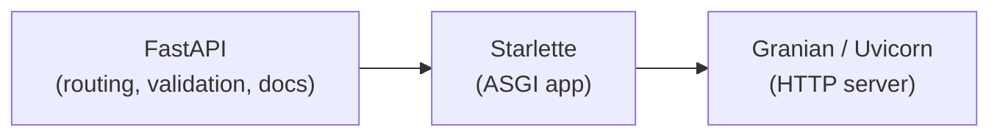
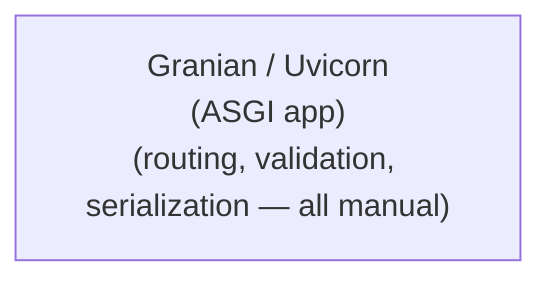
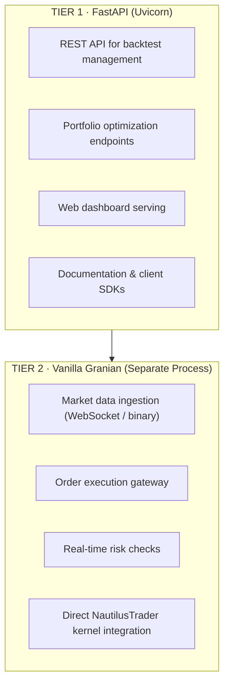
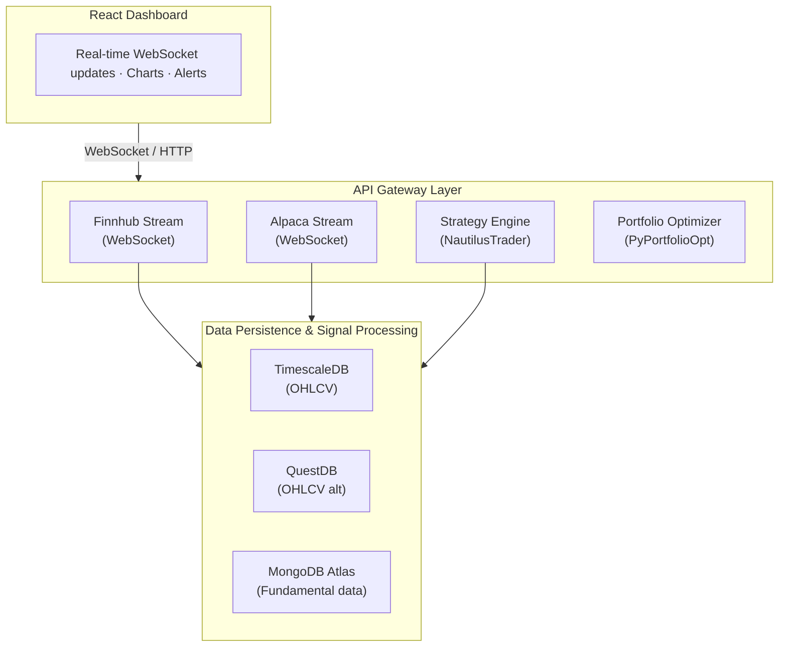
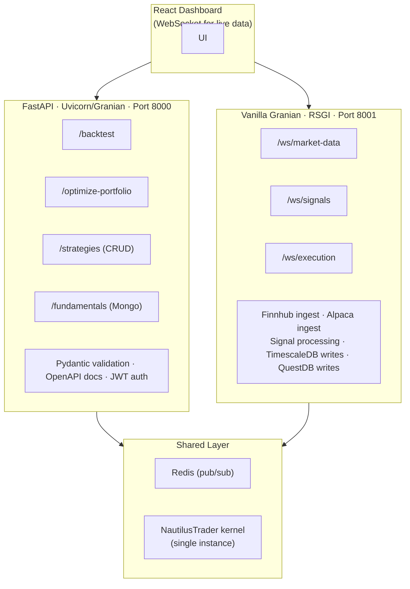
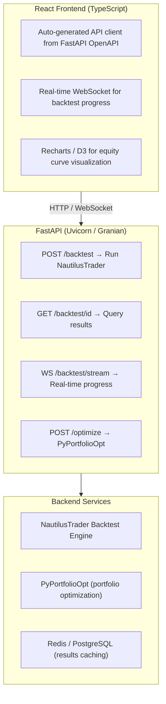

# ASGI Web Server — Framework Analysis

This document consolidates the analysis of ASGI Python web framework options for the trading platform built on NautilusTrader and PyPortfolioOpt. It covers architecture comparisons, performance benchmarks, database-specific optimizations, and recommendations for both research/backtesting and real-time trading use cases. For system-level context, see [system_design.md](system_design.md).

---

## Architecture Comparison

Two primary approaches exist for building the ASGI web layer: a full-stack framework (FastAPI/Starlette) on top of a high-performance server, or a vanilla ASGI/RSGI server with manual routing and validation.

### Option 1: Full Stack (FastAPI/Starlette + Granian/Uvicorn)



### Option 2: Vanilla Server (Granian/Uvicorn directly)



---

## Detailed Pros & Cons

### FastAPI/Starlette on Granian/Uvicorn

| Aspect | Pros | Cons |
|--------|------|------|
| **Development Speed** | ✅ Automatic OpenAPI docs · ✅ Pydantic validation · ✅ Dependency injection · ✅ Auto-generated client SDKs | ❌ ~30–40% performance overhead · ❌ Larger memory footprint · ❌ More dependencies |
| **Code Clarity** | ✅ Declarative route definitions · ✅ Type hints drive validation · ✅ Clean separation of concerns | ❌ "Magic" can obscure control flow · ❌ Steep learning curve for advanced features |
| **Trading System Fit** | ✅ Native Pydantic matches NautilusTrader · ✅ WebSocket support for real-time feeds · ✅ Easy integration with portfolio optimization APIs | ❌ May add latency to critical paths · ❌ Extra layers between market data and execution |
| **Maintenance** | ✅ Large community · ✅ Extensive documentation · ✅ Battle-tested in production | ❌ Framework updates may break APIs · ❌ Vendor lock-in to FastAPI patterns |

### Vanilla Granian/Uvicorn (Pure ASGI)

| Aspect | Pros | Cons |
|--------|------|------|
| **Performance** | ✅ Maximum throughput · ✅ Minimal memory allocation · ✅ No framework overhead · ✅ Direct control over event loop | ❌ Manual validation required · ❌ No auto-generated documentation · ❌ Reinvent routing, middleware |
| **Latency** | ✅ Lowest possible latency · ✅ No middleware stack traversal · ✅ Direct WebSocket handling | ❌ Must implement connection pooling · ❌ Manual error handling · ❌ No built-in CORS/security |
| **Trading System Fit** | ✅ Direct kernel integration · ✅ Custom serialization (MessagePack/Protobuf) · ✅ Fine-tuned for HFT patterns | ❌ Pydantic integration is manual · ❌ Portfolio optimization endpoints need boilerplate |
| **Maintenance** | ✅ No framework dependencies · ✅ Full control over upgrades · ✅ Smaller attack surface | ❌ All features built from scratch · ❌ Harder to onboard developers · ❌ Testing infrastructure needed |

---

## Performance Reality Check

Based on public TechEmpower-style benchmarks for a JSON API endpoint (parse params, body, return JSON):

| Configuration | Requests/sec | Latency 50% |
|---------------|-------------|-------------|
| **BlackSheep** | 10,505 | 4.70 ms |
| **Sanic** | 10,777 | 6.97 ms |
| **Starlette** | 8,135 | 6.03 ms |
| **FastAPI** | 5,882 | 8.36 ms |
| **Vanilla Uvicorn** | ~11,000* | ~3 ms* |

*\* Estimated based on Uvicorn's single-query leadership.*

**Key insight**: FastAPI adds ~30% overhead vs Starlette alone. Vanilla ASGI can approach BlackSheep/Sanic speeds.

---

## Framework Decision Matrix

| Criteria | FastAPI | Starlette + Pydantic | Vanilla Granian |
|----------|---------|---------------------|-----------------|
| **Development Speed** | ⭐⭐⭐ Excellent | ⭐⭐ Good | ⭐ Poor |
| **Auto API Documentation** | ⭐⭐⭐ Built-in | ⭐⭐ Manual setup | ⭐ None |
| **React Integration** | ⭐⭐⭐ Native CORS, JSON | ⭐⭐ Manual CORS | ⭐ Manual everything |
| **Backtest Endpoint Complexity** | ⭐⭐⭐ Easy | ⭐⭐ Moderate | ⭐ Verbose |
| **Performance (Sufficient?)** | ⭐⭐⭐ Yes for backtests | ⭐⭐⭐ Yes | ⭐⭐⭐ Overkill |
| **Team Onboarding** | ⭐⭐⭐ Easy | ⭐⭐ Moderate | ⭐ Hard |

---

## Recommendations for NautilusTrader + PyPortfolioOpt

### Use FastAPI/Starlette if:

- You're building a **trading dashboard** with many endpoints
- **Rapid iteration** is prioritized over micro-optimizations
- You need **OpenAPI documentation** for external integrations
- Team has mixed Python experience levels
- Portfolio optimization runs are **async batch jobs**, not real-time

```python
# FastAPI approach — clean but heavier
from fastapi import FastAPI
from nautilus_trader.trading.strategy import Strategy
from pypfopt.efficient_frontier import EfficientFrontier

app = FastAPI()

@app.post("/backtest")
async def run_backtest(config: BacktestConfig):  # Pydantic validation
    strategy = Strategy.load(config.strategy_id)
    results = await kernel.backtest(strategy, config.params)
    return {"sharpe": results.sharpe_ratio}
```

### Use Vanilla Granian/Uvicorn if:

- You're building a **market data gateway** or **execution engine**
- **Sub-millisecond latency** matters for alpha capture
- You want **custom binary protocols** (not just JSON)
- You have a specialized team capable of maintaining a custom stack
- You're doing **real-time portfolio rebalancing**

```python
# Vanilla ASGI — maximum control, more code
async def app(scope, receive, send):
    if scope['path'] == '/backtest':
        body = await read_body(receive)
        config = msgpack.unpackb(body)  # Manual deserialization

        # Direct kernel access, no framework overhead
        strategy = kernel.strategies.get(config[b'strategy_id'])
        results = await kernel.backtest(strategy, config[b'params'])

        await send({
            'type': 'http.response.start',
            'status': 200,
            'headers': [(b'content-type', b'application/msgpack')]
        })
        await send({
            'type': 'http.response.body',
            'body': msgpack.packb({'sharpe': results.sharpe_ratio})
        })
```

---

## Why FastAPI Wins for Backtesting + React

### Backtesting is compute-bound, not I/O-bound

The bottleneck is NautilusTrader's backtest engine, not the HTTP framework. A backtest taking seconds or minutes won't be materially faster with vanilla Granian's microsecond-level HTTP optimizations.

```python
@app.post("/backtest")
async def run_backtest(config: BacktestConfig) -> BacktestResults:
    strategy = load_strategy(config.strategy_id)
    # This dominates runtime (seconds), not FastAPI overhead (microseconds)
    results = await run_nautilus_backtest(strategy, config.params)
    return results  # Auto-serialized to JSON
```

### React frontend needs

| Requirement | FastAPI Solution |
|-------------|-----------------|
| CORS preflight | `CORSMiddleware` one-liner |
| Type-safe API | Auto-generated OpenAPI → TypeScript |
| Real-time updates | Native WebSocket support |
| File uploads (trade logs) | `UploadFile` dependency |
| Pagination (large results) | `fastapi-pagination` library |

```python
# CORS for React dev server
from fastapi.middleware.cors import CORSMiddleware

app.add_middleware(
    CORSMiddleware,
    allow_origins=["http://localhost:3000"],  # React dev
    allow_methods=["*"],
    allow_headers=["*"],
)
```

### Auto-generated client SDK

FastAPI exposes an OpenAPI spec at `/openapi.json` (also used by the `/docs` Swagger UI), which can be used to generate a TypeScript client automatically:

```bash
# Generate TypeScript client for React
npx openapi-typescript-codegen --input http://localhost:8000/openapi.json --output ./src/api
```

React code then gets full type safety:

```typescript
// Auto-generated from FastAPI models
const results = await BacktestService.runBacktest({
    strategy_id: "momentum_v1",
    start_date: "2024-01-01",
    parameters: { lookback: 20 }
});
```

### PyPortfolioOpt integration

FastAPI uses Pydantic for request/response models, and you can pass the validated data directly into PyPortfolioOpt:

```python
from pypfopt.efficient_frontier import EfficientFrontier
from pydantic import BaseModel

class OptimizationRequest(BaseModel):
    returns: list[list[float]]
    risk_free_rate: float = 0.02

@app.post("/optimize")
async def optimize_portfolio(request: OptimizationRequest):
    ef = EfficientFrontier(
        expected_returns=request.returns,
        cov_matrix=calculate_covariance(request.returns)
    )
    ef.max_sharpe()
    return {
        "weights": ef.clean_weights(),
        "performance": ef.portfolio_performance()
    }
```

---

## When to Consider Alternatives

### Choose Starlette + Pydantic if:

- You need middleware control FastAPI hides
- Want a lighter dependency tree (FastAPI pulls in Starlette + Pydantic anyway)
- Building reusable components across multiple ASGI projects

```python
# Starlette equivalent — more boilerplate
from starlette.applications import Starlette
from starlette.routing import Route
from pydantic import BaseModel
import json

class BacktestConfig(BaseModel):
    strategy_id: str

    @classmethod
    async def from_request(cls, request):
        body = await request.json()
        return cls(**body)

async def backtest_endpoint(request):
    config = await BacktestConfig.from_request(request)
    # ... manual validation, error handling, response formatting
    return JSONResponse({"results": ...})

app = Starlette(routes=[Route("/backtest", backtest_endpoint, methods=["POST"])])
```

### Choose Vanilla Granian if:

- You're building a **high-frequency trading gateway** (not backtesting)
- Need **custom binary protocols** (MessagePack/Protobuf) for efficiency
- Have a dedicated team to maintain infrastructure

For backtesting, this is premature optimization:

```python
# Vanilla ASGI — unnecessary complexity for this use case
async def app(scope, receive, send):
    if scope['path'] == '/backtest':
        # Manual: body reading, JSON parsing, validation, error handling, CORS...
        body = await read_body(receive)
        try:
            config = json.loads(body)
            # No auto-validation — manual checks everywhere
        except json.JSONDecodeError:
            await send_error(400, "Invalid JSON")
            return
        # ... 50 more lines vs FastAPI's 5
```

---

## Hybrid Architecture (Recommended for Production)

For production trading systems, a **two-tier approach** isolates research workloads from latency-critical paths.

### Simple two-tier overview



**Benefits:**

- FastAPI handles the "business logic" (portfolio optimization, reporting)
- Vanilla Granian handles the "hot path" (market data, execution)
- Both can share Pydantic models via a shared library
- Isolated failure domains

---

## Real-Time Trading: Why Vanilla Granian Wins

When the architecture grows to include multiple data sources, time-series databases, and live signal processing, the decision shifts toward vanilla Granian for the hot path.

### Architecture complexity



### Latency budget breakdown

| Component | Target Latency | FastAPI Overhead | Vanilla Granian |
|-----------|---------------|------------------|-----------------|
| Market data ingest (Finnhub/Alpaca) | < 5 ms | +2–5 ms | +0.5 ms |
| Signal calculation (NautilusTrader) | 10–50 ms | N/A (same) | N/A (same) |
| DB write (TimescaleDB/QuestDB) | 5–10 ms | N/A (same) | N/A (same) |
| WebSocket push to React | < 10 ms | +2–3 ms | +0.5 ms |
| **Total round-trip** | **~30–75 ms** | **+4–8 ms (10–25%)** | **Minimal** |

That 4–8 ms FastAPI overhead matters when you're competing with other algos.

### WebSocket performance (vanilla Granian)

```python
import asyncio
import msgpack
from granian.rsgi import RSGIProtocol  # public API (requires a Granian version that exposes RSGIProtocol here)

class TradingGateway:
    def __init__(self):
        self.clients = set()
        self.nautilus_kernel = NautilusKernel()

    async def handle_market_data(self, data: bytes):
        # Zero-copy deserialization
        tick = msgpack.unpackb(data, raw=False)

        # Direct kernel injection — no framework overhead
        signal = await self.nautilus_kernel.process_tick(tick)

        if signal:
            # Parallel: DB write + client broadcast
            await asyncio.gather(
                self.persist_to_timescaledb(signal, tick),
                self.broadcast_signal(signal)
            )

    async def broadcast_signal(self, signal):
        # Binary framing for efficiency
        payload = msgpack.packb({
            'timestamp': signal.timestamp,
            'action': signal.action,  # 'BUY' | 'SELL'
            'price': signal.price,
            'confidence': signal.confidence
        })
        for client in self.clients:
            await client.send(payload)
```

### Data ingestion with backpressure

```python
class DataIngestionManager:
    def __init__(self):
        # Pool is initialized asynchronously in `setup`
        self.timescale_pool = None
        self.quest_client = QuestDBClient()
        self.signal_queue = asyncio.Queue(maxsize=10000)  # Backpressure

    async def setup(self):
        # Create TimescaleDB connection pool
        self.timescale_pool = await asyncpg.create_pool(dsn="postgresql://...")
    async def finnhub_ingest(self):
        async with websockets.connect("wss://ws.finnhub.io") as ws:
            await ws.send('{"type":"subscribe","symbol":"AAPL"}')

            async for message in ws:
                if self.signal_queue.qsize() > 9000:
                    # Drop stale ticks rather than crash
                    logging.warning("Backpressure: dropping tick")
                    continue

                await self.signal_queue.put(('finnhub', message))

    async def process_pipeline(self):
        while True:
            source, data = await self.signal_queue.get()

            # Parallel persistence
            await asyncio.gather(
                self.write_ohlcv_timescaledb(data),
                self.enrich_fundamentals_mongodb(data),
                self.check_strategy_signals(data)
            )
```

---

## Production Hybrid Architecture



### Recommended architecture for backtesting + React frontend



### FastAPI service (research & configuration)

```python
# fastapi_service.py
from fastapi import FastAPI
from pydantic import BaseModel

app = FastAPI(title="Trading Research API")

@app.post("/backtest")
async def run_backtest(config: BacktestConfig):
    """Historical backtesting — not latency sensitive"""
    results = await kernel.backtest(config)
    return results

@app.get("/fundamentals/{ticker}")
async def get_fundamentals(ticker: str):
    """MongoDB Atlas query"""
    return await mongo.fundamentals.find_one({"ticker": ticker})
```

### Granian gateway (real-time hot path)

```python
# granian_gateway.py
import asyncio
import json
import logging
import msgpack
import os
from datetime import datetime

import aioredis
import asyncpg
import websockets
from granian.rsgi import RSGIProtocol  # public API; requires Granian >= 1.5.0

class RealtimeGateway:
    def __init__(self):
        self.redis = aioredis.from_url("redis://localhost")
        self.timescale_pool = None
        self.nautilus = None

    async def setup(self):
        self.timescale_pool = await asyncpg.create_pool(
            "postgresql://localhost/timescale"
        )
        self.nautilus = await NautilusKernel.create()

        # Start data ingestion
        asyncio.create_task(self.finnhub_ingest())
        asyncio.create_task(self.alpaca_ingest())

    async def finnhub_ingest(self):
        while True:
            try:
                async with websockets.connect(
                    f"wss://ws.finnhub.io?token={FINNHUB_KEY}"
                ) as ws:
                    await ws.send(json.dumps({
                        "type": "subscribe",
                        "symbol": "BINANCE:BTCUSDT"
                    }))

                    async for message in ws:
                        tick = json.loads(message)

                        # Redis pub + TimescaleDB async insert
                        await self.redis.publish(
                            "market:ticks", msgpack.packb(tick)
                        )

                        # TimescaleDB hypertable insert
                        await self.timescale_pool.execute(
                            "INSERT INTO ohlcv_1m (time, symbol, price, volume) "
                            "VALUES ($1, $2, $3, $4)",
                            datetime.fromtimestamp(tick['t'] / 1000),
                            tick['s'],
                            tick['p'],
                            tick['v']
                        )

                        # Signal check (non-blocking)
                        asyncio.create_task(self.check_signal(tick))

            except Exception as e:
                logging.error(f"Finnhub error: {e}")
                await asyncio.sleep(5)  # Reconnect backoff

    async def check_signal(self, tick):
        signal = await self.nautilus.process_tick(tick)
        if signal and signal.strength > 0.8:
            await self.redis.publish("signals:high", msgpack.packb({
                'symbol': tick['s'],
                'action': signal.action,
                'price': tick['p'],
                'timestamp': tick['t']
            }))

# RSGI application entry
gateway = RealtimeGateway()

async def app(scope, proto):
    if scope['type'] == 'websocket':
        pubsub = gateway.redis.pubsub()
        await pubsub.subscribe("market:ticks", "signals:high")

        async for message in pubsub.listen():
            if message['type'] == 'message':
                await proto.send(message['data'])

    elif scope['type'] == 'http':
        await proto.response(
            200,
            [(b'content-type', b'application/json')],
            b'{"status": "live"}'
        )
```

### Production-ready FastAPI setup

```python
# main.py
from fastapi import FastAPI
from contextlib import asynccontextmanager
from nautilus_trader.system.kernel import NautilusKernel

@asynccontextmanager
async def lifespan(app: FastAPI):
    # Startup: initialize trading kernel once
    app.state.kernel = NautilusKernel()
    await app.state.kernel.start()
    yield
    # Shutdown: cleanup
    await app.state.kernel.stop()

app = FastAPI(
    title="Trading Backtest API",
    lifespan=lifespan,
    docs_url="/api/docs" if settings.DEBUG else None,  # Hide docs in prod
)

# Run with: granian --interface asgi main:app --workers 4
# Or: uvicorn main:app --workers 4 (if Granian has issues)
```

---

## Database-Specific Optimizations

### TimescaleDB (primary OHLCV)

```python
async def batch_insert_ohlcv(self, ticks: list[dict]):
    """Copy-style insert for 10k+ ticks/sec"""
    async with self.timescale_pool.acquire() as conn:
        await conn.copy_records_to_table(
            'ohlcv_1m',
            records=[
                (t['time'], t['symbol'], t['open'], t['high'],
                 t['low'], t['close'], t['volume'])
                for t in ticks
            ]
        )
```

### QuestDB (alternative/backup)

```python
async def questdb_insert(self, tick: dict):
    """Influx Line Protocol for QuestDB"""
    line = (
        f"ohlcv,symbol={tick['symbol']} "
        f"price={tick['price']},volume={tick['volume']} "
        f"{tick['timestamp']}\n"
    )
    async with aiohttp.ClientSession() as session:
        await session.post("http://localhost:9000/write", data=line)
```

### MongoDB Atlas (fundamentals)

```python
from motor.motor_asyncio import AsyncIOMotorClient

mongo = AsyncIOMotorClient(os.getenv("MONGODB_ATLAS_URI"))
db = mongo.trading

async def get_fundamentals(ticker: str) -> dict:
    return await db.fundamentals.find_one(
        {"ticker": ticker},
        {"_id": 0}
    )
```

---

## Final Verdict

| Use Case | Recommendation | Reason |
|----------|---------------|--------|
| **Research / backtesting platform** | FastAPI on Uvicorn | Developer experience, docs, validation |
| **Your use case** (backtest + React) | **FastAPI** on Granian | 90% of vanilla performance with 10% of the code |
| **Building multiple ASGI services** | Starlette + Pydantic | Lighter framework, reusable components |
| **Live trading with < 10 ms latency** | Vanilla Granian | Sub-millisecond HTTP, direct kernel integration |
| **Real-time market data gateway** | Vanilla Granian (RSGI) | WebSocket control, binary protocols |
| **Signal processing** | Vanilla Granian + NautilusTrader | Direct kernel integration, no GIL contention |
| **Mixed system (research + production)** | Hybrid: FastAPI + Granian | FastAPI for research APIs, Granian for live trading |
| **Small team, rapid development** | FastAPI on Granian | Best of both worlds |

| Component | Technology | Reason |
|-----------|-----------|--------|
| **Data persistence** | TimescaleDB primary, QuestDB backup | Time-series optimized, high ingest rate |
| **Cross-service communication** | Redis pub/sub | Decoupling, backpressure handling |
| **Frontend** | React + WebSocket binary | msgpack for efficiency |

**Start with FastAPI on Granian** — you get Granian's Rust-based performance with FastAPI's developer experience. If latency becomes a bottleneck in production, extract the hot paths to vanilla Granian. Given multi-source real-time requirements, **build the gateway in vanilla Granian from day one** — the complexity is justified by the latency requirements.
