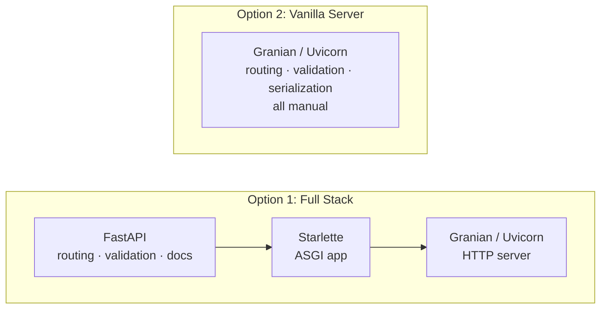
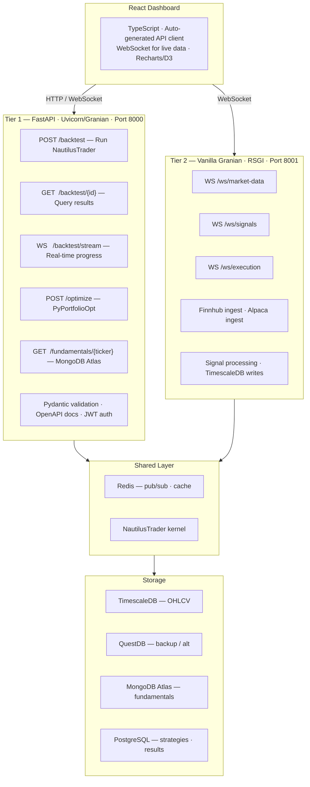

# ASGI Web Server: Framework & Architecture Decision

## Decision Summary

**FastAPI on Granian** is the default ASGI web server stack for QuantLens. For production systems with real-time market data ingestion, extract latency-critical paths to **vanilla Granian (RSGI)** using a hybrid two-tier architecture.

---

## Context

QuantLens serves two distinct workload profiles through its web layer:

1. **Research & backtesting** — REST endpoints for running NautilusTrader simulations, portfolio optimization via PyPortfolioOpt, strategy CRUD, and serving results to a React frontend. These are compute-bound; the HTTP framework is not the bottleneck.
2. **Real-time trading** — WebSocket streaming of market data from multiple providers (Finnhub, Alpaca), live signal processing, and order execution. These are I/O-bound and latency-sensitive.

This document evaluates three approaches — FastAPI, Starlette+Pydantic, and vanilla Granian — and recommends an architecture that matches each workload to the right tool.

---

## Architecture Options



---

## Comparison

### FastAPI on Granian/Uvicorn

| Aspect | Pros | Cons |
|--------|------|------|
| **Development Speed** | Automatic OpenAPI docs, Pydantic validation, dependency injection, auto-generated client SDKs | ~30–40 % performance overhead, larger memory footprint, more dependencies |
| **Code Clarity** | Declarative route definitions, type hints drive validation, clean separation of concerns | "Magic" can obscure control flow, steep learning curve for advanced features |
| **Trading System Fit** | Native Pydantic matches NautilusTrader, WebSocket support for real-time feeds, easy PyPortfolioOpt integration | May add latency to critical paths, extra layers between market data and execution |
| **Maintenance** | Large community, extensive documentation, battle-tested in production | Framework updates may break APIs, vendor lock-in to FastAPI patterns |

### Vanilla Granian/Uvicorn (Pure ASGI)

| Aspect | Pros | Cons |
|--------|------|------|
| **Performance** | Maximum throughput, minimal memory allocation, no framework overhead, direct control over event loop | Manual validation, no auto-generated documentation, must reinvent routing and middleware |
| **Latency** | Lowest possible latency, no middleware stack traversal, direct WebSocket handling | Must implement connection pooling, manual error handling, no built-in CORS/security |
| **Trading System Fit** | Direct kernel integration, custom serialization (MessagePack/Protobuf), fine-tuned for HFT patterns | Pydantic integration is manual, portfolio optimization endpoints need boilerplate |
| **Maintenance** | No framework dependencies, full control over upgrades, smaller attack surface | All features built from scratch, harder to onboard developers, testing infrastructure needed |

### Decision Matrix

| Criteria | FastAPI | Starlette + Pydantic | Vanilla Granian |
|----------|---------|----------------------|-----------------|
| Development speed | ⭐⭐⭐ | ⭐⭐ | ⭐ |
| Auto API documentation | ⭐⭐⭐ Built-in | ⭐⭐ Manual setup | ⭐ None |
| React integration | ⭐⭐⭐ Native CORS, JSON | ⭐⭐ Manual CORS | ⭐ Manual everything |
| Backtest endpoint complexity | ⭐⭐⭐ Easy | ⭐⭐ Moderate | ⭐ Verbose |
| Performance (sufficient?) | ⭐⭐⭐ Yes for backtests | ⭐⭐⭐ Yes | ⭐⭐⭐ Overkill for REST |
| Team onboarding | ⭐⭐⭐ Easy | ⭐⭐ Moderate | ⭐ Hard |

---

## Performance Reality Check

Backtesting is **compute-bound, not I/O-bound**. A NautilusTrader simulation taking seconds to minutes will not be materially faster with vanilla Granian's microsecond-level HTTP optimizations. The framework overhead is noise compared to engine runtime.

For the real-time path, the overhead matters:

| Configuration | Requests/sec | Latency p50 |
|---------------|-------------|-------------|
| BlackSheep | 10 505 | 4.70 ms |
| Sanic | 10 777 | 6.97 ms |
| Starlette | 8 135 | 6.03 ms |
| FastAPI | 5 882 | 8.36 ms |
| Vanilla Uvicorn (est.) | ~11 000 | ~3 ms |

FastAPI adds ~30 % overhead versus Starlette alone. Vanilla ASGI approaches BlackSheep/Sanic speeds.

### Latency Budget — Real-Time Trading Path

| Component | Target | FastAPI overhead | Vanilla Granian |
|-----------|--------|------------------|-----------------|
| Market data ingest (Finnhub/Alpaca) | < 5 ms | +2–5 ms | +0.5 ms |
| Signal calculation (NautilusTrader) | 10–50 ms | same | same |
| DB write (TimescaleDB/QuestDB) | 5–10 ms | same | same |
| WebSocket push to React | < 10 ms | +2–3 ms | +0.5 ms |
| **Total round-trip** | **~30–75 ms** | **+4–8 ms (10–25 %)** | **Minimal** |

---

## Why FastAPI Wins for Research & Backtesting

### 1. React Frontend Needs

| Requirement | FastAPI Solution |
|-------------|-----------------|
| CORS preflight | `CORSMiddleware` one-liner |
| Type-safe API | Auto-generated OpenAPI → TypeScript client |
| Real-time updates | Native WebSocket support |
| File uploads (trade logs) | `UploadFile` dependency |
| Pagination (large results) | `fastapi-pagination` library |

### 2. Auto-Generated Client SDK

FastAPI's `/docs` endpoint produces an OpenAPI spec that generates a TypeScript client automatically:

```bash
# Generate TypeScript client for React
npx openapi-typescript-codegen \
  --input http://localhost:8000/openapi.json \
  --output ./src/api
```

```typescript
// Auto-generated — full type safety in React
const results = await BacktestService.runBacktest({
    strategy_id: "momentum_v1",
    start_date: "2024-01-01",
    parameters: { lookback: 20 },
});
```

### 3. PyPortfolioOpt Integration

Both FastAPI and PyPortfolioOpt use Pydantic, giving seamless compatibility:

```python
from pypfopt.efficient_frontier import EfficientFrontier
from pydantic import BaseModel

class OptimizationRequest(BaseModel):
    returns: list[list[float]]
    risk_free_rate: float = 0.02

@app.post("/optimize")
async def optimize_portfolio(request: OptimizationRequest):
    ef = EfficientFrontier(
        expected_returns=request.returns,
        cov_matrix=calculate_covariance(request.returns),
    )
    ef.max_sharpe()
    return {
        "weights": ef.clean_weights(),
        "performance": ef.portfolio_performance(),
    }
```

### 4. Clean Backtest Endpoints

```python
@app.post("/backtest")
async def run_backtest(config: BacktestConfig) -> BacktestResults:
    strategy = load_strategy(config.strategy_id)
    # This dominates runtime (seconds), not FastAPI overhead (microseconds)
    results = await run_nautilus_backtest(strategy, config.params)
    return results  # Auto-serialized to JSON
```

---

## Why Vanilla Granian Wins for Real-Time Trading

When the system handles multiple streaming data sources, live signal processing, and order execution, vanilla Granian (or RSGI) provides the control and latency characteristics the hot path demands.

### WebSocket Performance

Real-time trading requires bidirectional streaming with minimal overhead:

```python
import asyncio
import msgpack

class TradingGateway:
    def __init__(self):
        self.clients: set = set()
        self.nautilus_kernel = NautilusKernel()

    async def handle_market_data(self, data: bytes):
        tick = msgpack.unpackb(data, raw=False)

        # Direct kernel injection — no framework overhead
        signal = await self.nautilus_kernel.process_tick(tick)

        if signal:
            await asyncio.gather(
                self.persist_to_timescaledb(signal, tick),
                self.broadcast_signal(signal),
            )

    async def broadcast_signal(self, signal):
        payload = msgpack.packb({
            "timestamp": signal.timestamp,
            "action": signal.action,
            "price": signal.price,
            "confidence": signal.confidence,
        })
        for client in self.clients:
            await client.send(payload)
```

### Data Ingestion with Backpressure

Multiple streaming sources need backpressure handling to stay resilient:

```python
class DataIngestionManager:
    def __init__(self):
        self.timescale_pool = asyncpg.create_pool(dsn="postgresql://...")
        self.signal_queue = asyncio.Queue(maxsize=10_000)

    async def finnhub_ingest(self):
        async with websockets.connect("wss://ws.finnhub.io") as ws:
            await ws.send('{"type":"subscribe","symbol":"AAPL"}')
            async for message in ws:
                if self.signal_queue.qsize() > 9_000:
                    logging.warning("Backpressure: dropping tick")
                    continue
                await self.signal_queue.put(("finnhub", message))

    async def process_pipeline(self):
        while True:
            source, data = await self.signal_queue.get()
            await asyncio.gather(
                self.write_ohlcv_timescaledb(data),
                self.check_strategy_signals(data),
            )
```

---

## Recommended Architecture: Hybrid Two-Tier

For production systems that combine research and real-time trading, split the workload across two processes:



### Benefits

- **FastAPI** handles business logic (portfolio optimization, backtesting, reporting) with full developer experience.
- **Vanilla Granian** handles the hot path (market data ingestion, order execution, real-time risk) with minimal latency.
- Both tiers share Pydantic models via a shared library.
- Isolated failure domains — a crash in the research API does not affect live trading.
- **Redis pub/sub** decouples the tiers with built-in backpressure handling.

---

## Implementation

### Tier 1 — FastAPI Service

```python
# fastapi_service.py
from fastapi import FastAPI
from fastapi.middleware.cors import CORSMiddleware
from contextlib import asynccontextmanager
from concurrent.futures import ProcessPoolExecutor

@asynccontextmanager
async def lifespan(app: FastAPI):
    app.state.kernel = NautilusKernel()
    await app.state.kernel.start()
    yield
    await app.state.kernel.stop()

app = FastAPI(title="Trading Backtest API", lifespan=lifespan)
executor = ProcessPoolExecutor(max_workers=4)

app.add_middleware(
    CORSMiddleware,
    allow_origins=["http://localhost:3000"],  # React dev server
    allow_methods=["*"],
    allow_headers=["*"],
)

@app.post("/backtest")
async def run_backtest(config: BacktestConfig):
    results = await app.state.kernel.backtest(config)
    return results

@app.post("/optimize-portfolio")
async def optimize_portfolio(holdings: dict):
    loop = asyncio.get_event_loop()
    return await loop.run_in_executor(executor, run_optimization_sync, holdings)

# Run with: granian --interface asgi main:app --workers 4
```

### Tier 2 — Vanilla Granian Gateway

```python
# granian_gateway.py
import asyncio
import json
import logging
import msgpack
import aioredis
import asyncpg
import websockets

class RealtimeGateway:
    def __init__(self):
        self.redis = aioredis.from_url("redis://localhost")
        self.timescale_pool = None
        self.nautilus = None

    async def setup(self):
        self.timescale_pool = await asyncpg.create_pool("postgresql://localhost/timescale")
        self.nautilus = await NautilusKernel.create()
        asyncio.create_task(self.finnhub_ingest())
        asyncio.create_task(self.alpaca_ingest())

    async def finnhub_ingest(self):
        while True:
            try:
                async with websockets.connect(
                    "wss://ws.finnhub.io?token=" + FINNHUB_KEY
                ) as ws:
                    await ws.send(json.dumps({
                        "type": "subscribe",
                        "symbol": "BINANCE:BTCUSDT",
                    }))
                    async for message in ws:
                        tick = json.loads(message)
                        pipe = self.redis.pipeline()
                        pipe.publish("market:ticks", msgpack.packb(tick))
                        await pipe.execute()

                        await self.timescale_pool.execute(
                            "INSERT INTO ohlcv_1m (time, symbol, price, volume) "
                            "VALUES ($1, $2, $3, $4)",
                            datetime.fromtimestamp(tick["t"] / 1000),
                            tick["s"],
                            tick["p"],
                            tick["v"],
                        )
                        asyncio.create_task(self.check_signal(tick))
            except Exception as e:
                logging.error(f"Finnhub reconnect after: {e}")
                await asyncio.sleep(5)

    async def check_signal(self, tick):
        signal = await self.nautilus.process_tick(tick)
        if signal and signal.strength > 0.8:
            await self.redis.publish(
                "signals:high",
                msgpack.packb({
                    "symbol": tick["s"],
                    "action": signal.action,
                    "price": tick["p"],
                    "timestamp": tick["t"],
                }),
            )

gateway = RealtimeGateway()

async def app(scope, proto):
    if scope["type"] == "websocket":
        pubsub = gateway.redis.pubsub()
        await pubsub.subscribe("market:ticks", "signals:high")
        async for message in pubsub.listen():
            if message["type"] == "message":
                await proto.send(message["data"])
    elif scope["type"] == "http":
        await proto.response(
            200,
            [(b"content-type", b"application/json")],
            b'{"status": "live"}',
        )
```

---

## Database-Specific Patterns

### TimescaleDB (Primary OHLCV)

```python
async def batch_insert_ohlcv(pool, ticks: list[dict]):
    """Copy-style insert for high-throughput ingestion."""
    async with pool.acquire() as conn:
        await conn.copy_records_to_table(
            "ohlcv_1m",
            records=[
                (t["time"], t["symbol"], t["open"], t["high"],
                 t["low"], t["close"], t["volume"])
                for t in ticks
            ],
        )
```

### QuestDB (Alternative/Backup)

```python
async def questdb_insert(session, tick: dict):
    """Influx Line Protocol for QuestDB."""
    line = (
        f"ohlcv,symbol={tick['symbol']} "
        f"price={tick['price']},volume={tick['volume']} "
        f"{tick['timestamp']}\n"
    )
    await session.post("http://localhost:9000/write", data=line)
```

### MongoDB Atlas (Fundamentals)

```python
from motor.motor_asyncio import AsyncIOMotorClient

mongo = AsyncIOMotorClient(os.getenv("MONGODB_ATLAS_URI"))
db = mongo.trading

async def get_fundamentals(ticker: str) -> dict:
    return await db.fundamentals.find_one({"ticker": ticker}, {"_id": 0})
```

---

## Final Verdict

| Use Case | Recommendation |
|----------|----------------|
| **Research / backtesting platform** | FastAPI on Granian |
| **Live trading with < 10 ms latency** | Vanilla Granian (RSGI) |
| **Mixed system (research + production)** | Hybrid — FastAPI for research APIs, vanilla Granian for live trading |
| **Small team, rapid development** | FastAPI on Granian (best of both worlds) |
| **Multiple real-time data sources** | Build the gateway in vanilla Granian from day one |

For QuantLens specifically — backtesting NautilusTrader strategies and serving results to a React frontend — start with **FastAPI on Granian**. Granian's Rust-based HTTP layer delivers strong baseline performance, and FastAPI's developer experience (OpenAPI docs, Pydantic validation, CORS middleware) eliminates boilerplate. If profiling reveals latency bottlenecks on the real-time path, extract those endpoints to a vanilla Granian service using the hybrid architecture above.

| Component | Technology | Reason |
|-----------|-----------|--------|
| Research / backtest API | FastAPI on Granian | Developer experience, docs, validation |
| Real-time market data gateway | Vanilla Granian (RSGI) | Sub-millisecond latency, WebSocket control |
| Signal processing | Vanilla Granian + NautilusTrader | Direct kernel integration |
| Data persistence | TimescaleDB primary, QuestDB backup | Time-series optimized, high ingest rate |
| Cross-service communication | Redis pub/sub | Decoupling, backpressure handling |
| Frontend | React + WebSocket (msgpack) | Binary framing for efficiency |

See also: [asgi_rsgi_wsgi.md](asgi_rsgi_wsgi.md) for the ASGI vs WSGI vs RSGI interface decision.
