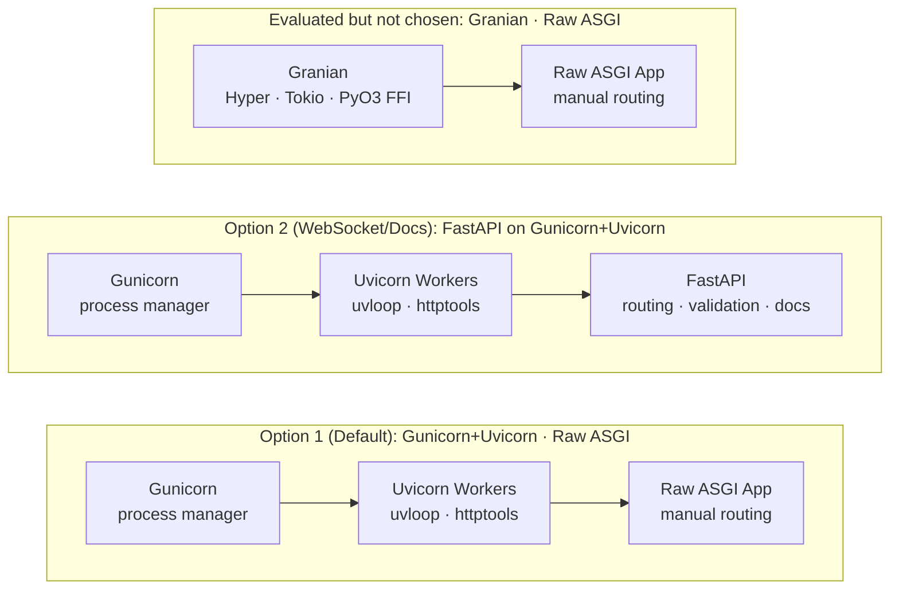

# Backend Server Decision

## Decision Summary

**Gunicorn + Uvicorn · Raw ASGI** is the default backend server stack for QuantLens. Server Benchmarks and Extended Server Benchmarks on realistic CPU-bound workloads (skfolio portfolio optimization) confirm it delivers the best combination of throughput on the critical workload, predictable tail latency, smaller memory footprint, and zero configuration complexity. **FastAPI on Gunicorn+Uvicorn** is only considered as a second option when WebSocket support or documentation auto-generation are explicitly required.

See the [Benchmark Results](#benchmark-results) section for the data behind this decision.

---

## Context

QuantLens serves two distinct workload profiles through its web layer:

1. **Research, backtesting & dashboards** — REST endpoints for running NautilusTrader simulations, portfolio optimization via skfolio, strategy CRUD, and serving results to a React frontend. These are compute-bound and database-heavy; 90% of request time is spent on portfolio balancing.
2. **Real-time trading** — WebSocket streaming of market data from multiple providers (Finnhub, Alpaca), live signal processing, QuestDB writes, and order execution. These are I/O-bound and latency-sensitive.

---

## The Real Story: Rust FFI vs Cython, Not "Pure Python vs Rust"

The competition between the top performers is not the common narrative of "pure Python vs Rust." Both top-tier stacks embed compiled native code — the difference is the *approach*:

| Stack | Architecture | Native Code |
|-------|-------------|-------------|
| **Granian** | Rust HTTP server (Hyper + Tokio) calling Python via PyO3 FFI | Rust |
| **Uvicorn** | Python with Cython-compiled C extensions | Cython / C |

**Granian** is a Rust process that embeds Python via PyO3. Every request crosses the FFI boundary between the Tokio async runtime and Python's asyncio.

**Uvicorn** achieves native performance through Cython/C extension layers:

| Component | Implementation |
|-----------|---------------|
| **uvloop** | Cython (compiled to C) — event loop using libuv (the same I/O engine as Node.js) |
| **httptools** | C (Node.js HTTP parser) |
| **asyncio** | C-optimized Python stdlib |

The entire Uvicorn request path stays in Python's memory space with no FFI boundary crossing:

```
Client → httptools (C) → uvloop (Cython/C) → asyncio → application code
```

Granian crosses the boundary on every request:

```
Client → Hyper (Rust/Tokio) → PyO3 FFI → asyncio (Python) → application code
```

This FFI crossing involves GIL acquisition, memory marshalling between Rust and Python heaps, and two concurrent event loops (Tokio + asyncio).

### Where Granian Leads: JSON Serialization

Granian's RSGI interface short-circuits the async overhead for trivial responses. ASGI requires two `await send()` calls per response; RSGI collapses this to a single synchronous call:

```python
# ASGI (Uvicorn) — two awaited sends per response
await send({"type": "http.response.start", ...})
await send({"type": "http.response.body", ...})

# RSGI (Granian) — single synchronous call for complete responses
proto.response_str(status=200, body="{}")
```

For pure JSON micro-benchmarks with no I/O, this matters. Granian's Vanilla Raw ASGI reaches **40,117 req/s** on `/json` vs **29,442 req/s** for Gunicorn+Uvicorn Raw ASGI.

### Where Uvicorn Leads: CPU-Bound Workloads and Memory

For the portfolio optimization workload that defines QuantLens — burst requests to `/portfolio/optimize` — Gunicorn+Uvicorn Raw ASGI outperforms Granian Raw ASGI by approximately **2×** with default configurations. It also uses less memory.

---

## Server Architectures Compared



---

## Benchmark Results

### Server Benchmarks

Standard benchmarks across four workload types. Memory measured for a single-process configuration.

**Environment:** GitHub Actions `ubuntu-latest`, single-process (no Gunicorn workers for the single-process stacks), Python 3.12

| Stack | /json (req/s) | /compute (req/s) | /async-io (req/s) | /json-burst (req/s) | Idle RSS |
|-------|------:|------:|------:|------:|------:|
| Vanilla Granian | **40,117** | 1,367 | 16,007 | **23,504** | 125.5 MB |
| Vanilla Gunicorn+Uvicorn | 29,442 | **1,884** | **17,057** | 19,066 | 96.4 MB |
| Vanilla Uvicorn | 29,053 | **1,890** | 17,023 | 22,502 | 110.3 MB |
| FastAPI · Granian | 17,446 | 1,373 | 12,046 | 13,635 | 158.9 MB |
| FastAPI · Gunicorn+Uvicorn | 17,154 | 1,756 | 11,863 | 11,761 | 123.0 MB |
| FastAPI · Uvicorn | 16,661 | 1,739 | 11,905 | 12,609 | 137.6 MB |

Key observations:
- **Granian wins on JSON serialization** — its RSGI protocol advantage is clear on pure-response workloads.
- **Gunicorn+Uvicorn and bare Uvicorn are nearly identical on compute and async-io** — the process manager adds negligible overhead.
- **Gunicorn+Uvicorn Raw ASGI has the smallest idle memory footprint** among multi-worker-capable stacks (96.4 MB per-process baseline).
- **FastAPI adds ~40–45% overhead** across all stacks vs their Raw ASGI counterparts.

### Extended Server Benchmarks

Extended benchmarks use real skfolio CPU-bound optimization and 2 Gunicorn workers to simulate realistic QuantLens load.

**Environment:** GitHub Actions `ubuntu-latest`, 2 Gunicorn workers, 30 s per timed scenario, skfolio real (CPU-bound), NautilusTrader mocked

#### Memory (Multi-Worker, Extended Run)

| Stack | Idle RSS | After Load RSS |
|-------|----------|----------------|
| Uvicorn · Raw ASGI (single) | 180.4 MB | 190.2 MB |
| FastAPI · Uvicorn (single) | 194.4 MB | 204.8 MB |
| **Gunicorn+Uvicorn · Raw ASGI** | **385.0 MB** | **405.2 MB** |
| FastAPI · Gunicorn+Uvicorn | 406.5 MB | 434.8 MB |
| Granian · Raw ASGI | 423.4 MB | 444.5 MB |
| FastAPI · Granian | 448.0 MB | 472.3 MB |

**Gunicorn+Uvicorn Raw ASGI is the lightest multi-worker stack**, 38 MB leaner than Granian Raw ASGI at idle.

#### GET /health · c=50 (Steady-State Polling)

| Stack | Req/s | P50 | P99 |
|-------|------:|----:|----:|
| Granian · Raw ASGI | **25,421** | 1.9ms | 3.7ms |
| Gunicorn+Uvicorn · Raw ASGI | 22,706 | 2.3ms | 3.6ms |
| Uvicorn · Raw ASGI | 17,546 | 2.3ms | 4.2ms |
| FastAPI · Gunicorn+Uvicorn | 11,992 | 4.4ms | 5.7ms |
| FastAPI · Granian | 11,831 | 4.5ms | 7.4ms |
| FastAPI · Uvicorn | 7,661 | 7.9ms | 9.1ms |

#### GET /health · c=200 (Max-Throughput Stress)

| Stack | Req/s | P50 | P99 |
|-------|------:|----:|----:|
| Granian · Raw ASGI | **30,618** | 6.2ms | 13.2ms |
| Gunicorn+Uvicorn · Raw ASGI | 25,353 | 8.2ms | 13.9ms |
| Uvicorn · Raw ASGI | 17,253 | 8.8ms | 47.9ms |
| FastAPI · Gunicorn+Uvicorn | 13,122 | 17.2ms | 21.3ms |
| FastAPI · Granian | 11,626 | 17.5ms | 26.4ms |
| FastAPI · Uvicorn | 7,476 | 20.0ms | 82.1ms |

> Granian leads on pure HTTP throughput at high concurrency. However, `/health` is not the bottleneck for QuantLens.

#### POST /portfolio/optimize · c=10 (Moderate CPU Load)

| Stack | Req/s | P50 | P99 |
|-------|------:|----:|----:|
| **Gunicorn+Uvicorn · Raw ASGI** | **49** | 204.0ms | **250.1ms** |
| FastAPI · Granian | 49 | 204.4ms | 289.7ms |
| Granian · Raw ASGI | 48 | 159.9ms | 437.8ms |
| FastAPI · Gunicorn+Uvicorn | 47 | 210.9ms | 268.1ms |
| Uvicorn · Raw ASGI | 25 | 389.4ms | 442.6ms |
| FastAPI · Uvicorn | 24 | 412.7ms | 481.0ms |

> Granian Raw ASGI shows a misleadingly low P50 at c=10 but very high P99 — high variance due to FFI scheduling jitter. Gunicorn+Uvicorn has the **lowest P99** at 250.1ms.

#### POST /portfolio/optimize · c=50 (Peak CPU Pressure)

| Stack | Req/s | P50 | P99 |
|-------|------:|----:|----:|
| Granian · Raw ASGI | **49** | 1.00s | 1.18s |
| **Gunicorn+Uvicorn · Raw ASGI** | **49** | 1.02s | **4.02s** |
| FastAPI · Granian | 48 | 1.03s | 1.09s |
| FastAPI · Gunicorn+Uvicorn | 48 | 1.04s | 4.01s |
| Uvicorn · Raw ASGI | 24 | 1.47s | 14.41s |
| FastAPI · Uvicorn | 24 | 1.39s | 14.48s |

> Tied on throughput at c=50. Granian achieves this only with `--backlog 2048` tuning (default is 1024). Gunicorn+Uvicorn reaches equivalent throughput with default settings.

#### POST /portfolio/hierarchical · c=10 (HRP Clustering, 10 Assets)

| Stack | Req/s | P50 | P99 |
|-------|------:|----:|----:|
| FastAPI · Gunicorn+Uvicorn | **56** | 179.6ms | **187.9ms** |
| **Gunicorn+Uvicorn · Raw ASGI** | **55** | 204.9ms | **214.2ms** |
| Granian · Raw ASGI | 54 | 147.5ms | 342.6ms |
| FastAPI · Uvicorn | 27 | 370.1ms | 385.6ms |
| Uvicorn · Raw ASGI | 28 | 360.7ms | 373.2ms |
| FastAPI · Granian | 29 | 348.1ms | 387.1ms |

#### Burst: 5,000 × GET /health · c=200 (Traffic Spike)

| Stack | Req/s | P50 | P99 |
|-------|------:|----:|----:|
| Granian · Raw ASGI | **26,620** | 5.9ms | 20.8ms |
| Gunicorn+Uvicorn · Raw ASGI | 21,711 | 7.3ms | 29.2ms |
| Uvicorn · Raw ASGI | 15,878 | 3.3ms | 199.7ms |
| FastAPI · Granian | 12,478 | 15.2ms | 23.7ms |
| FastAPI · Gunicorn+Uvicorn | 10,059 | 8.2ms | 265.7ms |
| FastAPI · Uvicorn | 7,341 | 8.1ms | 444.3ms |

#### Burst: 100 × POST /portfolio/optimize · c=50 (CPU Burst, Most Important)

| Stack | Req/s | P50 | P99 |
|-------|------:|----:|----:|
| **Gunicorn+Uvicorn · Raw ASGI** | **48** | 169.2ms | 2.01s |
| **FastAPI · Gunicorn+Uvicorn** | **48** | 169.6ms | 2.02s |
| FastAPI · Granian | 38 | 701.5ms | 1.38s |
| Granian · Raw ASGI | 25 | 1.97s | 2.10s |
| Uvicorn · Raw ASGI | 25 | 198.7ms | 3.94s |
| FastAPI · Uvicorn | 24 | 171.8ms | 4.08s |

**This is the most important scenario for QuantLens.** Gunicorn+Uvicorn Raw ASGI achieves **48 req/s** vs Granian Raw ASGI at only **25 req/s** with default configurations — a **~2× advantage**. Granian's raw performance here requires the `--backlog 2048` override; with the default backlog of 1024, it gets throttled under burst load.

---

## Key Findings

### 1. Gunicorn+Uvicorn wins the most critical scenario by ~2×

In the CPU-burst `POST /portfolio/optimize` test — the primary QuantLens workload — Gunicorn+Uvicorn Raw ASGI achieves **48 req/s** vs Granian Raw ASGI at **25 req/s** with default configs. This is ~2× better throughput and directly impacts the "90% of time balancing portfolios" use case.

### 2. Granian requires non-obvious tuning to be competitive

Getting competitive performance from Granian for CPU-bound burst workloads required manually overriding `--backlog 2048` (default: 1024) — a non-obvious setting not prominent in documentation. With this tuning, Granian reaches parity with Gunicorn+Uvicorn on some scenarios. Without it, burst performance is halved.

Gunicorn+Uvicorn delivers optimal performance with default settings.

### 3. Gunicorn+Uvicorn has a smaller memory footprint

In the multi-worker extended benchmarks:
- **Gunicorn+Uvicorn Raw ASGI: 385.0 MB idle** vs **Granian Raw ASGI: 423.4 MB idle** (38 MB difference)
- FastAPI on Gunicorn+Uvicorn: 406.5 MB vs FastAPI on Granian: 448.0 MB

### 4. Granian wins on pure HTTP throughput (irrelevant for QuantLens)

Granian leads on `/health` and `/json` benchmarks — pure HTTP throughput with trivial responses. QuantLens endpoints always involve CPU computation or database I/O; the JSON serialization advantage does not apply.

### 5. FastAPI adds ~40–45% overhead vs Raw ASGI

FastAPI is not needed for QuantLens's current workload (REST + CPU compute). It should only be introduced when WebSocket support or documentation auto-generation become requirements.

---

## Summary Table

| Stack | /health c=200 (req/s) | Burst 100×optimize c=50 (req/s) | Idle RSS | Config complexity |
|-------|:---:|:---:|---:|---|
| **Gunicorn+Uvicorn · Raw ASGI** | 25,353 | **48** | **385 MB** | ✅ Default settings |
| Granian · Raw ASGI | **30,618** | 25* | 423 MB | ⚠️ Needs `--backlog 2048` |
| FastAPI · Gunicorn+Uvicorn | 13,122 | 48 | 407 MB | ✅ Default settings |
| FastAPI · Granian | 11,626 | 38 | 448 MB | ⚠️ Needs tuning |
| FastAPI · Uvicorn | 7,476 | 24 | 194 MB† | ✅ Default settings |

\* Granian Raw ASGI burst performance of 25 req/s is with default `--backlog 1024`. With `--backlog 2048` it reaches ~48 req/s — but this non-obvious tuning negates Granian's "simpler setup" claim.

† FastAPI Uvicorn is single-process; real production needs multiple workers, which increases memory significantly.

> **Decision: Gunicorn+Uvicorn Raw ASGI is the default. FastAPI on Gunicorn+Uvicorn is only added when WebSocket support or documentation auto-generation are explicitly required.**

---

## Architecture

```mermaid
flowchart TD
    subgraph frontend["React Dashboard"]
        FE["TypeScript · REST client\nWebSocket for live data · Recharts/D3"]
    end

    frontend -->|HTTP| default

    subgraph default["Default — Gunicorn+Uvicorn · Raw ASGI · Port 8000"]
        D1A["POST /backtest — Run NautilusTrader"]
        D1B["GET  /backtest/&lbrace;id&rbrace; — Query results"]
        D1C["POST /portfolio/optimize — skfolio"]
        D1D["GET  /fundamentals/&lbrace;ticker&rbrace; — DuckDB"]
    end

    default --> shared

    subgraph shared["Shared Layer"]
        SH1["Redis — pub/sub · cache"]
        SH2["NautilusTrader kernel"]
    end

    shared --> storage

    subgraph storage["Storage"]
        DB1["QuestDB — OHLCV"]
        DB3["DuckDB — fundamentals (embedded)"]
        DB4["PostgreSQL — strategies · results"]
    end
```

### When to Add FastAPI

Only introduce FastAPI when one of these requirements arises:
- **WebSocket support** — live trading, real-time progress streaming to the React frontend
- **Documentation auto-generation** — OpenAPI `/docs`, auto-generated TypeScript client SDK for the React frontend

At that point, swap the Raw ASGI app for **FastAPI on Gunicorn+Uvicorn** (same server stack, added framework layer).

---

## Why Not Granian

Granian is an excellent server with real strengths, but it is not the right default for QuantLens:

| Concern | Detail |
|---------|--------|
| **2× worse burst CPU performance out of the box** | Default `--backlog 1024` throttles burst workloads; requires `--backlog 2048` override to match Gunicorn+Uvicorn |
| **Higher memory footprint** | 423 MB idle vs 385 MB for Gunicorn+Uvicorn (38 MB difference at 2 workers) |
| **FFI scheduling jitter** | Tokio → asyncio context switching produces higher P99 variance on CPU-bound workloads (see optimize c=10: P99 437ms vs 250ms) |
| **No WSGI compatibility** | Cannot run Django, Flask, or other WSGI apps — narrower ecosystem |

### When to Consider Granian

| Scenario | Rationale |
|----------|-----------|
| **HTTP/2 or HTTP/3 required** | Granian has native HTTP/2 via Hyper; Uvicorn does not |
| **Pure JSON API with no database or compute** | RSGI protocol optimization provides an edge for trivial responses |
| **Prometheus metrics built in** | `--metrics` flag, no extra middleware needed |

---

## Production Configuration

```bash
# Default — Gunicorn+Uvicorn Raw ASGI (backtesting, dashboards, optimization)
gunicorn asgi_app:app \
  -k uvicorn.workers.UvicornWorker \
  --workers 4 \
  --bind 0.0.0.0:8000 \
  --keep-alive 5 \
  --worker-tmp-dir /dev/shm \
  --log-level warning

# Optional upgrade — FastAPI on Gunicorn+Uvicorn (when WebSocket or auto-docs required)
gunicorn fastapi_app:app \
  -k uvicorn.workers.UvicornWorker \
  --workers 4 \
  --bind 0.0.0.0:8000 \
  --keep-alive 5 \
  --worker-tmp-dir /dev/shm \
  --log-level warning
```

---

## Database-Specific Patterns

### QuestDB (Primary OHLCV)

```python
async def questdb_insert_ilp(session, tick: dict):
    """Influx Line Protocol (ILP) for high-throughput QuestDB ingestion."""
    line = (
        f"ohlcv,symbol={tick['symbol']} "
        f"open={tick['open']},high={tick['high']},"
        f"low={tick['low']},close={tick['close']},"
        f"volume={tick['volume']} "
        f"{tick['timestamp']}\n"
    )
    await session.post("http://localhost:9000/write", data=line)


async def questdb_query(pool, symbol: str, start: str, end: str):
    """PGWire protocol for QuestDB reads — native SAMPLE BY and LATEST ON."""
    async with pool.acquire() as conn:
        return await conn.fetch(
            """
            SELECT timestamp, symbol,
                   first(price) as open, max(price) as high,
                   min(price) as low, last(price) as close,
                   sum(volume) as volume
            FROM trades
            WHERE symbol = $1 AND timestamp BETWEEN $2 AND $3
            SAMPLE BY 1m
            """,
            symbol, start, end,
        )
```

### DuckDB (Fundamentals)

```python
import duckdb

# DuckDB runs embedded — no connection string, no Docker container
con = duckdb.connect('fundamentals.db')

async def get_fundamentals(ticker: str) -> dict:
    result = con.execute(
        "SELECT * FROM fundamentals WHERE symbol = ? ORDER BY period DESC LIMIT 1",
        [ticker]
    ).fetchdf()
    return result.to_dict(orient='records')[0] if not result.empty else {}
```

---

See also: [asgi_rsgi_wsgi.md](asgi_rsgi_wsgi.md) for the ASGI vs WSGI vs RSGI interface decision.
