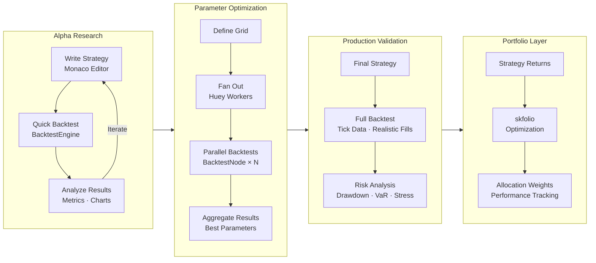

# Core Engine: Backtesting Library Decision

## Decision Summary

**NautilusTrader** is the sole core engine for QuantLens. We do not integrate VectorBT (or VectorBT Pro) as a secondary research engine. NautilusTrader's hybrid Rust/Python architecture, backtest-live parity, and institutional-grade execution modeling cover the full workflow — from alpha research and parameter optimization through realistic validation to potential live deployment — without the maintenance cost and strategy-rewrite friction of a dual-engine stack.

---

## Context

QuantLens is an alpha research and backtesting toolkit for quants, with complementing portfolio optimization features and performance tracking/showcasing. The core engine must support:

1. **Alpha research** — rapid hypothesis testing, indicator screening, parameter sweeps
2. **Realistic backtesting** — accurate fill simulation, slippage, commissions, multi-asset
3. **Portfolio-level analysis** — multi-asset strategies, exposure tracking, risk metrics
4. **Performance tracking** — equity curves, drawdowns, Sharpe ratios, trade-level analytics
5. **Future extensibility** — path to live/paper trading without rewriting strategies

The Python backtesting ecosystem offers two viable candidates at the quality level QuantLens requires:

- **VectorBT** — vectorized research engine optimized for speed and parameter sweeps
- **NautilusTrader** — event-driven Rust/Python engine with backtest-live parity

The question: integrate both (VectorBT for research, NautilusTrader for validation/production) or commit to NautilusTrader alone?

---

## Candidates Evaluated

The full ecosystem was assessed. Libraries eliminated early and the reasons:

| Library | Eliminated Because |
|---------|-------------------|
| **Backtesting.py** | Single-asset only, no live trading, development slowed since 2021 |
| **Backtrader** | 14x slower than Backtesting.py in benchmarks, development slowed since 2020, fragmented documentation |
| **QuantConnect Lean** | Cloud-first platform with C# core — architectural mismatch with QuantLens's self-hosted Python stack |
| **bt** | Portfolio allocation specialist, not a general backtesting engine |
| **fastquant** | Minimal feature set, educational tool |
| **PyAlgoTrade** | Deprecated, no longer maintained |

This leaves **VectorBT** and **NautilusTrader** as the only serious candidates.

---

## VectorBT — The Research Specialist

### Architecture

Fully vectorized operations using NumPy arrays and Numba JIT compilation. No event loop — strategies are expressed as boolean signal arrays over price matrices. Broadcasting enables massive parameter sweeps across assets and indicator windows simultaneously.

### Strengths

| Strength | Detail |
|----------|--------|
| **Speed** | Sub-second backtests via Numba JIT; fastest Python backtesting library in benchmarks |
| **Parameter optimization** | Test 10,000+ parameter combinations efficiently via broadcasting |
| **Multi-asset native** | Portfolio simulation across mixed assets with vectorized signal generation |
| **Analytics** | Comprehensive metrics — Sharpe, Sortino, Calmar, Omega, trade expectancy, exposure tracking |
| **Visualization** | Interactive Plotly dashboards for equity curves, drawdowns, and trade analysis |

### Limitations

| Limitation | Impact on QuantLens |
|------------|---------------------|
| **No live trading** | Dead end for users who want to paper-trade or deploy strategies |
| **Simplified execution** | Fills at price — no order book simulation, partial fills, or queue position modeling |
| **No event-driven logic** | Cannot express strategies that react to fills, position changes, or multi-leg contingencies |
| **Array-only paradigm** | Strategies must be expressible as vectorized operations; complex stateful logic is awkward |
| **Memory intensive** | Large parameter grids over many assets can exceed available RAM |

### VectorBT Pro

The commercial successor adds live trading, advanced order types, and risk controls. However:
- **Subscription-based licensing** conflicts with QuantLens's open architecture goals
- **Closed source** — no ability to extend or audit core behavior
- **Still vectorized** — the fundamental execution model limitations remain

---

## NautilusTrader — The Institutional Engine

### Architecture

Hybrid Rust/Python with an event-driven core. The Rust layer (via PyO3) handles data models, matching engine, and I/O at nanosecond precision. The Python layer provides the strategy API, configuration, and integration with the quant ecosystem.

```
┌─────────────────────────────────────┐
│         User Layer (Python)         │
│  Strategy code · Custom indicators  │
├─────────────────────────────────────┤
│         Python API Layer            │
│  BacktestNode · TradingStrategy     │
├─────────────────────────────────────┤
│       Core Services Layer           │
│  MessageBus · Cache · RiskEngine    │
├─────────────────────────────────────┤
│         Rust Core Layer             │
│  Data Models · Matching · I/O       │
├─────────────────────────────────────┤
│         Adapters Layer              │
│  Binance · IBKR · OKX · Custom      │
└─────────────────────────────────────┘
```

### Strengths

| Strength | Detail |
|----------|--------|
| **Performance** | <1ms latency, >100k events/sec via Rust core — comparable to VectorBT for throughput |
| **Backtest-live parity** | Identical strategy code runs in backtest and live modes with zero changes |
| **Execution realism** | Partial fills, queue position modeling, latency simulation, slippage models |
| **Order types** | Market, Limit, Stop, Trailing, Iceberg, OCO, OTO — full institutional order book |
| **Data granularity** | Tick, quote, trade, L1/L2/L3 order book, bars — not limited to OHLCV |
| **Risk engine** | Position limits, daily loss limits, order validation built into the core |
| **Multi-venue** | Trade across multiple exchanges simultaneously in a single strategy |
| **Actor model** | Concurrent processing via actors — scales to complex multi-strategy systems |

### Limitations

| Limitation | Impact on QuantLens |
|------------|---------------------|
| **Steeper learning curve** | More boilerplate than VectorBT for simple strategies — mitigated by QuantLens's strategy templates and Monaco editor |
| **No built-in parameter optimization** | Must build parameter sweep infrastructure — addressed by QuantLens's Huey workers running parallel `BacktestNode` instances |
| **Event-driven overhead for trivial strategies** | Simple SMA crossover requires more code than VectorBT — acceptable trade-off for execution realism |

---

## The Dual-Engine Problem

Integrating both VectorBT (research) and NautilusTrader (validation/production) appears attractive on paper — the "Modern Quant Stack" pattern. In practice, it creates significant costs:

### Strategy Translation Friction

VectorBT and NautilusTrader use fundamentally different paradigms. A strategy cannot run on both without rewriting:

```python
# VectorBT — vectorized signals (array paradigm)
entries = fast_ma.ma_crossed_above(slow_ma)   # Boolean array
exits = fast_ma.ma_crossed_below(slow_ma)     # Boolean array
pf = vbt.Portfolio.from_signals(price, entries, exits)

# NautilusTrader — event-driven (callback paradigm)
class MyStrategy(TradingStrategy):
    def on_bar(self, bar: Bar):
        if self.fast_ma.value > self.slow_ma.value:
            self.submit_order(self.order_factory.market(...))
```

Every strategy a user develops in the VectorBT research phase must be **completely rewritten** for NautilusTrader validation. This is not a minor syntax difference — it requires restructuring the logic from declarative array operations to imperative event callbacks.

### Doubled Integration Surface

| Concern | Cost |
|---------|------|
| **Data pipeline** | Two different data formats — VectorBT expects DataFrames, NautilusTrader expects `Bar`/`QuoteTick`/`TradeTick` objects via `ParquetDataCatalog` |
| **Indicator libraries** | VectorBT has built-in indicators + TA-Lib; NautilusTrader has its own indicator framework — results may differ subtly |
| **Results schema** | Two different output formats for trades, metrics, and equity curves need normalization |
| **Documentation** | Two sets of strategy writing guides, two editor template systems, two validation paths |
| **Testing** | Two engine integration test suites to maintain |
| **Bug surface** | Discrepancies between VectorBT and NautilusTrader results for the same strategy create confusing UX |

### User Experience Fragmentation

A dual-engine system forces users to answer: "Which engine should I use?" This decision requires understanding the trade-offs between vectorized and event-driven backtesting — exactly the kind of complexity QuantLens should abstract away. A single engine with a consistent workflow (write → backtest → analyze → optionally deploy) is a simpler, more coherent product.

---

## Why NautilusTrader Alone Is Sufficient

### Performance Is Comparable

NautilusTrader's Rust core processes >100,000 events/second. For QuantLens's workload profile — OHLCV bars across hundreds of symbols, not millions of tick-level events — the performance difference versus VectorBT is negligible. Both complete typical backtests in under a second.

### Parameter Optimization Without VectorBT

VectorBT's killer feature is broadcasting parameter sweeps. NautilusTrader achieves equivalent functionality through parallelization:

```python
# Parallel parameter sweep via Huey workers
# Each worker runs an isolated BacktestNode (required by NautilusTrader's singleton constraint)
from huey import RedisHuey

huey = RedisHuey("quantlens", host="localhost", port=6379)

@huey.task(retries=1, retry_delay=10)
def run_backtest(strategy_id, params):
    from nautilus_trader.backtest.node import BacktestNode
    # ... configure and run backtest with params
    pass

param_grid = [
    {"fast": f, "slow": s}
    for f in range(5, 50, 5)
    for s in range(20, 200, 10)
]

# Fan out across Huey process workers — one BacktestNode per process
# Calling a @huey.task function enqueues it to Redis; workers pick up jobs independently
for params in param_grid:
    run_backtest(strategy_id, params)
```

This approach:
- Leverages the existing Huey infrastructure (already chosen for backtest execution — see [task_queue.md](task_queue.md))
- Runs each backtest with NautilusTrader's realistic execution model, not VectorBT's simplified fills
- Scales horizontally across workers rather than vertically in memory
- Produces results that are directly comparable to production behavior

### Research Workflow Stays Fast

For rapid hypothesis testing — the workflow where VectorBT excels — NautilusTrader's `BacktestEngine` (low-level API) provides fast iteration:

```python
from nautilus_trader.backtest.engine import BacktestEngine
from nautilus_trader.config import BacktestEngineConfig

engine = BacktestEngine(config=BacktestEngineConfig(
    trader_id="RESEARCHER-001",
    log_level="ERROR",  # Minimal logging for speed
))

# Add venue, instruments, data, strategy — run
engine.run()
results = engine.trader.generate_order_fills_report()
engine.reset()  # Reset for next parameter set — no process restart needed
```

The `engine.reset()` method allows rerunning with different parameters without process overhead, enabling tight research loops within a single session.

### Backtest-Live Parity Protects User Investment

When a user develops a strategy in NautilusTrader, that exact code can run in paper trading or live trading via broker adapters (Binance, Interactive Brokers, OKX, Bybit). This is NautilusTrader's defining feature and QuantLens's strongest value proposition for serious quants.

With VectorBT as the research engine, users who want to go live must rewrite their strategy — wasting the research effort and introducing translation bugs.

---

## How This Integrates with QuantLens Architecture

NautilusTrader as the sole engine aligns cleanly with every existing architectural decision:

| Component | Integration |
|-----------|-------------|
| **Huey workers** ([task_queue.md](task_queue.md)) | One `BacktestNode` per process worker — NautilusTrader's singleton constraint matches Huey's `--worker-type process` isolation model |
| **Gunicorn+Uvicorn · Raw ASGI** ([backend_server.md](backend_server.md)) | API layer enqueues backtest jobs; NautilusTrader runs in workers, not in the web process — clean separation |
| **QuestDB → ParquetDataCatalog** ([ohlcv_database.md](ohlcv_database.md)) | Historical OHLCV stored in QuestDB (local Docker), exported to Parquet for NautilusTrader's native data catalog |
| **skfolio** ([portfolio_opt.md](portfolio_opt.md)) | Portfolio optimization runs independently of the backtest engine — NautilusTrader produces trade results, skfolio optimizes allocations |
| **Monaco Editor** ([ARCHITECTURE.md](ARCHITECTURE.md)) | Strategy templates target NautilusTrader's `TradingStrategy` API exclusively — one template system, one validation path |
| **Data providers** ([data_providers.md](data_providers.md)) | Single adapter pattern normalizing Tiingo/Alpaca/Finnhub data to NautilusTrader `Bar`/`QuoteTick` types |

### System Flow (Single Engine)



---

## Comparative Summary

| Criterion | VectorBT | NautilusTrader | Winner for QuantLens |
|-----------|----------|----------------|----------------------|
| **Raw backtest speed** | ⭐⭐⭐⭐⭐ | ⭐⭐⭐⭐⭐ | Tie (both sub-second for OHLCV) |
| **Parameter sweep speed** | ⭐⭐⭐⭐⭐ (broadcasting) | ⭐⭐⭐⭐ (parallel workers) | VectorBT (marginal) |
| **Execution realism** | ⭐⭐ | ⭐⭐⭐⭐⭐ | **NautilusTrader** |
| **Order type support** | ⭐⭐ | ⭐⭐⭐⭐⭐ | **NautilusTrader** |
| **Backtest-live parity** | ❌ | ✅ | **NautilusTrader** |
| **Data granularity** | OHLCV only | Tick · Quote · L3 | **NautilusTrader** |
| **Risk management** | Basic | Built-in engine | **NautilusTrader** |
| **Multi-venue** | ❌ | ✅ | **NautilusTrader** |
| **Integration cost** | Second data pipeline | Already architected | **NautilusTrader** |
| **Strategy portability** | Research only | Research → production | **NautilusTrader** |

---

## Decision

**NautilusTrader is the sole core engine for QuantLens.** VectorBT is not integrated.

### Rationale

1. **No strategy rewrite tax.** A single engine means strategies written in the research phase run identically in validation and (future) live trading. This is the most important factor for a tool targeting serious quants.

2. **Execution realism from day one.** VectorBT's simplified fill model (fills at price, no slippage modeling beyond a flat fee) produces backtest results that diverge from real-world performance. NautilusTrader's matching engine simulates partial fills, queue position, and latency — research results are trustworthy without a separate validation step.

3. **Architectural simplicity.** One data pipeline (QuestDB → Parquet → `ParquetDataCatalog`), one strategy API (`TradingStrategy`), one results schema, one set of templates, one validation path. Every additional engine multiplies integration and maintenance cost.

4. **Parameter sweeps are solved by infrastructure, not by the engine.** Huey's process pool parallelizes NautilusTrader backtests across workers. The speed difference versus VectorBT's in-process broadcasting is marginal for QuantLens's scale (hundreds of parameter combinations, not millions).

5. **VectorBT's advantage is narrowing.** NautilusTrader's Rust core continues to close the raw performance gap. The `BacktestEngine.reset()` API enables tight research loops without process restart overhead.

### Trade-offs Accepted

- **VectorBT's broadcasting is faster for extreme parameter grids** (100,000+ combinations). Accepted because QuantLens's target users run hundreds to low thousands of combinations — well within Huey worker parallelism.
- **VectorBT's API is simpler for trivial strategies.** Accepted because QuantLens provides strategy templates and Monaco editor autocompletion to reduce NautilusTrader's boilerplate.
- **VectorBT has better built-in visualization.** Accepted because QuantLens builds its own React-based visualization layer (Recharts/D3) from NautilusTrader results — engine-provided charts are not used.

### When to Revisit

- If QuantLens adds a "notebook mode" for exploratory research where users write throwaway analysis code (not deployable strategies), VectorBT could serve as an optional research-only dependency — not a core engine.
- If NautilusTrader's research iteration speed proves insufficient after real user testing, consider a lightweight vectorized pre-screening layer that generates candidate parameters for NautilusTrader validation.
