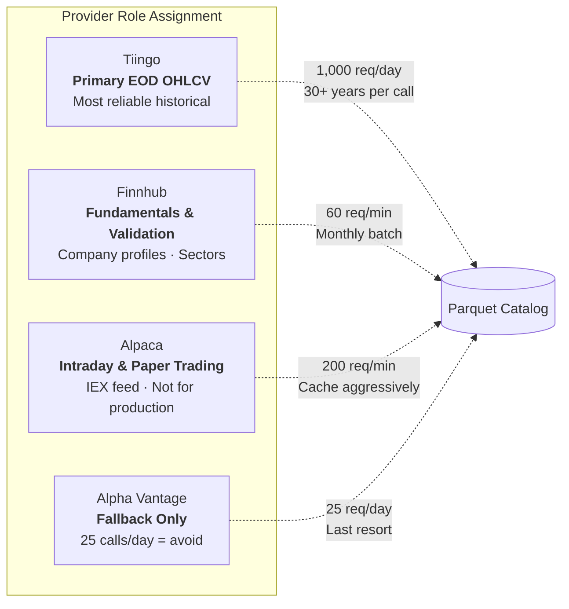
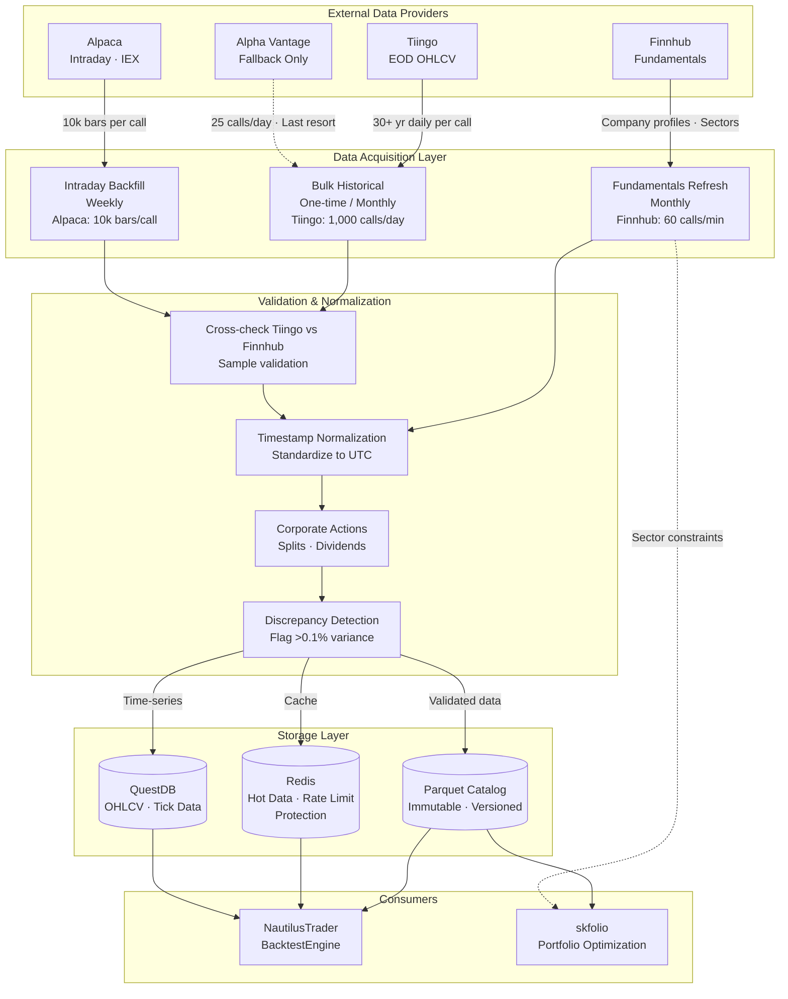
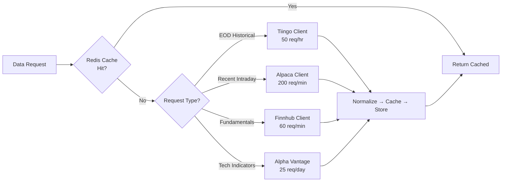
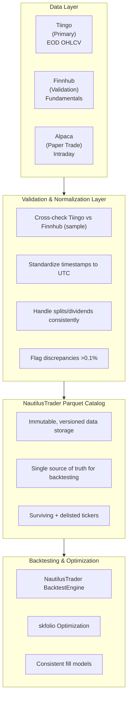

# Data Providers — Comprehensive Analysis

This document consolidates the analysis of free-tier data providers for the backtesting service built on NautilusTrader and skfolio. It covers provider capabilities, API constraints, data quality concerns, and a multi-provider integration strategy aligned with the system architecture defined in `ARCHITECTURE.md`.

---

## Provider Free Tier Comparison

### Rate Limits & Coverage

| Provider | Rate Limits | Data Coverage | Key Limitations |
|----------|-------------|---------------|-----------------|
| **Alpaca** | 200 API calls/min · 30 WebSocket symbols | US Stocks & ETFs (IEX only) · Historical since 2016 | Real-time data limited to IEX exchange only · Historical data delayed 15 min · Options: Indicative feed only |
| **Finnhub** | 60 API calls/min · 30 calls/sec · 50 WebSocket symbols | US stocks, forex, crypto · Company news (1 year) · Basic fundamentals | US market data only on free tier · Limited historical fundamentals · No survivorship-bias free data |
| **Alpha Vantage** | 25 API calls/day · 5 calls/min | 200,000+ tickers across 20+ exchanges · 50+ technical indicators · 20+ years history | Extremely restrictive daily limit · Only 100 data points per request (compact) · No real-time US data · No full historical downloads |
| **Tiingo** | 50 requests/hour · 1,000 requests/day · 500 unique symbols/month | 82,000+ global securities · 30+ years EOD stock data · 40+ crypto exchanges | No fundamental data on free tier · No news API access · Personal use only |

### Data Size Per API Call

| Provider | Max Records Per Call | Data Points | Approximate Size |
|----------|---------------------|-------------|------------------|
| **Alpaca** | 10,000 bars (v2 API) | OHLCV per bar | ~1–2 MB JSON |
| **Finnhub** | No explicit record limit | Depends on date range | Rate-limited by time (60/min) |
| **Alpha Vantage** | 100 data points (compact, free) | OHLCV per day | ~10–20 KB JSON |
| **Tiingo** | No hard limit | Full date range specified | Limited by 1,000 req/day |

### Daily Throughput Capacity

| Provider | Daily Call Budget | Max Records/Day | Best Use Case |
|----------|------------------|-----------------|---------------|
| **Alpaca** | ~12,000 calls (200/min) | ~120M bars | Intraday backtesting, paper trading |
| **Finnhub** | ~86,400 calls (60/min) | Unlimited (theoretical) | Real-time feeds, fundamentals |
| **Alpha Vantage** | 25 calls | 2,500 data points | Small universe, recent data only |
| **Tiingo** | 1,000 calls | 30+ years × 1,000 tickers | Bulk historical EOD downloads |

---

## Per-Provider Detail

### Alpaca — 10,000 bars per call

- **v2 API**: Maximum 10,000 bars per request; v1 (legacy) limited to 1,000
- **Pagination**: Uses `next_page_token` for additional data
- **Data per bar**: OHLCV + VWAP + trade count
- **Practical capacity**:
  - Daily bars: 10,000 days ≈ 40 years per call
  - 1-minute bars: 10,000 minutes ≈ 7 days per call
  - 30-minute bars: 10,000 bars ≈ 208 days per call

### Finnhub — No explicit record limit

- Rate-limited at 60 calls/min, 30 calls/sec
- Historical candles return all data for the specified period
- WebSocket supports 50 symbols max
- **Practical note**: Multi-year 1-minute requests (~780K bars) can timeout — chunk by month

### Alpha Vantage — 100 data points (free tier)

- Free tier: `outputsize=compact` → 100 data points max per call
- Premium only: `outputsize=full` → 20+ years of historical data
- **Critical limitation**: 25 calls/day × 100 points = 2,500 data points/day total — effectively unusable for backtesting

### Tiingo — No explicit record limit

- EOD API returns all data for the specified date range in one call
- Example: `/tiingo/daily/AAPL/prices?startDate=1990-01-01&endDate=2024-01-01` → ~8,500 daily bars (34 years) in a single request
- Intraday (IEX): Limited to ~10,000 records per call
- Formats: JSON or CSV

---

## Multi-Provider Strategy

### Provider Role Assignment



### 1. Primary Historical Data — Tiingo

- **Why**: Most generous free limits for backtesting (1,000/day, 500 symbols/month)
- **Use for**: Bulk historical EOD data downloads for universe construction
- **Strategy**: Download data in batches during off-hours, store locally in Parquet/Arrow format
- **NautilusTrader integration**: Use `BacktestDataConfig` with cached CSV/Parquet files rather than live API calls during backtests

### 2. Secondary / Intraday Data — Alpaca

- **Why**: 200 calls/min allows for reasonable intraday data fetching
- **Use for**: Recent historical bars (15 min delayed), real-time paper trading
- **Limitation**: IEX-only means less comprehensive volume data (~2% of market)
- **NautilusTrader integration**: Configure `LiveDataClient` for paper trading, cache aggressively

### 3. Fundamentals & News — Finnhub

- **Why**: 60 calls/min supports screening and signal generation
- **Use for**: Company profiles, earnings calendars, news sentiment
- **skfolio integration**: Use for factor-aware portfolio constraints and optimization inputs (sector limits from profile data)
- **Strategy**: Batch download fundamentals monthly, not daily

### 4. Alpha Vantage — Avoid for Primary Use

- **Why**: 25 calls/day is insufficient for any serious backtesting
- **Use case only**: Specific technical indicators not available elsewhere, or as a fallback
- **Implementation**: Cache every response permanently; never call twice for same data

---

## Data Quality

### Root Causes of OHLC Discrepancies

| Issue | Explanation |
|-------|-------------|
| **Exchange Coverage** | Alpaca free = IEX only (~2% market volume) vs. Tiingo/Finnhub = consolidated SIP data |
| **Trade Condition Filtering** | Different providers filter odd-lots, cancelled trades, after-hours differently |
| **Corporate Action Adjustments** | Splits, dividends, spin-offs applied at different times or differently |
| **Timestamp Handling** | UTC vs. exchange local time vs. SIP time; DST transitions |
| **Closing Price Methodology** | Primary exchange auction vs. last trade vs. VWAP of last 5 minutes |
| **Decimal Precision** | Some providers keep 2 decimals, others 4+ — leads to rounding discrepancies |

### Provider-Specific Quality Issues

| Provider | Known Issues |
|----------|-------------|
| **Alpaca (Free)** | IEX-only feed = incomplete market picture; bars built from ~2% of trades; 15-minute delay on recent data |
| **Tiingo** | Generally high-quality EOD; survivorship bias present (delisted stocks not included); institutional-grade cleaning methodology |
| **Finnhub** | Good real-time but limited historical depth on free tier; may have slight delays (40–60ms latency) |

### Handling Provider-Specific Limitations

| Scenario | Solution |
|----------|----------|
| **Alpaca IEX gaps** | Use only for paper trading; never for strategy validation |
| **Tiingo survivorship bias** | Maintain a separate "delisted" database from Finnhub corporate actions |
| **Finnhub rate limits** | Cache fundamentals locally; refresh monthly, not daily |
| **OHLC mismatches** | Use Tiingo as baseline; flag symbols with >0.5% variance for review |

### Timestamp Normalization

All providers use different timestamp formats. Standardize to UTC before catalog ingestion.

| Provider | Native Format |
|----------|---------------|
| Tiingo | UTC timestamps |
| Alpaca | Unix timestamps (nanoseconds) |
| Finnhub | Unix timestamps (seconds) |

---

## Data Layer Architecture

This architecture aligns with the Data Flow Architecture defined in `ARCHITECTURE.md`, extending it with the full provider strategy, validation layer, and acquisition cadences.

### Data Acquisition Pipeline



### Data Source Routing



### End-to-End Data Flow



---

## Rate Limiting Implementation

```python
class RateLimitedClient:
    def __init__(self):
        self.tiingo = TiingoClient(max_per_hour=50)
        self.alpaca = AlpacaClient(max_per_min=200)
        self.finnhub = FinnhubClient(max_per_min=60)
        self.alpha_vantage = AlphaVantageClient(max_per_day=25)  # Use sparingly

    async def get_historical_bars(self, symbol, start, end):
        # Try cache first
        if cached := self.cache.get(symbol, start, end):
            return cached

        # Tiingo for EOD historical (most generous)
        if self.is_eod_request():
            return await self.tiingo.get_prices(symbol, start, end)

        # Alpaca for recent intraday
        return await self.alpaca.get_bars(symbol, start, end)
```

---

## Data Validation Pipeline

```python
class DataQualityValidator:
    def __init__(self):
        self.tiingo = TiingoClient()
        self.finnhub = FinnhubClient()
        self.alpaca = AlpacaClient()

    def fetch_and_validate_eod(self, symbol, start_date, end_date):
        """Fetch from Tiingo as primary, cross-check with Finnhub."""
        tiingo_data = self.tiingo.get_daily(
            symbol,
            startDate=start_date,
            endDate=end_date,
            format='csv'
        )

        # Cross-validation sample: last 30 days from Finnhub
        validation_sample = self.finnhub.get_stock_candles(
            symbol,
            resolution='D',
            from_=int((datetime.now() - timedelta(days=30)).timestamp()),
            to=int(datetime.now().timestamp())
        )

        if not self._ohlc_statistically_equivalent(
            tiingo_data.tail(30),
            validation_sample,
            tolerance=0.001  # 0.1% tolerance
        ):
            self._alert_data_discrepancy(symbol, tiingo_data, validation_sample)

        return tiingo_data

    def _ohlc_statistically_equivalent(self, primary, secondary, tolerance):
        """Check if OHLC values are within tolerance."""
        for col in ['open', 'high', 'low', 'close']:
            primary_col = primary[col].astype(float)
            secondary_col = secondary[col].astype(float)
            rel_diff = abs(primary_col - secondary_col) / primary_col
            if (rel_diff > tolerance).any():
                return False
        return True
```

---

## NautilusTrader Data Catalog Design

```python
from nautilus_trader.persistence.catalog import ParquetDataCatalog

catalog = ParquetDataCatalog(path="/data/validated")

def ingest_validated_data():
    """
    1. Download from Tiingo (bulk)
    2. Validate against Finnhub (sample)
    3. Store in Parquet format (immutable)
    4. Version control the dataset
    """
    universe = get_sp500_universe()

    for symbol in universe:
        raw_data = fetch_tiingo_bulk(symbol)

        if validate_against_finnhub(symbol, raw_data):
            bars = wrangle_to_bars(raw_data)
            catalog.write_bars(bars)
        else:
            log.warning(f"Data validation failed for {symbol}")
```

### NautilusTrader Configuration

- Use `BacktestNode` with pre-loaded Parquet data from Tiingo for strategy development
- Configure `TradingNode` with Alpaca for paper trading only
- Implement custom `DataCatalog` that prioritizes local storage over API calls

### skfolio Integration

```python
from skfolio.optimization import MeanRisk, CVaR

def cvar_optimization(prices_df, confidence_level=0.95):
    """prices_df: DataFrame with datetime index and asset tickers as columns."""
    if prices_df.isnull().sum().sum() > 0:
        raise DataQualityError("Missing values in price data")

    if prices_df.shape[1] < 2:
        raise DataQualityError("Expected multiple asset columns for portfolio optimization")

    returns = prices_df.pct_change().dropna()
    optimizer = MeanRisk(risk_measure=CVaR(confidence_level))
    optimizer.fit(returns)
    return optimizer.weights_
```

---

## Critical Warnings

1. **Never Mix OHLC Sources in the Same Backtest** — Fills are determined by OHLC during backtesting. If you mix Alpaca (IEX) with Tiingo (consolidated), fill prices will be inconsistent. One provider per backtest run; cross-validate offline, not during simulation.

2. **Alpaca Free Tier is NOT Production-Ready** — IEX represents only ~2% of market volume. Free data can appear delayed simply because one isn't seeing all trades. Use only for paper trading validation, not strategy research.

3. **Survivorship Bias is Real** — Neither Tiingo nor Finnhub free tiers provide delisted tickers. Backtests will be upward-biased. Mitigate by downloading delisted tickers from Finnhub's fundamentals endpoint where available and marking them as "exited" in the database.

4. **No Real-Time Trading on Free Tiers** — All free tiers have delayed data (15 min minimum). Do not use for live trading without upgrading.

5. **Rate Limit Exceedance** — Implement exponential backoff and circuit breakers. Getting banned from one provider reduces data diversity.

6. **Legal Compliance** — All free tiers are for personal use only. Commercial backtesting services require paid licenses.
