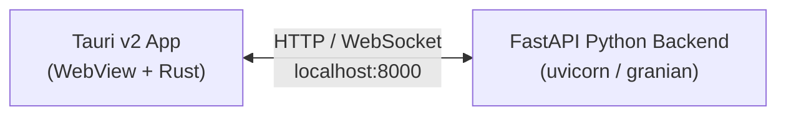

 
 # QuantLens Testing Strategy

End-to-end testing documentation for a **Tauri v2 frontend** communicating with a **FastAPI backend** served by Uvicorn, Gunicorn+Uvicorn, or Granian. Covers integration testing, raw throughput benchmarking, complex user behavior simulation, and Tauri UI E2E testing in GitHub Actions CI.

---

## Architecture Overview



### Testing Layers

| Layer | What | Tool(s) | Needs GUI? |
|-------|------|---------|------------|
| **Rust unit tests** | Tauri commands, state logic | `cargo test` (mock runtime) | No |
| **Frontend unit tests** | UI components, IPC mocking | Vitest + `@tauri-apps/api/mocks` | No |
| **Backend API tests** | FastAPI endpoints, business logic | pytest + httpx | No |
| **Integration tests** | Frontend ↔ Backend communication | pytest-asyncio + aiohttp | No |
| **Tauri UI E2E** | Full app via WebDriver | WebdriverIO + tauri-driver + xvfb | Virtual |
| **Load / throughput** | Backend under heavy load | Locust, k6, wrk/hey | No |

---

## 1. Tauri Testing in CI

### The Core Challenge

Tauri requires a WebView to function, which needs a display server. In headless CI environments like GitHub Actions runners, no native display server exists. There are two strategies:

1. **Mock runtime** — for unit tests. The `@tauri-apps/api/mocks` module lets you mock IPC calls, windows, and events in Vitest/Jest without any display server.
2. **Virtual display (xvfb)** — for E2E tests. `xvfb-run` provides a virtual X11 framebuffer so the real Tauri app can launch headlessly.

> **macOS limitation:** Tauri WebDriver testing is NOT supported on macOS because Apple does not provide a WKWebView driver. Only Linux and Windows are supported for desktop WebDriver E2E.

### 1a. Frontend Unit Tests (Vitest + Mock IPC)

No display server needed. Uses `@tauri-apps/api/mocks` to intercept IPC calls.

```javascript
// vitest.config.js
import { defineConfig } from 'vitest/config';

export default defineConfig({
  test: {
    environment: 'jsdom',
    setupFiles: ['./test/setup.js'],
  },
});
```

```javascript
// test/setup.js
import { beforeAll, afterEach } from 'vitest';
import { randomFillSync } from 'crypto';
import { clearMocks } from '@tauri-apps/api/mocks';

// jsdom doesn't come with a WebCrypto implementation
beforeAll(() => {
  Object.defineProperty(window, 'crypto', {
    value: {
      getRandomValues: (buffer) => randomFillSync(buffer),
    },
  });
});

afterEach(() => {
  clearMocks();
});
```

```javascript
// test/api.test.js
import { expect, test } from 'vitest';
import { mockIPC } from '@tauri-apps/api/mocks';
import { invoke } from '@tauri-apps/api/core';

test('invoke FastAPI endpoint through Tauri command', async () => {
  mockIPC((cmd, args) => {
    if (cmd === 'fetch_portfolio') {
      return { assets: ['AAPL', 'GOOG'], total_value: 150000 };
    }
  });

  const result = await invoke('fetch_portfolio', { userId: 1 });
  expect(result.assets).toContain('AAPL');
});
```

### 1b. Rust Unit Tests (Mock Runtime)

Tauri v2 provides a mock runtime so Rust `#[tauri::command]` handlers can be tested without a webview:

```rust
// src-tauri/src/lib.rs
#[tauri::command]
fn calculate_returns(prices: Vec<f64>) -> f64 {
    if prices.len() < 2 { return 0.0; }
    (prices.last().unwrap() / prices.first().unwrap()) - 1.0
}

#[cfg(test)]
mod tests {
    use super::*;

    #[test]
    fn test_calculate_returns() {
        let result = calculate_returns(vec![100.0, 110.0]);
        assert!((result - 0.1).abs() < f64::EPSILON);
    }
}
```

### 1c. Tauri UI E2E with WebdriverIO

Full E2E using WebdriverIO + `tauri-driver` + `xvfb-run` on Linux. Based on the official Tauri v2 WebdriverIO example. WebdriverIO provides built-in assertions, automatic retries, and a simpler `$` selector API compared to Selenium's verbose `findElement(By.css(...))` calls.

**Prerequisites:**
- `cargo install tauri-driver --locked`
- `webkit2gtk-driver` system package (Linux)
- `msedgedriver` on Windows (via `msedgedriver-tool`)
- Node.js 18+

```json
// e2e-tests/package.json
{
  "name": "e2e-tests",
  "version": "1.0.0",
  "private": true,
  "type": "module",
  "scripts": {
    "test": "wdio run wdio.conf.js"
  },
  "dependencies": {
    "@wdio/cli": "^9.19.0"
  },
  "devDependencies": {
    "@wdio/local-runner": "^9.19.0",
    "@wdio/mocha-framework": "^9.19.0",
    "@wdio/spec-reporter": "^9.19.0"
  }
}
```

```javascript
// e2e-tests/wdio.conf.js
import os from 'os';
import path from 'path';
import { spawn, spawnSync } from 'child_process';
import { fileURLToPath } from 'url';

const __dirname = fileURLToPath(new URL('.', import.meta.url));

let tauriDriver;
let exit = false;

export const config = {
  host: '127.0.0.1',
  port: 4444,
  specs: ['./test/specs/**/*.js'],
  maxInstances: 1,
  capabilities: [
    {
      maxInstances: 1,
      'tauri:options': {
        application: '../src-tauri/target/debug/quantlens',
      },
    },
  ],
  reporters: ['spec'],
  framework: 'mocha',
  mochaOpts: {
    ui: 'bdd',
    timeout: 60000,
  },

  // Build the Tauri app in debug mode before running tests
  onPrepare: () => {
    spawnSync(
      'yarn',
      ['tauri', 'build', '--', '--debug', '--no-bundle'],
      {
        cwd: path.resolve(__dirname, '..'),
        stdio: 'inherit',
        shell: true,
      }
    );
  },

  // Start tauri-driver before each WebDriver session
  beforeSession: () => {
    tauriDriver = spawn(
      path.resolve(os.homedir(), '.cargo', 'bin', 'tauri-driver'),
      [],
      { stdio: [null, process.stdout, process.stderr] }
    );

    tauriDriver.on('error', (error) => {
      console.error('tauri-driver error:', error);
      process.exit(1);
    });
    tauriDriver.on('exit', (code) => {
      if (!exit) {
        console.error('tauri-driver exited with code:', code);
        process.exit(1);
      }
    });
  },

  // Clean up tauri-driver after each session
  afterSession: () => {
    closeTauriDriver();
  },
};

function closeTauriDriver() {
  exit = true;
  tauriDriver?.kill();
}

function onShutdown(fn) {
  const cleanup = () => {
    try {
      fn();
    } finally {
      process.exit();
    }
  };
  process.on('exit', cleanup);
  process.on('SIGINT', cleanup);
  process.on('SIGTERM', cleanup);
  process.on('SIGHUP', cleanup);
  process.on('SIGBREAK', cleanup);
}

// Ensure tauri-driver is closed when the test process exits
onShutdown(() => {
  closeTauriDriver();
});
```

```javascript
// e2e-tests/test/specs/quantlens.e2e.js
describe('QuantLens App', () => {
  it('should render the main heading', async () => {
    const header = await $('h1');
    const text = await header.getText();
    expect(text).toBeTruthy();
  });

  it('should load the portfolio view', async () => {
    const portfolio = await $('[data-testid="portfolio"]');
    await expect(portfolio).toExist();
  });
});
```

---

## 2. Backend API Integration Tests

Test FastAPI endpoints independently using pytest + httpx (FastAPI's recommended test client).

```python
# tests/test_api.py
import pytest
from httpx import AsyncClient, ASGITransport
from app.main import app  # Your FastAPI app instance

@pytest.fixture
async def client():
    transport = ASGITransport(app=app)
    async with AsyncClient(transport=transport, base_url="http://test") as ac:
        yield ac

@pytest.mark.asyncio
async def test_health(client):
    resp = await client.get("/health")
    assert resp.status_code == 200

@pytest.mark.asyncio
async def test_portfolio_endpoint(client):
    resp = await client.post("/api/portfolio", json={
        "assets": ["AAPL", "GOOG"],
        "weights": [0.6, 0.4],
    })
    assert resp.status_code == 200
    data = resp.json()
    assert "expected_return" in data
```

---

## 3. ASGI Server Configuration

FastAPI can be served by multiple ASGI servers. All examples below bind to `0.0.0.0:8000`.

### Option A: Uvicorn (standalone)

```bash
pip install uvicorn[standard]
uvicorn app.main:app --host 0.0.0.0 --port 8000 --workers 4
```

Best for: development, simple deployments, single-machine setups.

### Option B: Gunicorn + Uvicorn Workers

```bash
pip install gunicorn uvicorn[standard]
gunicorn app.main:app \
  --worker-class uvicorn.workers.UvicornWorker \
  --workers 4 \
  --bind 0.0.0.0:8000
```

Best for: production on Linux (Gunicorn does not run on Windows), process management with pre-fork model.

### Option C: Granian

```bash
pip install granian
granian --interface asgi --host 0.0.0.0 --port 8000 --workers 4 app.main:app
```

Best for: maximum throughput. Granian is a Rust-based HTTP server supporting ASGI/WSGI/RSGI, HTTP/1 and HTTP/2, with built-in Prometheus metrics (`--metrics`). It replaces the Gunicorn+Uvicorn stack with a single dependency. Configurable backpressure, runtime threading modes (`st`/`mt`/`auto`), and optional event loops (`uvloop`, `rloop`, `winloop`).

### Server Comparison for CI

| Server | CI Start Command | Notes |
|--------|-----------------|-------|
| Uvicorn | `uvicorn app.main:app --host 0.0.0.0 --port 8000 &` | Simplest |
| Gunicorn | `gunicorn app.main:app -k uvicorn.workers.UvicornWorker --bind 0.0.0.0:8000 &` | Linux only |
| Granian | `granian --interface asgi --host 0.0.0.0 --port 8000 app.main:app &` | Fastest |

---

## 4. Load Testing: Locust (Complex User Behavior)

Locust is Python-native, writes test scenarios as Python classes, and runs headless in CI.

### Locustfile

```python
# locustfile.py
import time
import random
from locust import HttpUser, task, between

class QuantLensUser(HttpUser):
    wait_time = between(0.1, 2)

    def on_start(self):
        """Called once per simulated user on spawn."""
        resp = self.client.post("/auth/login", json={
            "username": f"user_{self.environment.runner.user_count}",
            "password": "test",
        })
        if resp.status_code == 200:
            self.token = resp.json().get("access_token", "")
            self.client.headers.update(
                {"Authorization": f"Bearer {self.token}"}
            )

    @task(10)
    def get_portfolio(self):
        self.client.get("/api/portfolio")

    @task(5)
    def get_ohlcv(self):
        symbols = ["AAPL", "GOOG", "MSFT", "TSLA"]
        self.client.get(f"/api/ohlcv/{random.choice(symbols)}")

    @task(2)
    def post_optimization(self):
        self.client.post("/api/optimize", json={
            "assets": ["AAPL", "GOOG", "MSFT"],
            "weights": [0.4, 0.3, 0.3],
            "lookback_days": 252,
        })

    @task(1)
    def heavy_backtest(self):
        self.client.post("/api/backtest", json={
            "strategy": "momentum",
            "start_date": "2020-01-01",
            "end_date": "2024-01-01",
        })
```

### CLI Usage (headless)

```bash
locust -f locustfile.py \
  --headless \
  --users 1000 \
  --spawn-rate 100 \
  --run-time 5m \
  --host http://localhost:8000 \
  --html report.html \
  --csv results
```

---

## 5. Load Testing: k6 (High-Throughput CI Integration)

k6 is written in Go, uses JavaScript for scripting, and has first-class GitHub Actions support via `grafana/setup-k6-action` + `grafana/run-k6-action`.

> **Note:** The old `grafana/k6-action` was archived in July 2024. Use the two-action approach below.

### k6 Script

```javascript
// tests/load/api-load.js
import http from 'k6/http';
import { check, sleep, group } from 'k6';
import { Rate, Trend } from 'k6/metrics';

const errorRate = new Rate('errors');
const apiLatency = new Trend('api_latency');

export const options = {
  stages: [
    { duration: '1m', target: 100 },
    { duration: '3m', target: 500 },
    { duration: '2m', target: 1000 },
    { duration: '1m', target: 0 },
  ],
  thresholds: {
    http_req_duration: ['p(95)<500'],
    errors: ['rate<0.05'],
  },
};

// setup() runs once before the test — use for auth tokens shared across VUs
export function setup() {
  const loginRes = http.post(
    'http://localhost:8000/auth/login',
    JSON.stringify({ username: 'loadtest', password: 'test' }),
    { headers: { 'Content-Type': 'application/json' } }
  );
  return { token: loginRes.json('access_token') };
}

export default function (data) {
  const headers = {
    Authorization: `Bearer ${data.token}`,
    'Content-Type': 'application/json',
  };

  group('Read Operations', () => {
    const res = http.get('http://localhost:8000/api/portfolio', { headers });
    const ok = check(res, { 'status 200': (r) => r.status === 200 });
    errorRate.add(!ok);
    apiLatency.add(res.timings.duration);
  });

  group('Write Operations', () => {
    const payload = JSON.stringify({
      assets: ['AAPL', 'GOOG'],
      weights: [0.6, 0.4],
    });
    const res = http.post('http://localhost:8000/api/optimize', payload, {
      headers,
    });
    const ok = check(res, { 'optimize ok': (r) => r.status === 200 });
    errorRate.add(!ok);
    apiLatency.add(res.timings.duration);
  });

  sleep(Math.random() * 2);
}
```

---

## 6. Raw Throughput Benchmarks: wrk / hey

Minimal-overhead tools for finding the server's maximum RPS ceiling.

### hey (recommended for CI — single binary, easy install)

```bash
# Install (Go required, or download binary)
go install github.com/rakyll/hey@latest

# 30 seconds, 200 concurrent connections
hey -z 30s -c 200 http://localhost:8000/api/portfolio

# POST with payload
hey -z 30s -c 200 -m POST \
  -H "Content-Type: application/json" \
  -d '{"assets":["AAPL","GOOG"]}' \
  http://localhost:8000/api/optimize
```

### wrk (higher throughput ceiling, requires build from source on Ubuntu)

```bash
# Build from source (not available via apt)
sudo apt-get install -y build-essential libssl-dev git
git clone https://github.com/wg/wrk.git && cd wrk && make && sudo cp wrk /usr/local/bin/

# 12 threads, 400 connections, 30 seconds
wrk -t12 -c400 -d30s --latency http://localhost:8000/api/portfolio
```

---

## 7. Integration Test with aiohttp (Python-native load)

For pytest-integrated load testing where you want assertions on throughput.

```python
# tests/test_throughput.py
import asyncio
import time
from statistics import mean, median

import aiohttp
import pytest

pytestmark = pytest.mark.asyncio


class LoadTestClient:
    def __init__(self, base_url: str, concurrency: int = 100):
        self.base_url = base_url
        self.concurrency = concurrency
        self.results: list[dict] = []

    async def __aenter__(self):
        connector = aiohttp.TCPConnector(
            limit=self.concurrency,
            limit_per_host=self.concurrency,
            force_close=False,
        )
        timeout = aiohttp.ClientTimeout(total=30, connect=5)
        self.session = aiohttp.ClientSession(
            connector=connector, timeout=timeout
        )
        return self

    async def __aexit__(self, *args):
        await self.session.close()

    async def request(self, endpoint: str, method: str = "GET", **kwargs):
        start = time.perf_counter()
        try:
            async with self.session.request(
                method, f"{self.base_url}{endpoint}", **kwargs
            ) as resp:
                await resp.read()
                self.results.append({
                    "status": resp.status,
                    "duration": time.perf_counter() - start,
                })
                return resp.status == 200
        except Exception:
            self.results.append({
                "status": 0,
                "duration": time.perf_counter() - start,
            })
            return False

    async def run(self, endpoint: str, n: int, method="GET", **kwargs):
        sem = asyncio.Semaphore(self.concurrency)

        async def bounded():
            async with sem:
                return await self.request(endpoint, method, **kwargs)

        return await asyncio.gather(*(bounded() for _ in range(n)))

    def stats(self, wall_time: float):
        durations = [r["duration"] for r in self.results]
        total = len(self.results)
        success = sum(1 for r in self.results if r["status"] == 200)
        return {
            "total": total,
            "success": success,
            "failed": total - success,
            "rps": total / wall_time if wall_time > 0 else 0,
            "avg_ms": mean(durations) * 1000 if durations else 0,
            "median_ms": median(durations) * 1000 if durations else 0,
            "p99_ms": sorted(durations)[int(len(durations) * 0.99)] * 1000
            if durations
            else 0,
        }


@pytest.fixture(scope="module")
async def client():
    async with LoadTestClient("http://localhost:8000", concurrency=200) as c:
        yield c


async def test_sustained_throughput(client):
    """10,000 requests at 200 concurrency."""
    # Warmup
    await client.run("/health", 100)
    client.results.clear()

    start = time.time()
    await client.run("/api/portfolio", 10_000)
    wall = time.time() - start

    s = client.stats(wall)
    print(f"\nRPS: {s['rps']:.0f} | Median: {s['median_ms']:.1f}ms | "
          f"P99: {s['p99_ms']:.1f}ms | Success: {s['success']}/{s['total']}")
    assert s["success"] / s["total"] > 0.99
    assert s["median_ms"] < 100


async def test_burst_traffic(client):
    """5,000 requests at max concurrency to find breaking point."""
    client.results.clear()
    start = time.time()
    await client.run("/api/ohlcv/AAPL", 5_000)
    wall = time.time() - start

    s = client.stats(wall)
    assert s["failed"] / s["total"] < 0.05
```

---

## 8. GitHub Actions CI Workflows

### 8a. Full Test Suite Workflow

```yaml
# .github/workflows/test.yml
name: Test Suite

on:
  push:
    branches: [main]
  pull_request:

jobs:
  # ── Backend tests (no GUI needed) ──────────────────────────
  backend:
    runs-on: ubuntu-latest
    steps:
      - uses: actions/checkout@v4

      - uses: actions/setup-python@v5
        with:
          python-version: "3.12"
          cache: pip

      - name: Install Python dependencies
        run: pip install -r requirements.txt -r requirements-test.txt

      - name: Run pytest (unit + integration)
        run: pytest tests/ -v --tb=short

  # ── Frontend unit tests (no GUI needed) ────────────────────
  frontend:
    runs-on: ubuntu-latest
    steps:
      - uses: actions/checkout@v4

      - uses: actions/setup-node@v4
        with:
          node-version: 22
          cache: yarn

      - run: yarn install --frozen-lockfile
      - run: yarn vitest run

  # ── Rust unit tests ────────────────────────────────────────
  rust:
    runs-on: ubuntu-latest
    steps:
      - uses: actions/checkout@v4

      - name: Install Tauri system dependencies
        run: |
          sudo apt-get update
          sudo apt-get install -y \
            libwebkit2gtk-4.1-dev \
            libayatana-appindicator3-dev \
            libssl-dev

      - uses: dtolnay/rust-toolchain@stable

      - uses: Swatinem/rust-cache@v2
        with:
          workspaces: src-tauri

      - name: Cargo test
        run: cargo test
        working-directory: src-tauri

  # ── Tauri E2E with WebdriverIO (xvfb) ──────────────────────
  e2e:
    runs-on: ${{ matrix.platform }}
    needs: [backend, frontend, rust]
    strategy:
      fail-fast: false
      matrix:
        platform: [ubuntu-latest, windows-latest]
    steps:
      - uses: actions/checkout@v4

      - name: Install system dependencies (Linux)
        if: matrix.platform == 'ubuntu-latest'
        run: |
          sudo apt-get update
          sudo apt-get install -y \
            libwebkit2gtk-4.1-dev \
            libayatana-appindicator3-dev \
            libssl-dev \
            webkit2gtk-driver \
            xvfb

      - uses: dtolnay/rust-toolchain@stable
      - uses: Swatinem/rust-cache@v2
        with:
          workspaces: src-tauri

      - name: Install msedgedriver (Windows)
        if: matrix.platform == 'windows-latest'
        run: |
          cargo install --git https://github.com/chippers/msedgedriver-tool
          & "$HOME/.cargo/bin/msedgedriver-tool.exe"
          $PWD.Path >> $env:GITHUB_PATH

      - uses: actions/setup-node@v4
        with:
          node-version: 22
          cache: yarn

      - uses: actions/setup-python@v5
        with:
          python-version: "3.12"

      - name: Install dependencies
        run: |
          yarn install --frozen-lockfile
          cd e2e-tests && yarn install --frozen-lockfile
          pip install -r requirements.txt
          cargo install tauri-driver --locked

      - name: Start Python backend
        run: |
          uvicorn app.main:app --host 0.0.0.0 --port 8000 &
          sleep 3
          curl --retry 10 --retry-delay 1 --retry-connrefused http://localhost:8000/health

      - name: WebdriverIO E2E (Linux)
        if: matrix.platform == 'ubuntu-latest'
        run: xvfb-run yarn test
        working-directory: e2e-tests

      - name: WebdriverIO E2E (Windows)
        if: matrix.platform == 'windows-latest'
        run: yarn test
        working-directory: e2e-tests
```

### 8b. Load Testing Workflow (Locust)

```yaml
# .github/workflows/load-test.yml
name: Load Test (Locust)

on:
  push:
    branches: [main]
  workflow_dispatch:

jobs:
  locust:
    runs-on: ubuntu-latest
    steps:
      - uses: actions/checkout@v4

      - uses: actions/setup-python@v5
        with:
          python-version: "3.12"
          cache: pip

      - name: Install dependencies
        run: pip install -r requirements.txt locust

      - name: Start backend
        run: |
          uvicorn app.main:app --host 0.0.0.0 --port 8000 --workers 4 &
          sleep 3
          curl --retry 10 --retry-delay 1 --retry-connrefused http://localhost:8000/health

      - name: Run Locust
        run: |
          locust -f locustfile.py \
            --headless \
            --users 500 \
            --spawn-rate 50 \
            --run-time 3m \
            --host http://localhost:8000 \
            --html locust-report.html \
            --csv locust-results

      - uses: actions/upload-artifact@v4
        with:
          name: locust-report
          path: |
            locust-report.html
            locust-results*.csv
```

### 8c. Load Testing Workflow (k6)

```yaml
# .github/workflows/k6-load-test.yml
name: Load Test (k6)

on:
  push:
    branches: [main]
  workflow_dispatch:

jobs:
  k6:
    runs-on: ubuntu-latest
    steps:
      - uses: actions/checkout@v4

      - uses: actions/setup-python@v5
        with:
          python-version: "3.12"
          cache: pip

      - name: Install dependencies
        run: pip install -r requirements.txt

      - name: Start backend
        run: |
          uvicorn app.main:app --host 0.0.0.0 --port 8000 --workers 4 &
          sleep 3
          curl --retry 10 --retry-delay 1 --retry-connrefused http://localhost:8000/health

      - uses: grafana/setup-k6-action@v1

      - uses: grafana/run-k6-action@v1
        with:
          path: tests/load/api-load.js

      - uses: actions/upload-artifact@v4
        if: always()
        with:
          name: k6-summary
          path: k6-summary.txt
```

### 8d. Raw Throughput Benchmark Workflow

```yaml
# .github/workflows/benchmark.yml
name: Raw Throughput Benchmark

on:
  workflow_dispatch:

jobs:
  benchmark:
    runs-on: ubuntu-latest
    steps:
      - uses: actions/checkout@v4

      - uses: actions/setup-python@v5
        with:
          python-version: "3.12"
          cache: pip

      - name: Install dependencies
        run: |
          pip install -r requirements.txt
          go install github.com/rakyll/hey@latest
          echo "$HOME/go/bin" >> $GITHUB_PATH

      - name: Start backend (Granian for max throughput)
        run: |
          pip install granian
          granian --interface asgi --host 0.0.0.0 --port 8000 --workers 4 app.main:app &
          sleep 3
          curl --retry 10 --retry-delay 1 --retry-connrefused http://localhost:8000/health

      - name: hey benchmark (GET)
        run: hey -z 30s -c 200 http://localhost:8000/api/portfolio

      - name: hey benchmark (POST)
        run: |
          hey -z 30s -c 200 -m POST \
            -H "Content-Type: application/json" \
            -d '{"assets":["AAPL","GOOG"],"weights":[0.6,0.4]}' \
            http://localhost:8000/api/optimize
```

---

## 9. Tool Comparison

| Tool | Language | Throughput | Best For | CI Integration |
|------|----------|------------|----------|----------------|
| **Locust** | Python | High | Complex user behavior, realistic scenarios | Excellent (headless CLI) |
| **k6** | JavaScript | Very High (Go engine) | API load testing, threshold-based CI gates | Excellent (`setup-k6-action`) |
| **wrk** | C (Lua scripts) | Extreme | Raw max-RPS discovery | Manual (build from source) |
| **hey** | Go | Very High | Quick benchmarks, easy CI | Good (single binary) |
| **pytest + aiohttp** | Python | Medium | Integrated assertions in test suite | Good (part of pytest) |

---

## 10. Shared Test Fixtures

```python
# conftest.py
import subprocess
import time

import httpx
import pytest


@pytest.fixture(scope="session")
def backend_server():
    """Start the FastAPI server for the test session."""
    # Check if already running (e.g. started externally)
    try:
        httpx.get("http://localhost:8000/health", timeout=2)
        yield
        return
    except httpx.ConnectError:
        pass

    proc = subprocess.Popen(
        ["uvicorn", "app.main:app", "--host", "0.0.0.0", "--port", "8000"],
        stdout=subprocess.PIPE,
        stderr=subprocess.PIPE,
    )

    for _ in range(30):
        try:
            resp = httpx.get("http://localhost:8000/health", timeout=1)
            if resp.status_code == 200:
                break
        except httpx.ConnectError:
            time.sleep(0.5)
    else:
        proc.terminate()
        raise RuntimeError("Backend server failed to start")

    yield

    proc.terminate()
    try:
        proc.wait(timeout=5)
    except subprocess.TimeoutExpired:
        proc.kill()
```
