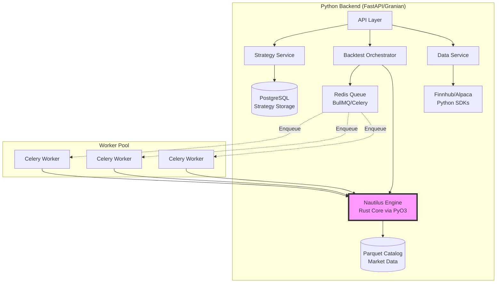
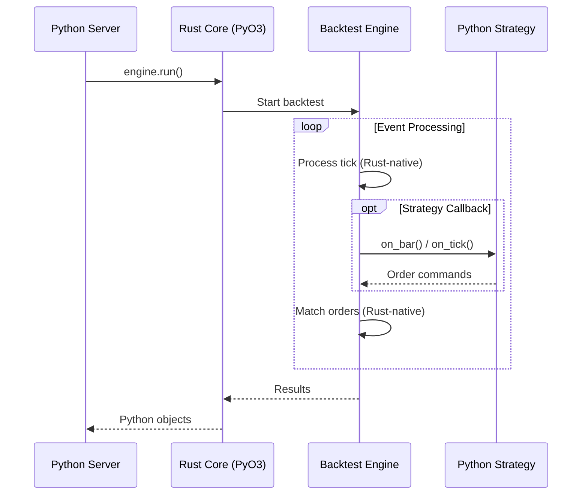
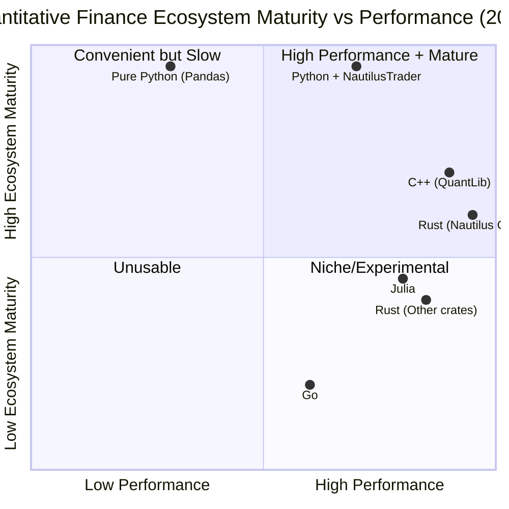

# Server Language Decision: Python

## Decision Summary

**Python** is the server language for the backtesting platform. NautilusTrader already provides a Rust core via PyO3 bindings, so the real question was never "Python, Rust or Go" but rather how to best interface with its hybrid architecture. Python gives us Rust-level performance in the engine while preserving ecosystem compatibility, strategy authoring in Python (Monaco Editor), and access to mature data provider SDKs.

---

## NautilusTrader's Hybrid Architecture

NautilusTrader (v1.208+) is a **Rust core with Python bindings**, not a pure Python library:

| Layer | Language | Responsibility |
|-------|----------|----------------|
| Networking (tokio) | Rust | WebSocket/REST connections |
| Order matching | Rust | Simulated exchange matching engine |
| Data parsing | Rust | Parquet/Arrow ingestion, serialization |
| Core engine loop | Rust | Event-driven backtest execution |
| Strategy API | Python | `Strategy` base class, user-facing API |
| Configuration | Python | Engine setup, data catalog wiring |
| Bridge | PyO3 | Rust ↔ Python interop with minimal overhead |



The backtest hot path runs entirely in Rust. Python is only invoked for strategy callbacks (`on_bar`, `on_tick`), making PyO3 overhead negligible:



---

## Why Python

### 1. Strategy Code Must Be Python

Users write strategies in the Monaco Editor as Python. NautilusTrader's `Strategy` base class is Python:

```python
from nautilus_trader.trading.strategy import Strategy

class UserStrategy(Strategy):
    def on_bar(self, bar: Bar):
        # User's Python logic
        pass
```

A Rust server would need to embed Python anyway to execute user strategies, adding complexity with no performance benefit.

### 2. Ecosystem Maturity

Python's quantitative finance ecosystem is unmatched:

| Category | Python Libraries |
|----------|-----------------|
| **Backtesting** | NautilusTrader, Backtesting.py, Zipline-reloaded, VectorBT, QSTrader |
| **Technical Indicators** | TA-Lib (12k+ stars, 200+ indicators), Pandas TA (115+ indicators) |
| **Data Handling** | Pandas, Polars (Rust-based), ArcticDB, PyArrow |
| **ML/Stats** | Scikit-learn, PyTorch, Statsmodels, MLfinlab |
| **Risk/Portfolio** | skfolio, Riskfolio-Lib, Empyrical, QuantStats |
| **Data Sources** | alpaca-py, finnhub-python (official SDKs), yfinance, polygon-io |

By comparison, Rust has a handful of early-stage finance crates and Go has effectively zero actively maintained quant libraries (see detailed breakdowns in [Why Not Rust or Go](#why-not-rust-or-go) below).

### 3. Data Provider Compatibility

Finnhub and Alpaca both provide **official Python SDKs**. Their Rust/Go support is community-maintained or non-existent. Python SDKs integrate directly with our data ingestion pipeline and respect rate limiting out of the box.

### 4. Task Queue & Worker Ecosystem

Python integrates seamlessly with Celery, RQ, or arq for distributing backtest jobs across worker pools — a core requirement of our architecture (see system design: Backtest Execution Flow).

---

## Why Not Rust or Go

### Rust Server

The `nautilus-backtest` crate is an internal crate within the NautilusTrader monorepo — using it with the `python` feature flag is equivalent to building the `nautilus_trader` Python package from source. Using it in a pure Rust build (without the `python` flag) loses Python strategy compatibility entirely, meaning users couldn't write strategies in the Monaco Editor.

Beyond NautilusTrader's own crate, the broader Rust quant ecosystem is rapidly expanding but still early-stage with varying stability:

| Category | Crates | Maturity |
|----------|--------|----------|
| **Backtesting** | `nautilus-backtest` (core crate), `bts-rs`, `barter-rs`, `qust`, `alator` | Early-mid stage |
| **Technical Analysis** | `kand` (TA-Lib inspired), `traquer`, `tindi`, `ta-lib-wrapper` | Functional but limited |
| **Data Structures** | `polars` (DataFrames), `arrow-rs`, `parquet` | Production-ready |
| **Math/Stats** | `statrs`, `rust-ml`, `smartcore` | Growing |
| **Market Data** | `yfinance-rs`, `finnhub-rs`, `apca` (Alpaca), `databento-defs` | Good coverage |
| **Order Books** | `otterbook_core`, `rust_ob`, `hotfix` (FIX engine) | Specialized |
| **Pricing** | `RustQuant`, `black_scholes_pricer`, `finql` | Academic/prototype |

Most Rust backtesters require strategies written in Rust (e.g. `bts-rs`, `barter-rs`), no single framework matches the breadth of NautilusTrader or Backtesting.py, and enterprise-grade documentation is rare.

A Rust server would only make sense if:

- Building a new backtesting engine from scratch
- Users write strategies in Rust
- Need ultra-low latency (<10μs) tick processing beyond what NautilusTrader provides
- Running >10,000 concurrent backtests

None of these apply to our use case.

### Go Server

Go's quant-specific tooling is minimal — general-purpose libraries only:

| Category | Libraries | Notes |
|----------|-----------|-------|
| **DataFrames** | `gonum`, `dataframe-go`, `gota` | Basic compared to Pandas/Polars |
| **Indicators** | `go-talib` (TA-Lib port), `indicator` | Functional but limited ecosystem |
| **Backtesting** | `gobacktest`, `crex`, `goex_backtest` | Crypto-focused, minimal traction |
| **Stats/Math** | `gonum/stats` | Good for basic stats, not finance-specific |
| **Order Book** | `go-hft-orderbook` | Specialized HFT use case |
| **ML** | `gorgonia` (like TensorFlow), `sklearn` (partial port) | Not finance-optimized |

Go's ecosystem is primarily suited for infrastructure (exchanges, data feeders), not quantitative research. The `awesome-go-quant` list hasn't been meaningfully updated since 2020, and most listed projects are unmaintained or experimental. Go is suited for exchange connectivity and infrastructure microservices, not strategy backtesting.

---

## Ecosystem Maturity vs Performance



---

## Performance Optimization Strategy

Performance is achieved through architecture choices, not language replacement:

### Granian over Uvicorn
Use Granian (Rust-based ASGI server) for HTTP handling. Rust performance at the transport layer, Python business logic above it.

### Streaming Data via BacktestNode
Use NautilusTrader's `BacktestNode` with `ParquetDataCatalog` for memory-efficient streaming instead of loading entire datasets into RAM:

```python
from nautilus_trader.backtest.node import BacktestNode
node = BacktestNode(configs)
node.run()  # Streams from disk in batches
```

### Engine Reuse
Reuse Nautilus engines across backtests by resetting state while keeping data loaded:

```python
engine.reset()  # Keeps data catalog, clears strategy state
engine.add_strategy(new_strategy)
engine.run()
```

### Polars for Data Processing
Use Polars (Rust-backed DataFrames exposed via Python) for any data transformations outside the Nautilus engine.

### Custom Rust Extensions (if needed)
If custom data transformations become a bottleneck, write a Rust crate using `nautilus-data` and expose it via PyO3 — keeping the server in Python.

---

## Summary

The performance-critical path (data parsing, order matching, event loop) already runs in Rust inside NautilusTrader. Python orchestrates the engine, serves the API, manages workers, and connects to data providers. This hybrid approach delivers Rust speed where it matters without sacrificing the ecosystem, SDK compatibility, or the Python strategy authoring workflow that the frontend depends on.
