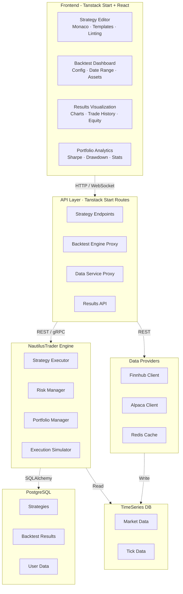
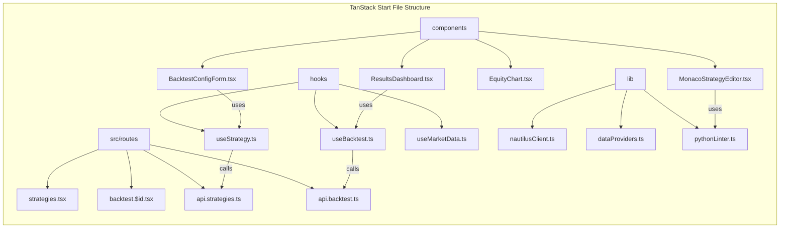
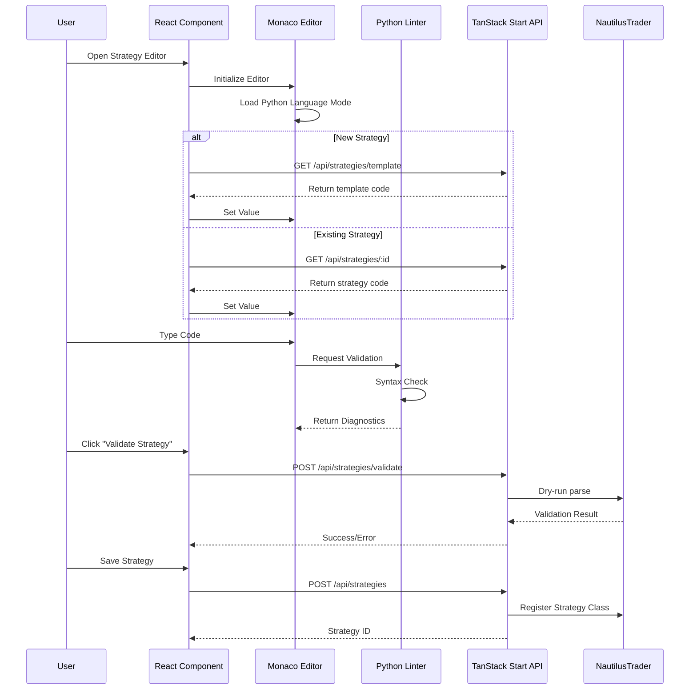
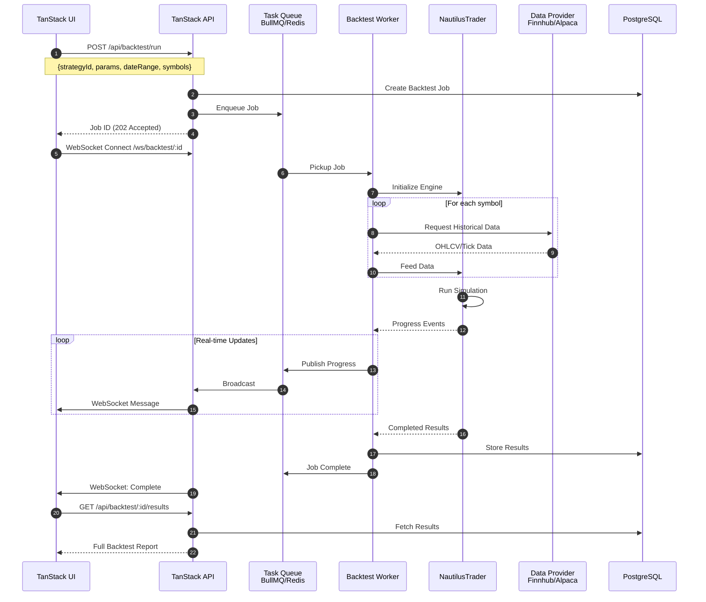
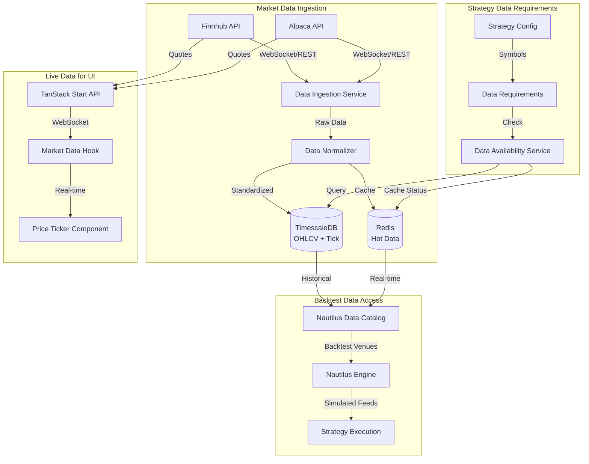
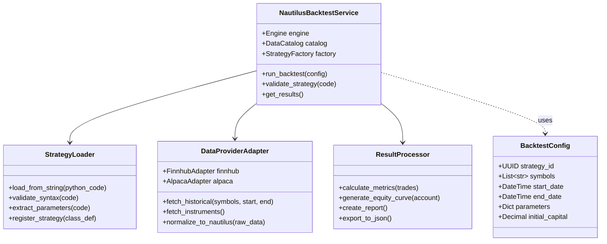
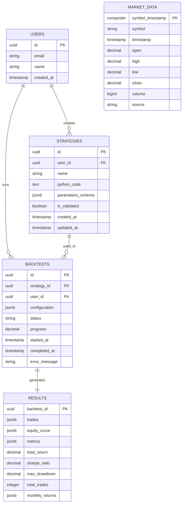
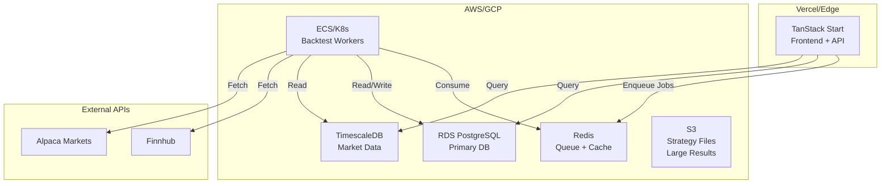

## System Architecture Overview

## Frontend Component Architecture

## Monaco Editor Integration Flow

## Backtest Execution Flow

## Data Flow Architecture

## NautilusTrader Integration Detail

## Database Schema

## Deployment Architecture

## Key Implementation Recommendations

Based on this architecture, here are critical implementation points:

**1. Monaco Editor Setup**
- Use `@monaco-editor/react` with Python language support
- Implement custom completion providers for NautilusTrader APIs
- Add Python linting via WebAssembly (Pyodide) or backend validation endpoint

**2. NautilusTrader Integration**
- Run backtests in isolated worker processes (Docker containers recommended)
- Use NautilusTrader's `BacktestEngine` with custom `DataCatalog`
- Implement adapter pattern for Finnhub/Alpaca data normalization to Nautilus `QuoteTick`/`TradeTick`

**3. TanStack Start Patterns**
- Use server functions for strategy validation (compile Python without execution)
- Implement streaming for real-time backtest progress via `createEventStream`
- Leverage TanStack Query for optimistic UI updates on backtest submission

**4. Data Management**
- Use TimescaleDB for time-series market data (hypertables for performance)
- Implement data warming strategy - prefetch likely-needed data into Redis
- Cache Finnhub/Alpaca API responses to respect rate limits

**5. Security Considerations**
- Sandbox Python execution (restricted environment, no network access)
- Validate all strategy code before execution (AST parsing)
- Implement resource limits (max backtest duration, memory caps)
