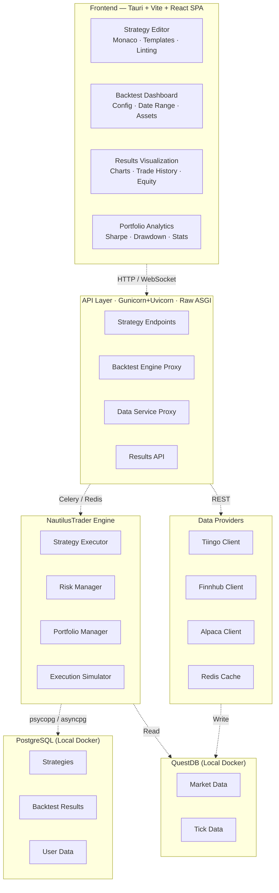
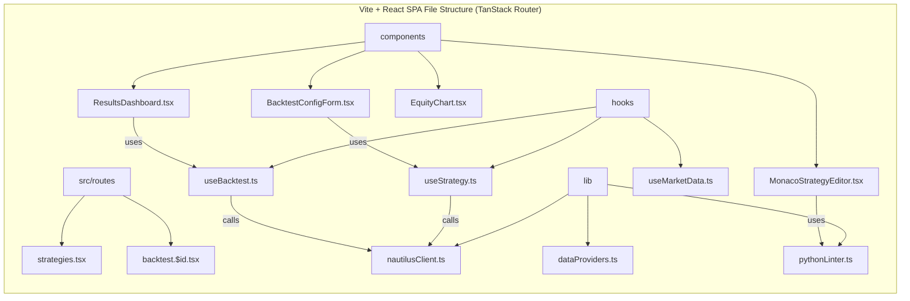
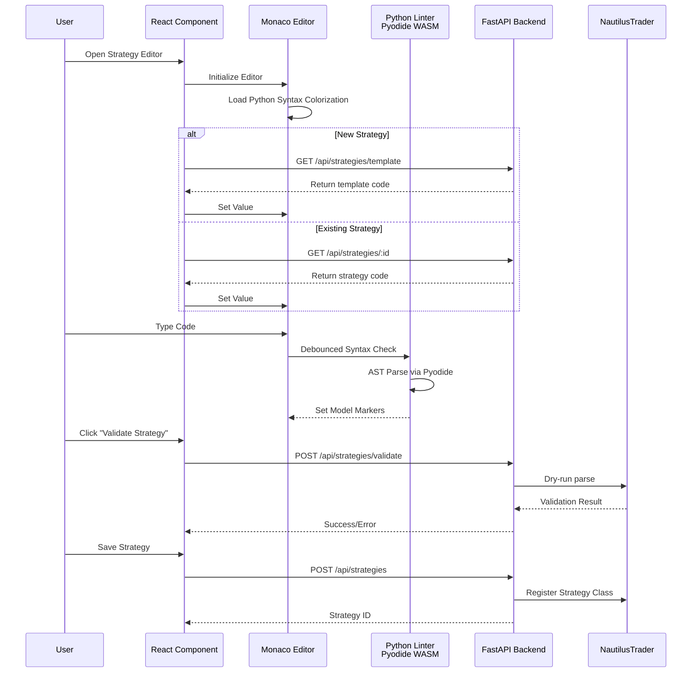
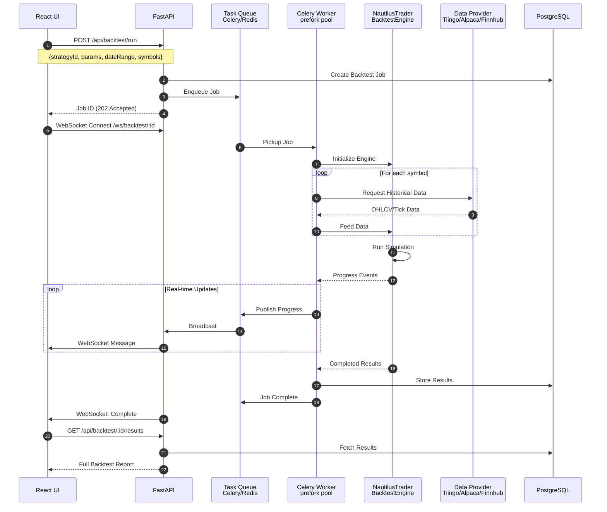
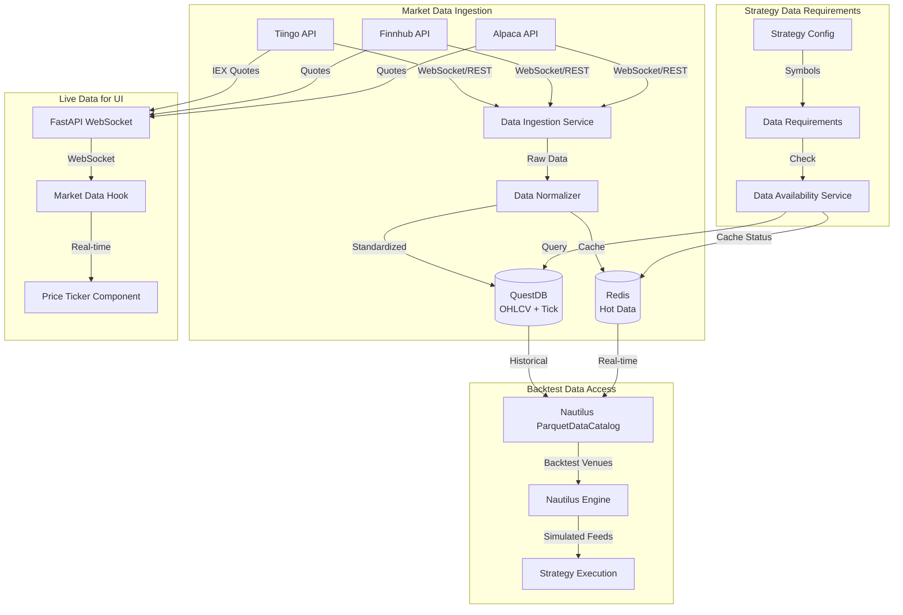
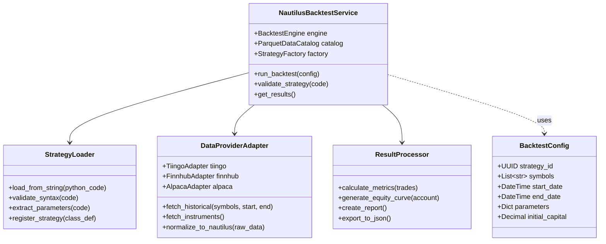
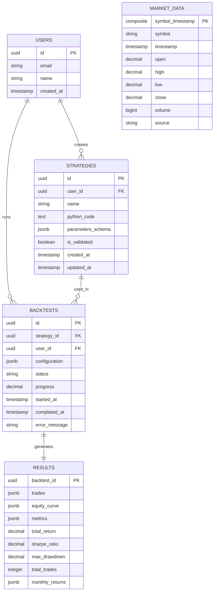
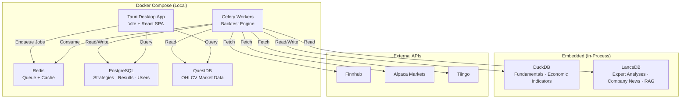
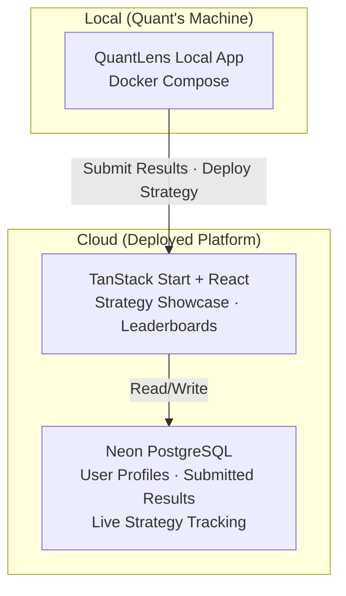

## System Architecture Overview

QuantLens is a **local-first** desktop application for alpha research, strategy backtesting, and portfolio optimization — powered by a **Tauri** shell wrapping a **Vite + React** SPA, with backend services Dockerized for easy setup. A future **platform app** (deployed **TanStack Start + React** app on Neon) will allow quants to submit backtesting results and deploy strategies live to track and showcase real-world performance.

### Local App (Dockerized)

## Frontend Component Architecture

## Monaco Editor Integration Flow

## Backtest Execution Flow

## Data Flow Architecture

## NautilusTrader Integration Detail

## Database Schema

## Deployment Architecture

### Local App (Docker Compose + Embedded)

All services run locally — Docker containers via `docker compose up`, plus embedded databases (DuckDB, LanceDB) in the Python process:

### Future Platform App (Deployed)

The project will evolve into a platform where quants submit backtesting results and deploy strategies live to track and showcase real-world performance.

## Key Implementation Recommendations

Based on this architecture, here are critical implementation points:

**1. Monaco Editor Setup**
- Use `@monaco-editor/react` — Python gets **syntax colorization only** (no built-in IntelliSense or validation; Monaco's `onValidate` fires only for JS/TS/CSS/JSON/HTML)
- Implement custom `CompletionItemProvider` for NautilusTrader APIs via `monaco.languages.registerCompletionItemProvider`
- Add Python linting via Pyodide (WASM) for client-side AST parsing, with markers set via `monaco.editor.setModelMarkers`; deep validation (NautilusTrader import resolution) must happen server-side

**2. NautilusTrader Integration**
- Run backtests in isolated worker processes — **one `BacktestNode` per process** (NautilusTrader enforces this due to global singleton state: force-stop flag, logger mode, Tokio runtime). Celery `prefork` pool satisfies this naturally.
- Use `BacktestEngine` (low-level, fine-grained control) or `BacktestNode` with `BacktestRunConfig` objects (high-level, recommended for production). The catalog class is `ParquetDataCatalog`, not `DataCatalog`.
- NautilusTrader is a **library, not a service** — there is no REST/gRPC API. The API layer enqueues jobs to Celery; workers import and call `nautilus_trader` directly in-process.
- Implement adapter pattern for Tiingo/Finnhub/Alpaca data normalization to Nautilus `Bar`/`QuoteTick`/`TradeTick` types

**3. Tauri + Vite + React Patterns**
- Use TanStack Router with file-based routing for type-safe navigation
- Use TanStack Query for REST data fetching with automatic caching and invalidation
- WebSocket connections are managed directly in React — no framework abstraction needed. Push real-time updates into TanStack Query cache via `queryClient.setQueryData()` for unified state management.
- See [local_frontend.md](local_frontend.md) for the full tech stack decision and architecture

**4. Data Management**
- Use QuestDB for time-series market data — native `SAMPLE BY` for OHLCV bar generation, `ASOF JOIN` for trade/quote correlation, and `LATEST ON` for efficient last-value-per-symbol queries. Running locally in Docker eliminates the free-tier constraints that previously favored TimescaleDB, and QuestDB's append-only columnar architecture with 11M+ rows/sec ingestion is purpose-built for financial market data.
- Implement data warming strategy — prefetch likely-needed data into Redis
- Cache API responses to respect rate limits: Tiingo limits are plan-dependent (hourly requests + daily requests + monthly bandwidth — see [pricing page](https://www.tiingo.com/pricing)); Finnhub free tier: 60 calls/min with a hard 30 calls/sec cap; Alpaca free tier: ~200 calls/min
- **Finnhub OHLCV caveat:** Stock Candles and Tick Data endpoints are **Premium-only**. On the free tier, Finnhub is useful for fundamentals, news, quotes, and recommendation data — not historical OHLCV ingestion. Tiingo (EOD + IEX intraday) and Alpaca should be the primary free-tier sources for historical price data.
- Tiingo provides **WebSocket streams** for IEX (US equities intraday), Crypto, and Forex — not just REST. Use these for real-time data instead of polling.
- Store validated datasets in Parquet format for NautilusTrader's `ParquetDataCatalog` — this is the primary backtest data path, not live API calls
- For OHLCV data corrections, use QuestDB's insert-new-row pattern (append a corrected row with a later processing timestamp) rather than in-place updates. The `LATEST ON` clause efficiently retrieves the most recent version per symbol.

**5. Security Considerations**
- Sandbox Python execution (restricted environment, no network access)
- Validate all strategy code before execution (AST parsing)
- Implement resource limits (max backtest duration, memory caps)

**6. Portfolio Optimization (skfolio)**
- Use `skfolio` as the optimization engine with a scikit-learn-native `fit/predict/transform` workflow for clean FastAPI dependency injection.
- Default to downside-aware risk objectives (`CVaR`) and monitor drawdown-focused metrics (max drawdown, conditional drawdown, tracking error).
- Use walk-forward cross-validation for optimization endpoints to reduce overfitting in production allocation workflows.
