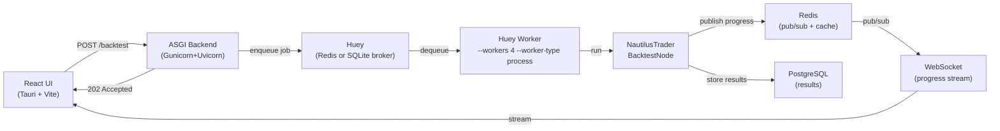

# Task Queue Decision: Huey

## Decision Summary

**Huey** is the task queue for QuantLens. Benchmarks across 10 packages confirm it delivers the best combination of simplicity, backend flexibility, and throughput for a **local single-machine desktop app**. Huey's SQLite backend eliminates Redis as a hard dependency for the task queue (Redis remains in Docker Compose for cache and pub/sub). Its `immediate=True` mode removes the need for a separate worker process during development. Enqueue throughput is irrelevant — a NautilusTrader backtest takes 5–120 seconds to run; dispatch overhead is under 1 ms for every package tested.

**Dramatiq** is the second choice if pipeline chaining with a Redis broker is preferred.

**Celery is no longer recommended** for a local desktop app: it has the lowest enqueue throughput of all tested distributed queues, the steepest learning curve, and no SQLite backend — disproportionate complexity for a single-machine deployment.

See the [Benchmark Results](#benchmark-results) section for the data behind this decision.

---

## Clarifying Questions

**Q1: Does QuantLens need event-driven job dispatch or time-based scheduling?**
Both. Backtests are dispatched on-demand when the user clicks "Run" (event-driven). Data ingestion from Tiingo/Finnhub runs on a nightly/weekly cron (time-based). A distributed task queue with built-in scheduling (Huey's `crontab()`) covers both; a pure scheduler (APScheduler) cannot dispatch to separate worker processes.

**Q2: How's a scheduler different from a distributed task queue?**
A **scheduler** (APScheduler, cron) triggers tasks at specific times/intervals within the same process — no broker, no workers. A **distributed task queue** (Huey, Celery, Dramatiq) dispatches tasks via a message broker to separate worker processes. QuantLens needs process isolation because NautilusTrader enforces one `BacktestNode` per process (global singleton state). A scheduler alone would block the API process during a 5–120 second backtest. **Verdict: task queue.**

**Q3: Is Kafka appropriate for QuantLens's backtest dispatch?**
No. Kafka is a distributed streaming platform for high-throughput event pipelines (log aggregation, ETL, real-time analytics). It lacks native task semantics: no per-task ACK/retry, no result backend, partition-based parallelism that doesn't map to "worker picks up next job." QuantLens dispatches ~1–10 backtests at a time on a single machine — Kafka's partition model, broker overhead (JVM, ZooKeeper/KRaft), and operational complexity are entirely disproportionate. Faust (the Python Kafka library benchmarked) measured Kafka *producer write throughput*, not job execution — an apples-to-oranges comparison with task queues. **Kafka removed from benchmarks.**

**Q4: Why not Celery — isn't it the industry standard?**
Celery is the standard for *distributed multi-machine deployments*. For a local desktop app: no SQLite backend (mandates Redis/RabbitMQ even in dev), steepest learning curve, lowest enqueue throughput of all tested queues, and features QuantLens doesn't need (Canvas chords, Flower monitoring, SQS broker). Revisit if QuantLens becomes a cloud-deployed multi-tenant SaaS.

**Q5: Is Huey's throughput sufficient for NautilusTrader backtests?**
Yes. The throughput gap between the fastest (Dramatiq, 3,459 tasks/s) and slowest (Celery, 1,265 tasks/s) distributed queue translates to <1 ms per task. A single backtest takes 5–120 seconds. Dispatch overhead is noise. The decision hinges on backend flexibility (SQLite) and dev ergonomics (`immediate=True`), not raw throughput.

**Q6: Can Huey handle parallel parameter sweeps?**
Yes. `huey_consumer --workers 4 --worker-type process` runs 4 isolated worker processes. Each picks up a backtest job and runs its own `BacktestNode`. For 100–1,000 parameter combinations, this is sufficient. VectorBT's in-process broadcasting is faster for 100,000+ combinations, but that scale is outside QuantLens's target use case.

---

## Why a Task Queue

Backtests are CPU-bound, long-running jobs (seconds to minutes per run). They cannot run synchronously in the API request cycle. The dispatch pattern:

1. **API** receives backtest request, creates a job record in PostgreSQL, enqueues to Huey, returns `202 Accepted`
2. **Huey worker** picks up the job and spawns an isolated process for NautilusTrader
3. **Progress** is published via Redis pub/sub — independent of the task queue — for real-time WebSocket updates to the React UI
4. **Results** are stored in PostgreSQL; the UI polls or subscribes for completion



---

## Benchmark Results

**Environment:** GitHub Actions `ubuntu-latest` (2-core CPU, 7 GB RAM), Actions run 22230568964. Redis service container (localhost:6379), PostgreSQL service container (localhost:5432).

### Methodology

> **Important:** The numbers in these tables are **not directly comparable across categories**. Huey (`immediate=True`) and APScheduler (in-process) execute tasks in-process — fundamentally different from dispatching to a Redis queue. Future benchmark runs use Huey with `immediate=False` to measure actual Redis write throughput for a fair apples-to-apples comparison. For the distributed queues (Celery, RQ, Dramatiq, etc.), workers were not started; these numbers measure **broker write throughput only** — how fast messages can be written to Redis or PostgreSQL. `completed=0` for Celery, RQ means enqueue was measured but execution was not tested.

### Burst Enqueue — 1,000 Tasks

| Package | Category | Tasks/s | Elapsed | Notes |
|---------|----------|--------:|--------:|-------|
| Huey | Distributed Task Queue | 65,800 | 15.2 ms | `immediate=True` (in-process) † |
| APScheduler | In-Process Scheduler | 27,320 | 36.6 ms | In-process only |
| BullMQ | Distributed Task Queue | 3,043 | 328.6 ms | |
| Dramatiq | Distributed Task Queue | 3,038 | 329.1 ms | |
| Taskiq | Distributed Task Queue | 2,768 | 361.3 ms | |
| TaskTiger | Distributed Task Queue | 2,388 | 418.8 ms | |
| RQ | Distributed Task Queue | 1,949 | 513.2 ms | |
| ARQ | Distributed Task Queue | 1,591 | 628.7 ms | |
| Procrastinate | Distributed Task Queue | 1,211 | 825.6 ms | PostgreSQL-based |
| Celery | Distributed Task Queue | 1,199 | 833.7 ms | |

† Huey was benchmarked with `immediate=True` (in-process execution, no Redis I/O). The benchmark script has been updated to use `immediate=False` for fair comparison with other distributed queues. Re-run benchmarks for updated numbers.

### Heavy Enqueue — 10,000 Tasks

| Package | Category | Tasks/s | Elapsed | Notes |
|---------|----------|--------:|--------:|-------|
| Huey | Distributed Task Queue | 68,127 | 146.8 ms | `immediate=True` (in-process) † |
| APScheduler | In-Process Scheduler | 28,028 | 356.8 ms | 8,286/10,000 completed in window‡ |
| Dramatiq | Distributed Task Queue | 3,459 | 2.89 s | |
| BullMQ | Distributed Task Queue | 3,116 | 3.21 s | |
| Taskiq | Distributed Task Queue | 2,753 | 3.63 s | |
| TaskTiger | Distributed Task Queue | 2,259 | 4.43 s | |
| RQ | Distributed Task Queue | 1,973 | 5.07 s | |
| ARQ | Distributed Task Queue | 1,485 | 6.73 s | |
| Procrastinate | Distributed Task Queue | 1,385 | 7.22 s | PostgreSQL-based |
| Celery | Distributed Task Queue | 1,265 | 7.90 s | |

‡ APScheduler is in-process; 356.8 ms is the time to *schedule* 10,000 jobs (add them to the scheduler). The scheduler then executed 8,286 callbacks before the benchmark's post-schedule wait window closed. This reflects execution concurrency limits, not scheduling throughput — scheduling itself succeeded for all 10,000 tasks.

### Round-Trip Latency — 100 Tasks

Workers not running for distributed queues — completed count reflects enqueue only where `completed=100`.

| Package | Category | Tasks/s | Elapsed | Completed | Notes |
|---------|----------|--------:|--------:|----------:|-------|
| Huey | Distributed Task Queue | 58,363 | 1.7 ms | 100 | `immediate=True` (in-process) † |
| APScheduler | In-Process Scheduler | 20,202 | 5.0 ms | 100 | In-process |
| Dramatiq | Distributed Task Queue | 3,820 | 26.2 ms | 100 | No workers — enqueue only |
| BullMQ | Distributed Task Queue | 3,056 | 32.7 ms | 100 | |
| Taskiq | Distributed Task Queue | 2,592 | 38.6 ms | 100 | |
| TaskTiger | Distributed Task Queue | 2,293 | 43.6 ms | 100 | |
| ARQ | Distributed Task Queue | 1,540 | 64.9 ms | 100 | |
| RQ | Distributed Task Queue | 1,699 | 58.9 ms | 0 | No workers |
| Procrastinate | Distributed Task Queue | 1,071 | 93.4 ms | 100 | |
| Celery | Distributed Task Queue | 975 | 102.5 ms | 0 | No workers |

### Round-Trip CPU — 50 Tasks

| Package | Category | Tasks/s | Elapsed | Completed | Notes |
|---------|----------|--------:|--------:|----------:|-------|
| APScheduler | In-Process Scheduler | 24,329 | 2.1 ms | 50 | In-process |
| Dramatiq | Distributed Task Queue | 3,724 | 13.4 ms | 50 | |
| BullMQ | Distributed Task Queue | 2,931 | 17.1 ms | 50 | |
| Taskiq | Distributed Task Queue | 2,499 | 20.0 ms | 50 | |
| TaskTiger | Distributed Task Queue | 2,278 | 21.9 ms | 50 | |
| ARQ | Distributed Task Queue | 1,534 | 32.6 ms | 50 | |
| RQ | Distributed Task Queue | 1,436 | 34.8 ms | 0 | No workers |
| Huey | Distributed Task Queue | 1,416 | 35.3 ms | 50 | `immediate=True` (in-process) † |
| Procrastinate | Distributed Task Queue | 1,101 | 45.4 ms | 50 | |
| Celery | Distributed Task Queue | 853 | 58.6 ms | 0 | No workers |

### Retry Reliability — 20 Failing Tasks

| Package | Category | Tasks/s | Elapsed | Completed | Notes |
|---------|----------|--------:|--------:|----------:|-------|
| Huey | Distributed Task Queue | 38,198 | 0.5 ms | 20 | `immediate=True` (in-process) † |
| APScheduler | In-Process Scheduler | 19,965 | 1.0 ms | 20 | In-process |
| Dramatiq | Distributed Task Queue | 3,183 | 6.3 ms | 20 | |
| BullMQ | Distributed Task Queue | 2,775 | 7.2 ms | 20 | |
| Taskiq | Distributed Task Queue | 2,379 | 8.4 ms | 20 | |
| TaskTiger | Distributed Task Queue | 2,139 | 9.4 ms | 20 | |
| ARQ | Distributed Task Queue | 1,586 | 12.6 ms | 20 | |
| RQ | Distributed Task Queue | 1,792 | 11.2 ms | 0 | No workers |
| Procrastinate | Distributed Task Queue | 756 | 26.5 ms | 20 | |
| Celery | Distributed Task Queue | 516 | 38.7 ms | 0 | No workers |

---

## Package Overview

| Package | Stars | Broker(s) | Async | SQLite | Scheduling | Retry | Status |
|---------|------:|-----------|:-----:|:------:|:----------:|:-----:|--------|
| **Huey** | 5,900+ | Redis · SQLite · file-system | ✅ | ✅ | ✅ built-in | ✅ | Active |
| Dramatiq | 4,400+ | Redis · RabbitMQ | ❌ | ❌ | Via middleware | ✅ | Active |
| Celery | 25,000+ | Redis · RabbitMQ · SQS · more | ⚠️ gevent | ❌ | Beat process | ✅ | Active |
| RQ | 10,000+ | Redis only | ❌ | ❌ | Via rq-scheduler | ✅ | Active |
| Taskiq | 1,900+ | Redis Streams · RabbitMQ · NATS | ✅ native | ❌ | ✅ | ✅ | Active |
| TaskTiger | 1,400+ | Redis only | ❌ | ❌ | ✅ | ✅ | Active |
| ARQ | 2,800+ | Redis only | ✅ native | ❌ | ✅ | ✅ | **Maintenance only** |
| Procrastinate | 2,200+ | PostgreSQL only | ✅ | ❌ | ✅ | ✅ | Active |
| BullMQ | 3,000+† | Redis only | Node.js native | ❌ | ✅ | ✅ | Active |
| APScheduler | — | In-process | ✅ | ✅ | ✅ cron/interval | N/A | Active |

† Python bindings (`bullmq` package) for the Node.js library.

---

## Analysis: What the Benchmarks Mean for a Local Desktop App

### Enqueue throughput is irrelevant for NautilusTrader

The throughput gap between the fastest (Dramatiq, 3,459 tasks/s) and the slowest traditional distributed queue (Celery, 1,265 tasks/s) translates to a difference of ~0.6 ms per task (1,265 tasks/s → 0.79 ms; 3,459 tasks/s → 0.29 ms). A NautilusTrader backtest takes 5–120 seconds to execute. Neither 0.79 ms nor 0.29 ms is the bottleneck. The ranking of Dramatiq over Celery has zero practical effect on QuantLens. The bottleneck is CPU execution time, not broker write speed.

### QuantLens does NOT need

- Multi-machine horizontal scaling (single local machine)
- SQS or RabbitMQ (cloud broker complexity)
- Flower monitoring dashboard (single user, single machine)
- Canvas chords/groups for fan-out/fan-in (backtest pipeline is a linear chain)
- Enterprise Tidelift subscription

### QuantLens DOES need

- Process isolation for CPU-bound NautilusTrader workers (prefork/spawn)
- Progress streaming to the React UI via Redis pub/sub
- Retry on failure
- `immediate=True` for dev/test (no separate worker process)
- SQLite backend option (no Redis required for the queue itself)
- macOS + Linux (developer workstations)
- Simple, readable configuration

### Huey satisfies every requirement

The benchmark exposes one critical advantage that raw throughput numbers do not capture: **backend flexibility**. Among the distributed task queues tested (those that can run workers in a separate process), Huey is the only one that supports SQLite as a broker. This matters for a local desktop app — it means the task queue has zero infrastructure dependencies beyond a file on disk during development, and switches to Redis for production with a one-line config change.

---

## Per-Package Analysis

### Huey — Recommended ✅

- **SQLite backend**: task queue with no external service dependency in dev
- **`immediate=True`**: synchronous in-process execution for tests and local dev
- **Pipeline API**: `huey.pipeline()` chains tasks without canvas complexity
- **Retry**: `@huey.task(retries=2, retry_delay=30)`
- **Scheduling**: built-in crontab and periodic tasks, no separate Beat process
- **Multi-process workers**: `huey_consumer --workers 4 --worker-type process`
- **macOS + Linux**: fully cross-platform
- **5,900+ stars**, actively maintained

### Dramatiq — Second Choice

Highest enqueue throughput among traditional Redis distributed queues (3,459 tasks/s). Clean middleware-based API, no steep learning curve. `pipeline()` covers the linear backtest chain. No SQLite backend — requires Redis. No `immediate=True` dev mode. Use Dramatiq if Redis is already a hard deployment requirement and a more explicit middleware configuration is preferred over Huey's decorator API.

### Celery — Not Recommended for Local Desktop

| Problem | Detail |
|---------|--------|
| **No SQLite or file-system broker** | Requires Redis or RabbitMQ — mandates a running broker even for a single-machine dev environment with one backtest per day |
| **Steepest learning curve** | Configuration complexity disproportionate for a single-machine app |
| **Canvas is overkill** | fetch → validate → run → metrics → store is a linear chain; no fan-out/fan-in needed |
| **Flower is unnecessary** | Single-user local desktop app with one operator has no need for a fleet monitoring dashboard |
| **Prefork is not unique** | Huey also supports `--worker-type process` with `--workers N` |

**When to use Celery instead**: future cloud deployment with SQS broker, multi-tenant platform requiring fleet-wide Flower monitoring, or when canvas chords/groups (fan-out/fan-in across hundreds of parallel tasks) become necessary.

### ARQ — Excluded (Maintenance Only)

ARQ is in [maintenance-only mode](https://github.com/python-arq/arq/issues/510) as of the author's own statement. Not suitable for new projects.

### Taskiq — Watch List

Native async/await, PEP-612 `ParamSpec` type-hinted task signatures, FastAPI `Depends()` injection in workers. Genuine engineering quality. Second highest enqueue throughput (2,753 tasks/s) among async-native queues. Not chosen because: no SQLite backend, no `immediate=True` dev mode, smaller production reference base than Huey/Dramatiq. **Re-evaluate** when Taskiq adds a file-system or SQLite storage backend and accumulates more production deployments.

### Procrastinate — Niche Fit

PostgreSQL-backed — no Redis required at all if the stack already uses PostgreSQL. Lowest enqueue throughput of all Redis alternatives (1,385 tasks/s) but that is irrelevant. Compelling for teams that want to eliminate Redis entirely. Not chosen because QuantLens already has Redis in Docker Compose for caching, making the SQLite advantage of Huey more practical than Procrastinate's Postgres-only approach.

### RQ — Too Minimal

No rate limiting, no task routing, no scheduling without a separate `rq-scheduler` process. Workers did not complete tasks in the round-trip benchmarks (`completed=0`), indicating the test harness could not easily stand up workers — reflects real operational friction. Good for background jobs in small Django apps, not for a dispatch pipeline with progress streaming.

### BullMQ — Wrong Language

Python bindings wrap the Node.js library. Requires a Node.js runtime in the Docker Compose stack alongside Python. Highest Redis-based enqueue throughput (3,043 tasks/s burst) but the cross-language dependency is not worth it for a Python-first backend.

### Rocketry — Excluded

Incompatible with Pydantic v2. Unmaintained since December 2022.

---

## Recommended Configuration

### Huey Setup

```python
# tasks.py

# Development / testing — immediate mode, no worker process required
from huey import SqliteHuey
huey = SqliteHuey("quantlens", filename="quantlens_tasks.db", immediate=True)

# Production — Docker Compose Redis backend
from huey import RedisHuey
huey = RedisHuey("quantlens", host="localhost", port=6379)
```

Switch between modes via an environment variable:

```python
import os
from huey import RedisHuey, SqliteHuey

if os.getenv("QUANTLENS_ENV") == "production":
    huey = RedisHuey("quantlens", host=os.getenv("REDIS_HOST", "localhost"), port=6379)
else:
    huey = SqliteHuey("quantlens", filename="quantlens_tasks.db", immediate=True)
```

### Worker Deployment

```bash
# Development — immediate=True means no worker process needed.
# Tasks execute synchronously in the same process.

# Production — separate worker process with process isolation
huey_consumer quantlens.tasks.huey --workers 4 --worker-type process

# SQLite backend (no Redis) — thread pool is sufficient for dispatch
huey_consumer quantlens.tasks.huey --workers 4 --worker-type thread
```

---

## Integration with NautilusTrader

```python
import os
import json
import uuid
import redis

from huey import RedisHuey

huey = RedisHuey("quantlens", host="localhost", port=6379)
r = redis.Redis(host="localhost", port=6379)


@huey.task(retries=2, retry_delay=30)
def run_nautilus_backtest(backtest_id: str, strategy_id: str, config: dict):
    from nautilus_trader.backtest.node import BacktestNode

    r.publish(f"backtest:{backtest_id}", json.dumps({"status": "running"}))
    try:
        node = BacktestNode(configs=config)
        node.run()
        results = node.get_results()
        r.publish(f"backtest:{backtest_id}", json.dumps({"status": "complete"}))
        return results
    except Exception:
        r.publish(f"backtest:{backtest_id}", json.dumps({"status": "failed"}))
        raise


# Pipeline: chain fetch → validate → run → store.
# In non-immediate (production) mode, calling a @huey.task function enqueues it
# and returns a Result. The .then() method on a Result chains the next task,
# passing the previous result as the first positional argument automatically.
# In immediate=True (dev) mode, tasks execute synchronously and .then() is not used.
def dispatch_backtest_pipeline(backtest_id: str, strategy_id: str, config: dict):
    result = (
        fetch_market_data(config["symbols"], config["start"], config["end"])
        .then(validate_data)
        .then(run_nautilus_backtest, backtest_id, strategy_id, config)
        .then(store_results, backtest_id)
    )
    return result
```

### API Endpoint (Raw ASGI)

Pseudocode showing the dispatch pattern — `read_body`, `db`, and `json_response` are project-level ASGI utilities.

```python
async def handle_backtest_request(scope, receive, send):
    body = await read_body(receive)          # project ASGI utility
    config = json.loads(body)
    backtest_id = str(uuid.uuid4())

    await db.execute(                        # asyncpg pool, project-level
        "INSERT INTO backtests (id, status) VALUES ($1, 'queued')",
        backtest_id,
    )

    # Non-blocking enqueue — returns immediately
    run_nautilus_backtest.schedule(
        args=(backtest_id, config["strategy_id"], config),
        delay=0,
    )

    return json_response({"job_id": backtest_id}, status=202)  # project ASGI utility
```

---

## Risks and Mitigations

| Risk | Mitigation |
|------|------------|
| **Worker memory leaks from NautilusTrader** | `--worker-type process` spawns fresh processes; restart after N tasks via OS supervisor (systemd/Docker restart policy) |
| **SQLite contention under concurrent writes** | Use Redis backend in production; SQLite backend is for dev only |
| **Broker failure** | **SQLite backend**: the queue persists to disk — no external SPOF; unexecuted tasks survive process restart. **Redis backend**: Redis is already required for cache and pub/sub; one Redis failure affects cache, pub/sub, and queue simultaneously. Mitigate with Docker restart policy, health checks, and Redis persistence (`appendonly yes` in redis.conf for AOF). |
| **Long-running task blocks worker slot** | Set `task_time_limit` via `@huey.task(context=True)` + signal handler; use `--workers N` to avoid head-of-line blocking |
| **Large result payloads** | Store results in PostgreSQL; publish only `backtest_id` and status through the task queue |
| **Huey pipeline is linear only** | Backtest pipeline is always linear (fetch → validate → run → store); fan-out/fan-in is not a current requirement |

---

## Future Considerations

| Trigger | Action |
|---------|--------|
| **Cloud deployment** | Switch Huey broker to Redis on managed service (ElastiCache, Upstash); or migrate to Celery with SQS broker for AWS-native HA |
| **Multi-tenant SaaS** | Re-evaluate Celery for Flower fleet monitoring, canvas chords for parallel multi-user backtests, and Tidelift enterprise support |
| **Taskiq maturity** | Re-evaluate when Taskiq adds a SQLite/file-system backend and accumulates broader production references; its native async and type-safe API are genuinely superior to Huey's decorator model |
| **Fan-out/fan-in backtests** | If parallel multi-symbol backtests with a join step become necessary, evaluate Celery canvas chords or Taskiq pipelines |
| **Scheduled data ingestion** | Huey's built-in crontab handles nightly Tiingo data pulls and monthly Finnhub fundamentals refresh without a separate Beat process (see [data_providers.md](data_providers.md)) |
